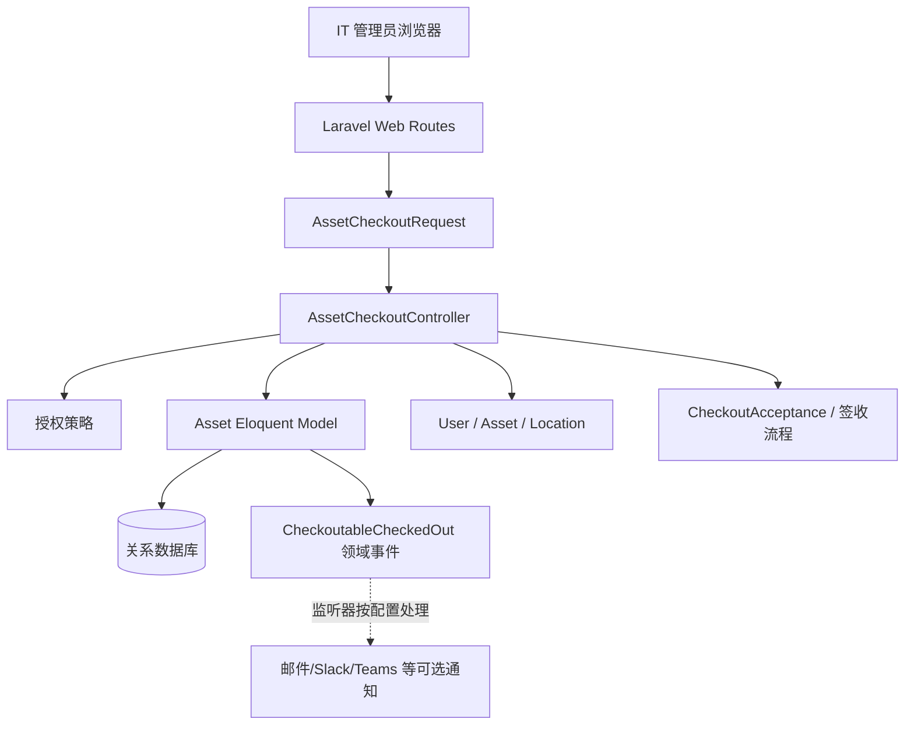
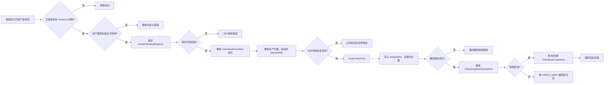
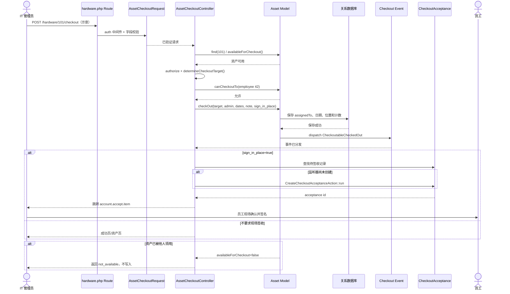

# grokability/snipe-it 源码架构解析

- 报告日期：2026-07-30
- Trending 排名：#6
- 项目类型：IT 资产与许可证管理 Web 系统
- 分析状态：SUCCESS
- Architecture Confidence：High
- Flow Confidence：High
- Innovation Confidence：Medium

## 1. 项目概览

Snipe-IT 是基于 PHP 8.2 与 Laravel 12 的成熟 IT 资产管理系统。公开源码覆盖硬件、许可证、配件、耗材、用户、位置、状态标签、签收、通知、审计与 REST API 等业务面，数据访问主要由 Laravel Eloquent 承担，认证和 API 能力通过 Laravel 生态组件提供。

本次选择“管理员把一台可部署笔记本领用给员工，并可选现场签收”作为典型业务案例。该流程可以从认证路由、请求校验、授权、资产可用性、目标对象、公司边界、模型写入、领域事件到签收跳转逐段核对，不需要根据目录名猜测数据库、队列或外部服务。

## 2. 系统架构

### 架构边界

- 已验证：认证 Web 路由、Form Request 校验、Controller 编排、Eloquent Asset 模型、关联目标、关系数据库持久化、领域事件、签收对象。
- 数据库类型未固定为单一产品；`composer.json` 与 Laravel 配置说明它是关系数据库应用，但本报告不虚构具体生产数据库拓扑。
- 通知集成依赖在 `composer.json` 可见，具体监听器是否启用取决于设置；不把邮件、Slack 或 Teams 写成每次领用必经步骤。
- 没有证据表明该主链路必须依赖缓存集群、消息队列、微服务或可观测性平台。

## 3. 核心模块及代码位置

| 模块 | 代码位置 | 已验证职责 | 证据级别 |
|---|---|---|---|
| 应用依赖与自动加载 | `composer.json` | Laravel 12、Passport、Livewire、数据库、通知、测试与 AGPL 许可 | High |
| 资产 Web 路由 | `routes/web/hardware.php` | 在 `auth` 中间件下注册领用页面和提交端点 | High |
| 领用请求校验 | `app/Http/Requests/AssetCheckoutRequest.php` | 校验领用目标、可部署状态、日期、领用类型和备注要求 | High |
| 领用控制器 | `app/Http/Controllers/Assets/AssetCheckoutController.php` | 授权、可用性判断、目标解析、公司边界、状态更新、签收跳转 | High |
| 资产领域模型 | `app/Models/Asset.php` | `availableForCheckout()` 与 `checkOut()`，建立归属、保存、触发事件和计数 | High |
| 签收动作 | `app/Actions/Acceptances/CreateCheckoutAcceptanceAction.php` | 现场签收未由监听器创建时补建 acceptance；由控制器直接引用 | Medium |
| 领域事件 | `CheckoutableCheckedOut` | 资产保存成功后分发领用事件 | High |
| 测试 | `tests/Feature/Checkouts/Ui/AssetCheckoutTest.php` 等 | 覆盖 UI 领用、签收与相关计数/通知分支 | Medium |
| 部署 | Docker 文档与镜像、Web Server | README 明确为 Web 软件并提供 Docker 方式 | Medium |

## 4. 主线流程

### 状态与数据

- 资产可用性：删除状态、状态标签是否允许部署、当前是否已分配。
- 领用目标：`User`、`Asset` 或 `Location`，必须是未软删除且符合公司边界的对象。
- 资产字段：`assignedTo` 关联、`assigned_type`、`checkout_at`、`expected_checkin`、位置、状态标签、`requestable`、领用计数。
- 事件数据：资产、目标、管理员、备注、领用时间、预计归还时间等由模型/事件携带。
- 可选签收：`CheckoutAcceptance` 记录待签名状态，现场签收时在会话保存 acceptance 与资产标识并跳转。

## 5. 典型业务场景：把一台笔记本领用给员工并现场签收

### 5.1 场景定义

- 场景名称：单台硬件领用与现场签收
- 参与者：IT 管理员、员工、浏览器、Laravel Router、AssetCheckoutRequest、AssetCheckoutController、Asset 模型、关系数据库、CheckoutAcceptance
- 前置条件：
  1. 管理员已登录并拥有该资产的 `checkout` 权限。
  2. 资产存在、未删除、状态标签允许部署，且当前没有被分配。
  3. 员工存在、未软删除，并满足组织/公司范围限制。
- 输入：**示意输入**——资产 ID `101`，员工 ID `42`，`checkout_to_type=user`，预计归还日 `2026-12-31`，`sign_in_place=true`，备注“新员工入职设备”。
- 期望结果：资产归属员工，领用时间和预计归还时间被保存，领用事件产生，浏览器进入现场签收页面。
- 成功判定：资产 `assignedTo` 指向员工 42；资产不再处于可领用状态；对应待签收记录存在；管理员收到成功跳转。

### 5.2 Mermaid 时序图

### 5.3 逐步追踪表

| 步骤 | 输入 | 执行组件 | 关键代码位置 | 状态变化 | 输出 | 失败分支 | 证据级别 |
|---:|---|---|---|---|---|---|---|
| 1 | `POST /hardware/{assetId}/checkout` | Laravel Route | `routes/web/hardware.php` | 进入 `auth` 保护的领用端点 | 调用 `store` | 未登录被中间件拦截 | High |
| 2 | 目标、日期、状态、备注 | `AssetCheckoutRequest` | `app/Http/Requests/AssetCheckoutRequest.php` | 无业务写入 | 已验证请求 | 软删除目标、非可部署状态、缺目标或必填备注导致校验失败 | High |
| 3 | 资产 ID | Controller + Asset | `AssetCheckoutController::store` | 读取资产 | 资产对象 | 不存在或 `availableForCheckout=false` 时返回错误 | High |
| 4 | 当前管理员与资产 | Policy/Controller | `authorize('checkout', $asset)` | 无业务写入 | 授权通过 | 无权限抛出授权错误 | High |
| 5 | `checkout_to_type` 与 assigned ID | `determineCheckoutTarget()` | Controller 使用 `CheckInOutTrait` | 解析目标对象 | User/Asset/Location | 目标不存在由校验或模型查找失败阻止 | Medium |
| 6 | 资产与目标 | `canCheckoutTo()` | `AssetCheckoutController.php` | 无写入 | 公司边界判定 | 公司不匹配返回明确错误 | High |
| 7 | 目标、日期、备注、签收开关 | `Asset::checkOut()` | `app/Models/Asset.php` | 写 `assignedTo`、位置、日期并保存 | 已领用资产 | 自领用、空目标或模型保存失败抛错/返回 false | High |
| 8 | 保存成功资产 | 领域事件 | `Asset::checkOut()` 中 `event(new CheckoutableCheckedOut(...))` | checkout counter 增加 | 监听器可处理通知/签收 | 监听器行为由配置决定，不影响已保存主结果 | High |
| 9 | `sign_in_place=true` | Controller + Acceptance | `AssetCheckoutController.php` | 查找或创建待签收记录，会话保存 acceptance id | 签名页跳转 | acceptance 未由监听器创建时由 Action 补建 | High |
| 10 | 员工签名 | 账户签收流程 | `account.accept.item` 路由目标（本次未展开全部控制器） | acceptance 状态后续更新 | 完成现场确认 | 员工取消或签名失败需在签收流程处理 | Medium |

### 5.4 关键状态或数据变化

1. `Asset.assignedTo`：空 → 员工 42（**示意 ID**）。
2. `checkout_at`：空/旧值 → 实际领用时间。
3. `expected_checkin`：空 → `2026-12-31`（**示意日期**）。
4. 资产位置：可按领用目标位置更新。
5. `requestable`：根据表单布尔值双向更新。
6. `checkout_counter`：保存成功后递增。
7. `CheckoutAcceptance`：无待签收 → 已存在或由 Action 新建。

### 5.5 失败传播与重试分支

- 并发或重复领用：Controller 在写入前再次检查 `availableForCheckout()`；若资产已被其他操作领用，本请求返回 `not_available`，不会覆盖现有归属。
- 公司范围不匹配：`canCheckoutTo()` 失败后返回资产与目标的公司差异，不进入 `checkOut()`。
- 模型校验或保存失败：`checkOut()` 返回 false，Controller 把模型错误带回领用表单，管理员修正后可重新提交。
- 签收记录未由事件监听器创建：现场签收分支显式调用 `CreateCheckoutAcceptanceAction::run()`，这是一个有源码依据的补偿分支，不是凭空设计的重试队列。

### 5.6 最终业务结果

资产台账明确记录“哪台设备在何时由哪位管理员领给谁、预计何时归还”。选择现场签收时，员工可以在同一流程中确认，避免资产状态更新了，签收证据还在纸堆里散步。

### 5.7 最小复现方法

> 以下账号、资产和字段均为**示意**；数据库、邮件与安全配置须按官方安装文档完成。

1. 按官方文档部署 Snipe-IT，创建管理员、员工、可部署状态标签和一台未分配资产。
2. 登录管理员账号，打开该资产详情并进入 Checkout。
3. 选择员工，填写预计归还日和备注，勾选现场签收。
4. 提交表单，预期跳转到签名页面。
5. 返回资产详情，确认归属、领用日期和预计归还日期已更新。
6. 使用另一会话先领用同一资产，再重复提交，预期第二次收到不可领用错误。
7. 运行 `php artisan test --filter=AssetCheckoutTest`（测试名/参数按当前仓库实际定义调整）验证相关 Feature Test。

## 6. 分层技术栈

| 层 | 技术/模块 | 说明 |
|---|---|---|
| 表现层 | Blade、Livewire、Web 浏览器 | 表单、列表、详情、签名和后台管理 |
| 接口层 | Laravel Routes、Controllers、Form Requests、REST API | 路由、认证、授权、输入校验与响应 |
| 领域层 | Asset、User、License、CheckoutAcceptance、事件 | 资产状态、归属、签收和审计业务 |
| 持久化层 | Eloquent ORM、PDO、关系数据库 | 模型关系、事务性写入与迁移 |
| 身份与集成 | Laravel Passport、Socialite、SAML、SCIM、通知渠道 | API 身份、企业身份与可选外部通知 |
| 运维与质量 | Docker、PHPUnit、Pint、Larastan | 部署、测试、格式与静态分析 |

## 7. 创新点

1. 以统一的 Checkoutable 模式处理硬件、许可证席位、配件等多类可领用资源。
2. 将“可部署状态”“当前归属”“公司边界”“软删除目标”放进不同层次校验，减少单点判断遗漏。
3. 领用成功后通过领域事件扩展通知和签收，同时保留现场签收缺失记录时的补偿动作。
4. 对 IT 运维中容易被表格掩盖的责任链，保存管理员、目标、日期、备注和审计记录。

## 8. 应用场景

- 企业、学校和非营利组织的电脑与移动设备台账。
- 软件许可证席位与附件、耗材管理。
- 员工入职、离职和设备交接。
- 定期资产审计、归还提醒和折旧信息管理。
- 通过 REST API 与 MDM、目录或服务台系统集成。

## 9. 阅读验证路径

1. `README.md`：确认产品范围、Web 部署和运维定位。
2. `composer.json`：确认 Laravel、PHP、身份、通知与许可边界。
3. `routes/web/hardware.php`：从领用端点进入。
4. `app/Http/Requests/AssetCheckoutRequest.php`：看输入边界。
5. `app/Http/Controllers/Assets/AssetCheckoutController.php`：看业务编排和分支。
6. `app/Models/Asset.php`：看可用性与 `checkOut()` 的真实状态更新。
7. `app/Events`、`app/Listeners`、Acceptance Action：补齐通知与签收。
8. `tests/Feature/Checkouts/**`：用测试校验成功、失败和回归条件。

## 10. 风险与限制

- AGPL-3.0-or-later 对修改和网络部署的义务需要组织自行评估。
- 资产台账包含人员、位置、设备序列号等敏感信息，需要权限、备份、审计和数据保留策略。
- 邮件、Slack、Teams、SAML、SCIM 等集成不是零配置能力，生产部署需逐项验证。
- 本报告没有实际部署数据库和 Web Server，也未执行并发领用压力测试。
- 现场签收的法律效力和签名保存规则取决于组织政策与所在地法规。

## 11. Evidence Notes

- `README.md`：FOSS IT 资产管理、Laravel 12、Web/Docker 和 REST API 说明。
- `composer.json`：PHP 8.2、Laravel 12、Passport、Livewire、通知集成、PHPUnit 与 AGPL 标识。
- `routes/web/hardware.php`：认证组内的领用 GET/POST 路由。
- `AssetCheckoutRequest.php`：未删除目标、可部署状态、领用类型、日期和备注校验。
- `AssetCheckoutController.php`：授权、可用性、公司边界、`checkOut()`、签收和错误回传。
- `Asset.php`：`availableForCheckout()`、`checkOut()`、关联写入、事件和领用计数。

## 12. Honest Caveat

本报告是源码静态分析，没有在真实 Snipe-IT 实例中执行迁移、邮件通知、SAML/SCIM 或现场签名。核心单资产领用链路从路由到模型保存证据完整，因此 Flow 评为 High；事件监听器的具体通知顺序和签收后续控制器未全部展开，不应据此推断所有集成都已动态通过。

## 13. 可信度说明

- Architecture：High。Laravel 分层、模型、路由、依赖和部署形态有清晰源码与 manifest。
- Flow：High。典型领用链路可从请求、控制器、模型、事件和补偿签收逐步定位。
- Innovation：Medium。核心价值来自成熟领域建模和业务完整性，创新更多是工程组合而非全新计算范式。
