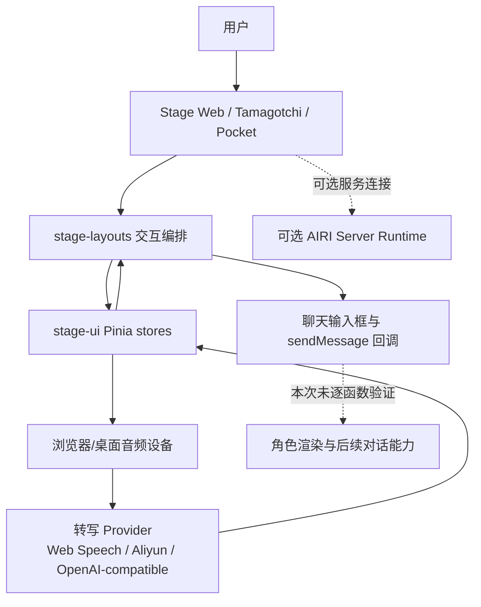
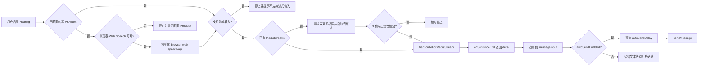
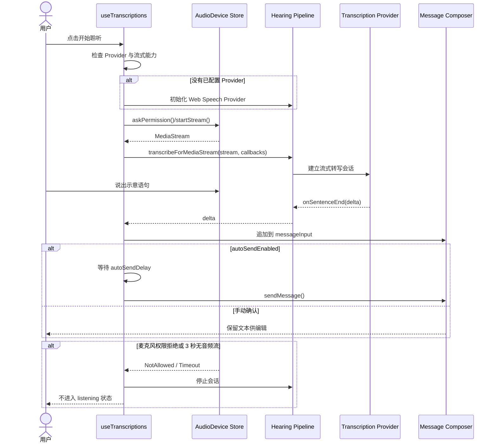

# moeru-ai/airi 源码架构解析

- 报告日期：2026-07-30
- Trending 排名：#2
- 项目类型：跨端 AI 虚拟角色 / 数字伴侣平台
- 分析状态：SUCCESS
- Architecture Confidence：High
- Flow Confidence：Medium
- Innovation Confidence：Medium

## 1. 项目概览

AIRI 不是单页聊天 Demo，而是一个由 `apps/**`、`packages/**`、`services/**`、`engines/**` 组成的 TypeScript monorepo。根 `package.json` 把 Web Stage、桌面 Tamagotchi、Pocket 移动端、服务端运行时、UI 组件、音频管线与测试任务纳入同一 pnpm/Turbo 工作区。

本次重点验证“用户开麦说话，系统流式转写并自动提交为聊天消息”的前端主链路。该链路能从公开源码追到麦克风权限、音频流、转写提供方、文本追加、延迟自动发送和失败停止；后续 LLM 回复、TTS 播放与角色动作没有在本次逐函数连通，因此不把它们写成已验证调用链。

## 2. 系统架构

### 架构边界

- 已验证：跨端工作区、Stage Web 依赖、Hearing Store、转写 Provider 选择、MediaStream 输入、自动提交、Vitest 测试。
- 未验证为必需组件：独立数据库、消息队列、缓存集群、微服务网关。仓库存在 server/runtime 等模块，但本业务案例不需要凭目录名推断其参与。
- 角色渲染、LLM 与 TTS 依赖在 `apps/stage-web/package.json` 中可见，但本次没有把完整响应链硬接到语音输入链上。

## 3. 核心模块及代码位置

| 模块 | 代码位置 | 已验证职责 | 证据级别 |
|---|---|---|---|
| Monorepo 调度 | `package.json` | 定义 Stage Web、Tamagotchi、Pocket、Server、packages 的开发、构建与测试命令 | High |
| Web 应用依赖 | `apps/stage-web/package.json` | Vue、Pinia、音频管线、Live2D/Three、xsAI 文本/语音/转写能力 | High |
| Hearing 状态与 Provider 适配 | `packages/stage-ui/src/stores/modules/hearing.ts` | 保存 Provider/Model/自动发送配置，选择流式或一次性转写，归一化错误与响应 | High |
| 语音输入交互编排 | `packages/stage-layouts/src/composables/use-transcriptions.ts` | 请求麦克风、等待 MediaStream、启动转写、追加文本、延迟调用 `sendMessage()` | High |
| Web Speech Provider | `packages/stage-ui/src/stores/providers/web-speech-api/index.ts` | 浏览器 SpeechRecognition 提供方实现；由源码搜索定位 | Medium |
| Aliyun 流式 Provider | `packages/stage-ui/src/stores/providers/aliyun/stream-transcription.ts` | 由 Hearing Store 显式导入并用于流式执行 | High |
| 单元测试 | `packages/stage-layouts/src/composables/use-transcriptions.test.ts` | 覆盖自动配置、无 API 降级、权限请求、流超时、文本追加与自动发送相关行为 | High |
| Web 部署 | `apps/stage-web/Dockerfile`、`apps/stage-web/netlify.toml` | 提供 Web 构建/部署入口；未假设其为唯一生产方式 | Medium |

## 4. 主线流程

### 状态与数据

- 配置状态：`settings/hearing/active-provider`、`active-model`、`auto-send-enabled`、`auto-send-delay` 通过本地存储型 composable 持久化。
- 运行状态：`isListening`、`streamingSession`、`AbortController`、MediaStream 与音频 Worklet 只在运行期维护。
- 输入数据：音频流或音频文件；本案例采用 `MediaStream`。
- 中间数据：Provider 返回的 sentence delta 或生成式转写结果。
- 输出数据：追加后的 `messageInputRef`；自动发送开启时触发外部注入的 `sendMessage()`。

## 5. 典型业务场景：语音一句话自动提交给 AI 角色

### 5.1 场景定义

- 场景名称：浏览器端语音输入自动提交
- 参与者：用户、Stage Web 页面、音频设备设置 Store、Hearing Store、转写 Provider、聊天输入组件
- 前置条件：
  1. 用户已打开 AIRI Stage Web。
  2. 浏览器允许麦克风访问，或已配置支持流式输入的第三方转写 Provider。
  3. Hearing 已启用；自动发送可开可关。
- 输入：**示意输入**——用户说“帮我总结今天的任务”。
- 期望结果：语音被转为文本并写入聊天输入框；若启用自动发送，等待配置的延迟后提交该文本。
- 成功判定：`messageInputRef` 包含完整转写文本；自动发送开启时 `sendMessage()` 被调用一次，且无重复追加。

### 5.2 Mermaid 时序图

### 5.3 逐步追踪表

| 步骤 | 输入 | 执行组件 | 关键代码位置 | 状态变化 | 输出 | 失败分支 | 证据级别 |
|---:|---|---|---|---|---|---|---|
| 1 | 用户点击开麦 | `useTranscriptions.startStreaming` | `packages/stage-layouts/src/composables/use-transcriptions.ts` | `isListening=false`，开始检查配置 | Provider 决策 | 无 Provider 且 Web Speech 不可用则直接结束 | High |
| 2 | 当前 Provider 配置 | Providers/Hearing Store | 同上；`packages/stage-ui/src/stores/modules/hearing.ts` | 可能写入 `activeTranscriptionProvider=browser-web-speech-api` | 可用 Provider | Electron/Tamagotchi 不自动使用 Web Speech | High |
| 3 | 麦克风请求 | Audio Device Store | `use-transcriptions.ts` 中 `askPermission()`、`startStream()` | 浏览器权限与 `stream` 更新 | `MediaStream` | 权限拒绝、设备不可用；记录错误并保持非 listening | High |
| 4 | MediaStream | Hearing Pipeline | `use-transcriptions.ts` 中 `until(stream).toBeTruthy({timeout:3000})` | 等待流就绪 | 可消费音频流 | 3 秒超时后停止，不重试死循环 | High |
| 5 | 音频流与 Provider | Hearing Store | `hearing.ts` 的 `transcription()` / `transcribeForMediaStream` | 建立 `streamingSession`、AbortController | 流式转写结果 | Provider 不支持输入或网络错误时抛错并上报 | High |
| 6 | sentence delta | `onSentenceEnd` 回调 | `use-transcriptions.ts` | `messageInput.value` 追加文本 | 可编辑文本 | 空白 delta 被忽略，避免空消息 | High |
| 7 | 新文本 | 自动发送计时器 | `debouncedAutoSend()` | 清理旧计时器，建立新计时器 | 防抖后的提交 | 用户关闭 auto-send 会清除待发送任务 | High |
| 8 | 到达延迟 | 聊天 Composer | 注入的 `sendMessage()` 回调 | 输入进入下游会话 | 用户消息已提交 | 下游 LLM/TTS 不在本次已验证链路内 | Medium |

### 5.4 关键状态或数据变化

1. `activeTranscriptionProvider`: 空值 → `browser-web-speech-api`，或保持用户配置的第三方 Provider。
2. `stream`: `null` → 浏览器 `MediaStream`；超时则仍为空。
3. `isListening`: `false` → 成功启动后 `true`；错误或关闭时回到 `false`。
4. `messageInputRef`: `""` → `"帮我总结今天的任务"`（**示意文本**）。
5. `autoSendTimeout`: 无 → 定时器 → 发送后清空；新的 delta 会重置定时器。

### 5.5 失败传播与重试分支

- 权限拒绝：`askPermission()` 抛错，函数记录错误，`isListening` 保持 `false`，不会调用 Provider。
- 设备流超时：等待最多 3 秒后停止；用户修复浏览器权限或选择设备后可手动再次启动。
- Provider 不支持流式输入：停止现有会话并提示选择支持流式输入的 Provider，不做隐式降级到未经实现的非流式路径。
- 用户主动关闭 Hearing：watcher 调用 `stopStreaming()`，清除待自动发送计时器，AbortError 中已知的停止原因被视为预期控制流。

### 5.6 最终业务结果

在成功路径上，用户无需键盘即可把一句话转成聊天输入并按配置自动提交。系统保留手动确认模式，也避免在权限、设备和 Provider 不满足时伪装成已开始聆听。

### 5.7 最小复现方法

> 以下命令和文本均为**示意**，实际 Provider、浏览器权限与环境变量按官方文档配置。

1. 克隆仓库并执行 `pnpm install`。
2. 运行 `pnpm dev:web`。
3. 在支持 Web Speech API 的浏览器打开 Stage Web，允许麦克风。
4. 在 Hearing 设置启用自动发送，延迟设为 2 秒。
5. 点击开麦并说“帮我总结今天的任务”（**示意语句**）。
6. 观察文本进入输入框；两秒无新 delta 后消息提交。
7. 拒绝麦克风权限再次测试，预期不会进入 listening 状态。
8. 运行 `pnpm vitest run --config packages/stage-layouts/vitest.config.ts` 或仓库对应测试命令验证单元行为。

## 6. 分层技术栈

| 层 | 技术/模块 | 说明 |
|---|---|---|
| 交互呈现 | Vue、Stage UI、Live2D、Three | 角色、页面与输入交互 |
| 领域编排 | `stage-layouts` composables | 把设备、转写、输入框与发送行为接起来 |
| 状态管理 | Pinia、Vue refs、本地存储 composable | Provider、模型、自动发送与运行状态 |
| AI/音频适配 | xsAI、Web Speech、Aliyun、Audio Worklet | 转写、文本/语音能力与流式音频 |
| 跨端运行 | Stage Web、Electron Tamagotchi、Pocket | Web、桌面与移动入口 |
| 构建与质量 | pnpm、Turbo、Vite、Vitest、Playwright | Monorepo 构建、测试与检查 |

## 7. 创新点

1. 将虚拟角色产品拆为可复用 Stage、音频、Provider、渲染和服务模块，而不是把所有逻辑塞进页面组件。
2. 对浏览器 Web Speech、流式第三方 Provider、MediaStream、文件转写采用统一 Hearing Store 入口。
3. 对“主动停止”与真实 Provider 错误做语义区分，减少关闭麦克风时的错误噪声。
4. 自动发送使用可取消防抖计时器，允许连续 sentence delta 合并后再提交。

## 8. 应用场景

- AI VTuber 与数字角色交互前端。
- 自托管语音伴侣和桌面常驻角色。
- 多 Provider 语音输入实验台。
- 游戏或直播中的角色控制与对话入口。
- 跨 Web/桌面/移动的角色产品原型。

## 9. 阅读验证路径

1. `README.md`：先确认产品范围和跨端目标。
2. `package.json`：理解 apps/packages/services/engines 及主命令。
3. `apps/stage-web/package.json`：确认 Web Stage 的核心依赖。
4. `packages/stage-layouts/src/composables/use-transcriptions.ts`：读业务编排主线。
5. `packages/stage-ui/src/stores/modules/hearing.ts`：读 Provider、流式会话与错误处理。
6. `packages/stage-ui/src/stores/providers/**`：逐个核对 Provider 实现。
7. `packages/stage-layouts/src/composables/use-transcriptions.test.ts`：用测试反向验证分支。
8. 继续追踪聊天 `sendMessage`、LLM stream、TTS 与角色动作模块，补齐完整语音回合。

## 10. 风险与限制

- 浏览器 Web Speech API 的可用性、隐私和服务依赖因平台而异。
- Electron 明确不能直接复用浏览器嵌入式 Web Speech API，需要单独 Provider。
- 第三方 STT/LLM/TTS Provider 可能引入费用、网络、数据出境与密钥管理问题。
- 自动发送可能把误识别文本直接提交，应在高风险场景关闭或增加确认。
- 仓库模块多且变化快，本报告是指定提交快照的静态分析，不代表所有端均已实际运行。

## 11. Evidence Notes

- `README.md`：产品目标、Web/macOS/Windows、实时语音与游戏交互公开说明。
- `package.json`：版本 `0.11.3`、MIT、pnpm monorepo、各端构建与测试命令。
- `apps/stage-web/package.json`：Vue/Pinia、音频、模型驱动、xsAI、Live2D/Three 等依赖。
- `packages/stage-ui/src/stores/modules/hearing.ts`：Provider、模型、流式/生成式转写、错误分类、Abort 生命周期。
- `packages/stage-layouts/src/composables/use-transcriptions.ts`：权限、流等待、转写回调、文本追加和自动发送。
- `packages/stage-layouts/src/composables/use-transcriptions.test.ts`：自动配置、无 API、权限、超时和文本追加测试。

## 12. Honest Caveat

本报告没有实际调用第三方语音 Provider，也没有在浏览器、Electron 和移动端分别完成一轮端到端语音对话。源码可以高可信证明“语音流 → 转写 → 输入框 → sendMessage 回调”，但 `sendMessage` 之后的 LLM、TTS、角色动作和记忆写入不应被视为已完成动态验证。

## 13. 可信度说明

- Architecture：High。工作区、应用、依赖与主要边界均有 manifest 和源码支撑。
- Flow：Medium。语音输入到消息提交的链路证据充分，但完整 AI 回答回路未逐函数验证。
- Innovation：Medium。模块化 Provider、跨端 Stage 和停止语义有明确实现；产品体验与效果仍需运行验证。
