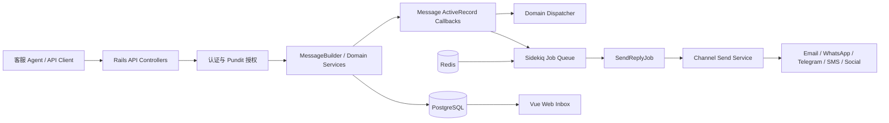
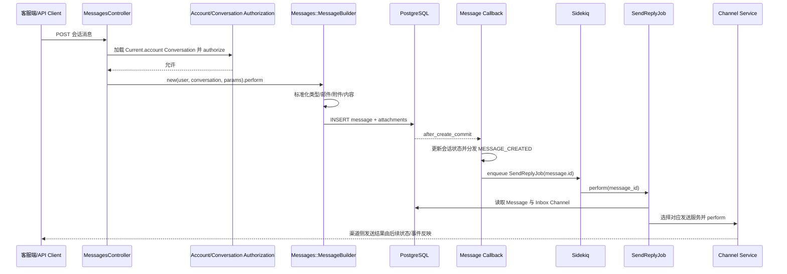
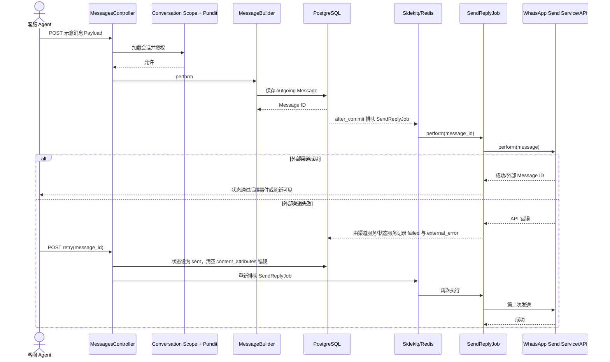

# chatwoot/chatwoot 项目深度解析

## 1. 项目概览

- 报告日期：2026-07-31
- 仓库地址：https://github.com/chatwoot/chatwoot
- Trending 原始排名：7
- Stars Today：53
- 项目定位：可自托管的全渠道客户支持平台，把网站聊天、邮件、社交与消息渠道集中到统一收件箱。
- 解决的问题：客服团队不必在多个渠道间来回切换，消息、联系人、会话、分配、自动化和报表可以在同一系统管理。
- 目标用户：SaaS、互联网服务、企业支持团队、客服外包和需要掌控客户数据的组织。
- 当前成熟度：成熟项目，具备长期维护、多种部署方式、后台任务和多渠道适配。
- 推荐结论：适合需要完整客服业务闭环并能承担 Rails/PostgreSQL/Redis/Sidekiq 运维的团队；渠道凭据、数据合规和容量规划不能靠默认配置蒙混过关。

## 2. 系统架构

### 2.1 架构概览

Chatwoot 是典型的 Rails 业务系统。Rails API 和 Web 应用承接用户与渠道请求，ActiveRecord 把账户、收件箱、会话、消息和附件持久化到 PostgreSQL；消息创建后通过模型回调分发领域事件并把实际外发工作交给 `SendReplyJob`。Sidekiq 从高优先级队列执行任务，再根据 Inbox Channel 类型选择邮件、WhatsApp、Telegram、SMS、Line、Instagram 等发送服务。Redis 为后台任务与运行时能力提供基础支持，前端由 Vue/Vite 体系构建。

### 2.2 架构图

### 2.3 核心模块

| 模块 | 职责 | 代码位置 | 关键依赖 | 证据级别 |
|---|---|---|---|---|
| API Controller | 接收会话消息请求、加载会话、调用 Builder、处理错误与重试 | `app/controllers/api/v1/accounts/conversations/messages_controller.rb` | Rails、Current Context | High |
| Conversation Base Controller | 从当前 Account 加载会话并执行 Pundit 授权 | `app/controllers/api/v1/accounts/conversations/base_controller.rb` | ActiveRecord、Pundit | High |
| MessageBuilder | 标准化消息参数、附件、邮件地址和内容，构建并保存 Message | `app/builders/messages/message_builder.rb` | ActiveRecord、Liquid、附件服务 | High |
| Message Model | 校验、持久化回调、领域事件、等待状态、异步发送调度 | `app/models/message.rb` | ActiveRecord、Dispatcher、ActiveJob | High |
| SendReplyJob | 根据 Channel 类型选择具体发送服务 | `app/jobs/send_reply_job.rb` | Sidekiq/ActiveJob、渠道 Service | High |
| Channel Services | 调用外部渠道 API 或邮件服务发送消息 | `app/services/**/send_on_*_service.rb` | 各渠道 SDK/API | High（映射确认，未逐个服务分析） |
| Web Client | 提供统一收件箱、会话、联系人和管理界面 | `app/javascript/` | Vue、Vite | Medium |
| 部署基础 | Rails、Sidekiq、PostgreSQL、Redis、持久化存储 | `docker-compose.production.yaml` | Docker | High |

### 2.4 数据与状态管理

- `messages` 表保存内容、类型、状态、Sender、Conversation、Inbox、附件关联和外部错误等字段。
- `Message` 状态枚举包括 `sent`、`delivered`、`read`、`failed`；消息类型包括 incoming、outgoing、activity、template。
- 创建消息后会更新 Conversation 的等待时间、首响时间或重新打开状态，具体取决于发送者、消息类型和 Conversation 当前状态。
- PostgreSQL 是核心持久化；Redis 与 Sidekiq 支撑后台任务。可选高级搜索使用 Searchkick/OpenSearch，但不是基础消息发送链路的必选组件。

### 2.5 外部集成与协议

- Rails JSON API：客服端和外部客户端写入/读取会话消息。
- 邮件、WhatsApp、Telegram、Twilio SMS、Line、Instagram、Facebook、TikTok 等渠道 API。
- 文件附件通过 ActiveStorage，可接本地或对象存储。
- Webhook、领域 Dispatcher 和前端实时能力用于通知其他模块；本报告没有把它画成独立外部消息总线。

### 2.6 部署与运行形态

官方生产 Compose 将应用拆为 Rails Web、Sidekiq、PostgreSQL、Redis，并挂载 Storage Volume。README 还提供 Heroku、DigitalOcean Kubernetes 和其他部署入口。真实生产环境通常还需要反向代理、TLS、备份、对象存储、邮件和各渠道凭据。

## 3. 主线流程

### 3.1 核心流程图

### 3.2 关键步骤

1. Controller 通过当前账户的 Conversation Scope 查找会话，并使用 `authorize @conversation, :show?` 验权。
2. `Messages::MessageBuilder` 根据 `message_type` 决定 Sender，处理附件、邮箱地址、邮件 HTML/Text 和 Content Attributes。
3. Builder 调用 `@message.save!`，ActiveRecord 在事务中写入 PostgreSQL。
4. `Message#execute_after_create_commit_callbacks` 更新会话活动、等待时间和首响状态，并分发 `MESSAGE_CREATED`。
5. `Message#send_reply` 将 `SendReplyJob` 放入队列；有附件时延迟两秒，等待 ActiveStorage 完成关联。
6. Job 根据 `message.conversation.inbox.channel.class.to_s` 选择渠道 Service 并执行发送。

### 3.3 异常与失败处理

- 会话不属于当前账户或无权限时，Controller 在进入 Builder 前失败。
- Builder 校验消息内容、JSON Schema、附件数量、邮件地址和短时间消息洪泛；`save!` 失败由 Controller 捕获并返回创建错误。
- 外部渠道失败可以把 Message 状态与 `external_error` 更新为失败；Controller 提供 `retry` 动作，把状态重置为 sent、清空错误并重新排队 `SendReplyJob`。
- Job 找不到映射的 Channel Service 时直接返回，不会凭空发送。

## 4. 典型业务场景端到端执行链路

### 4.1 场景定义

| 项目 | 内容 |
|---|---|
| 场景名称 | 客服 Agent 在现有 WhatsApp 会话中发送回复，首次外发失败后重试 |
| 参与者 | 客服 Agent、Chatwoot Web/API、Rails Controller、MessageBuilder、PostgreSQL、Sidekiq、SendReplyJob、WhatsApp Send Service、外部 WhatsApp API |
| 前置条件 | Account、Inbox、Conversation 和 Agent 已存在；Agent 有会话查看/回复权限；WhatsApp Channel 已配置；Rails、Sidekiq、PostgreSQL、Redis 正常 |
| 输入 | **示意输入**：`{"content":"订单已经重新发出","message_type":"outgoing"}`；字段名称来自 Builder，文本为示意 |
| 期望结果 | Message 被保存并进入发送队列；渠道成功时客户收到回复；若外部 API 首次失败，Agent 可点击重试并再次排队 |
| 成功判定 | 数据库存在对应 outgoing Message；任务已执行；最终 Message 不再保留外部错误，且渠道侧收到消息或返回成功状态 |

### 4.2 端到端时序图

### 4.3 执行步骤追踪

| 步骤 | 输入 | 执行组件 | 关键代码位置 | 状态或数据变化 | 输出 | 失败分支 | 证据级别 |
|---:|---|---|---|---|---|---|---|
| 1 | Account ID、Conversation Display ID、Agent 身份 | Conversation Base Controller | `app/controllers/api/v1/accounts/conversations/base_controller.rb` | 无写入；限定 Account Scope | 已授权 Conversation | 找不到或 Pundit 拒绝，终止请求 | High |
| 2 | **示意 outgoing Payload** | MessagesController | `.../messages_controller.rb#create` | 确定 `Current.user` 或 Resource 作为调用者 | Builder 调用 | StandardError 转为 create error | High |
| 3 | Content、message_type、附件/邮件字段 | MessageBuilder | `app/builders/messages/message_builder.rb` | 构造 Message，标准化 Content Attributes | 可保存的 Message | 非 API Inbox 伪造 incoming、邮件地址或附件校验失败 | High |
| 4 | Message Attributes | ActiveRecord/PostgreSQL | `MessageBuilder#perform`、`app/models/message.rb` | 插入 messages；状态默认 sent；关联 Conversation/Inbox/Account | Message ID | Validation/DB Error，事务不提交 | High |
| 5 | 已提交 Message | Message Callback | `Message#execute_after_create_commit_callbacks` | 会话活动、waiting_since、首响等按条件更新；分发 MESSAGE_CREATED | 领域事件 | Callback 异常会暴露，不应伪装成渠道成功 | High |
| 6 | Message ID | ActiveJob/Sidekiq | `Message#send_reply` | Queue 增加高优先级 Job；附件消息延迟 2 秒 | Job | Redis/Sidekiq 不可用导致任务无法及时消费 | High |
| 7 | Message + Channel Class | SendReplyJob | `app/jobs/send_reply_job.rb` | 选择 WhatsApp Service | Service 调用 | 无映射 Service 时返回；查询 Message 失败则 Job 失败 | High |
| 8 | Channel Credential + Message | WhatsApp Service/API | `app/services/whatsapp/**`（本次未逐文件展开） | 外部渠道产生消息或错误 | 客户收到消息/错误状态 | 网络、Token、模板或渠道 API 错误 | Medium |
| 9 | 失败 Message ID | MessagesController Retry | `messages_controller.rb#retry` | 状态设回 sent，清空错误属性，重新排队 | 新 Job | 再次失败继续暴露错误，未无限自动重试 | High |

### 4.4 关键状态与数据变化

- Request 未授权 → 授权 Conversation。
- 内存中的 Message → PostgreSQL `messages` 记录，默认/指定状态与 Sender 确定。
- Conversation 的 `waiting_since`、`first_reply_created_at` 或状态可能按业务条件变化。
- Queue 从无任务变为包含 `SendReplyJob(message.id)`。
- 渠道失败时 Message 可进入 `failed` 并记录 `external_error`；人工重试把状态恢复为 `sent` 并重新排队。

### 4.5 失败传播、重试与回滚

- Builder 保存失败发生在数据库提交前，不会排队外发任务。
- `after_create_commit` 之后数据库记录已存在；此后渠道失败不回滚消息，而是用状态和错误字段表示投递结果。
- `retry` 是显式业务重试：状态更新、错误清理、重新入队。它不是无限自动循环，避免渠道故障时失控重复发送。
- 外部渠道是否支持幂等取决于具体 Service 和 API；本次没有找到统一跨渠道幂等键承诺，因此重复发送风险需要渠道级验证。

### 4.6 最终业务结果

客服 Agent 的回复先成为可审计的 Chatwoot Message，再异步发往目标渠道。即使外部 API 暂时失败，会话和消息记录仍保留，Agent 能看见失败并执行重试。对用户而言，最终结果不是“按钮点了没报错”，而是目标渠道实际收到消息，或系统明确显示失败原因。

### 4.7 最小复现与验证方法

1. 使用官方 Docker Compose 启动 Rails、Sidekiq、PostgreSQL 与 Redis。
2. 创建 Account、Agent、WhatsApp 测试 Inbox 和 Conversation；也可先用 API Channel 验证基础 Message 创建。
3. 调用会话消息 API，发送一条 **示意 outgoing 文本**，确认数据库 Message 和 Sidekiq Job。
4. 在测试渠道凭据正确时确认成功投递。
5. 失败验证：使用无效测试 Token 或受控 Stub 让渠道 Service 返回错误，确认 Message 显示失败；调用 Retry 后修正凭据，确认重新排队与成功发送。

## 5. 技术栈

| 层次 | 技术 | 用途 | 是否核心 | 证据位置 |
|---|---|---|---|---|
| 语言与运行时 | Ruby 3.4、JavaScript/TypeScript | 后端业务与前端应用 | 是 | `Gemfile`、前端目录 |
| 服务框架 | Rails 7.1、Puma | API、MVC、ActiveJob、ActiveRecord | 是 | `Gemfile` |
| 前端 | Vue、Vite Rails | 统一收件箱与管理 UI | 是 | README、`app/javascript/`、Gemfile |
| 数据 | PostgreSQL | Account、Inbox、Conversation、Message 等持久化 | 是 | Message Schema、Compose |
| 缓存/任务 | Redis、Sidekiq | 后台任务和队列 | 是 | Gemfile、Compose |
| 领域事件 | Wisper/Dispatcher | Message Created、First Reply 等进程内领域事件 | 是 | Gemfile、Message Model |
| 文件 | ActiveStorage + S3/Azure/GCS | 附件与媒体存储 | 可选核心 | Gemfile、MessageBuilder |
| 通信 | JSON API、渠道 HTTP API、Webhook | 客户端与外部渠道集成 | 是 | Controllers、Send Services |
| 部署 | Docker Compose、Kubernetes/云平台 | Web、Worker、DB、Redis 部署 | 是 | README、Compose |
| 可观测性 | Rails Logging，可选 Sentry/APM | 错误与性能监控 | 可选 | Gemfile |

## 6. 创新点

### 创新点 1

- 类型：工程整合创新
- 传统方案：每个客户渠道各用一个后台和独立数据模型。
- 当前方案：以 Account/Inbox/Conversation/Message 为统一域模型，再由 Channel Service 适配外部平台。
- 实际收益：客服在一个会话界面处理多渠道消息，核心业务逻辑可复用。
- 证据：Message、Conversation、Inbox 关联与 `SendReplyJob::CHANNEL_SERVICES`。
- 局限：渠道差异仍会渗入模板、状态、媒体和错误处理，不能假装所有平台完全一致。

### 创新点 2

- 类型：架构与可靠性整合
- 传统方案：请求线程直接调用外部渠道，网络慢或失败会拖住用户请求。
- 当前方案：先持久化 Message，再在 `after_create_commit` 后通过 Sidekiq 异步投递。
- 实际收益：记录与外发解耦，失败可见且可重试。
- 证据：`MessageBuilder#save!`、`Message#send_reply`、`SendReplyJob`。
- 局限：需要 Redis/Sidekiq 运维；跨渠道幂等和最终一致性仍需额外治理。

### 创新点 3

- 类型：业务工作流创新
- 传统方案：投递失败常只留在日志里，客服不知道该做什么。
- 当前方案：Message 状态和 `external_error` 进入业务模型，并提供显式 Retry Controller 动作。
- 实际收益：失败从运维事件变成可操作的客服工作流。
- 证据：Message Status、StatusUpdateService 调用和 Controller Retry。
- 局限：根因修复仍依赖渠道配置；盲目重试可能造成重复消息。

## 7. 应用场景

### 适合

- 多渠道 SaaS 客服与用户成功团队。
- 需要自托管、数据主权和可扩展 API 的企业支持系统。
- 需要会话、联系人、分配、自动化和报表一体化的团队。

### 可以尝试

- 大规模客服中心，但需压测消息峰值、Sidekiq Queue、数据库索引和渠道限流。
- 深度定制渠道或内部系统集成，需要维护自定义 Channel Service/Webhook。
- AI 客服 Captain 与知识库场景，需要额外验证答案质量、权限和成本。

### 暂不建议

- 没有能力维护 PostgreSQL、Redis、后台任务、备份和升级的极小团队直接自托管生产。
- 在未完成隐私、数据保留和渠道合规评估前处理敏感客户数据。
- 把所有外部渠道状态视为同步且完全一致。

## 8. 第一次阅读与验证建议

1. 先读 README 的产品范围、Branching Model 和 Deployment。
2. 再看 `docker-compose.production.yaml`，明确 Rails/Sidekiq/PostgreSQL/Redis 边界。
3. 从 `messages_controller.rb` → `message_builder.rb` → `message.rb` → `send_reply_job.rb` 追一条 outgoing 链路。
4. 阅读一个具体 Channel Send Service，并查看相关测试。
5. 通过测试 Inbox 复现成功、外部 API 失败和 Retry，确认数据库状态与队列行为。

## 9. 风险与限制

- 安全：需要保护渠道 Token、客户 PII、附件和管理员权限；外部 Webhook 必须验证来源。
- 性能：消息峰值会同时压到 PostgreSQL、Redis、Sidekiq 和外部 API；需监控 Queue Lag 与慢查询。
- 许可证：核心仓库 MIT；集成服务、品牌、云产品和第三方 SDK 条款需分别核验。
- 维护状态：活跃成熟，但大版本升级、数据库迁移和渠道 API 变化会带来运维成本。
- 生产可用性：具备生产形态，不代表默认 Compose 配置就是高可用架构；备份、冗余、TLS 和监控需自行补齐。

## 10. Evidence Notes

- README 确认全渠道客服定位、自托管、主要功能和部署入口。
- `Gemfile` 确认 Rails、PostgreSQL、Redis、Sidekiq、Pundit、渠道 SDK、对象存储和可选 APM。
- `MessagesController` 与 Base Controller 确认 Account Scope、Conversation 授权、创建和 Retry 入口。
- `Messages::MessageBuilder` 确认消息参数、附件、邮件内容处理与 `save!`。
- `Message` 模型确认 Schema、状态枚举、创建后事件、会话状态更新和异步投递。
- `SendReplyJob` 确认 Channel 类型到具体发送服务的映射。
- `docker-compose.production.yaml` 确认 Rails、Sidekiq、PostgreSQL、Redis 和 Storage Volume。

## 11. Honest Caveat

本次没有连接真实 WhatsApp、邮件或社交平台，也没有逐个审查所有 Channel Service 的幂等、速率限制和状态回写。Controller → Builder → PostgreSQL → Model Callback → Sidekiq → SendReplyJob 的主链路由源码直接确认；具体外部渠道成功回执和实时前端更新只按公开接口边界描述，因此没有把所有渠道细节涂成一锅“统一成功”。

## 12. 可信度

- Architecture Confidence: High
- Flow Confidence: High
- Innovation Confidence: Medium