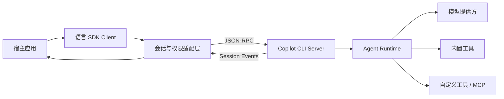
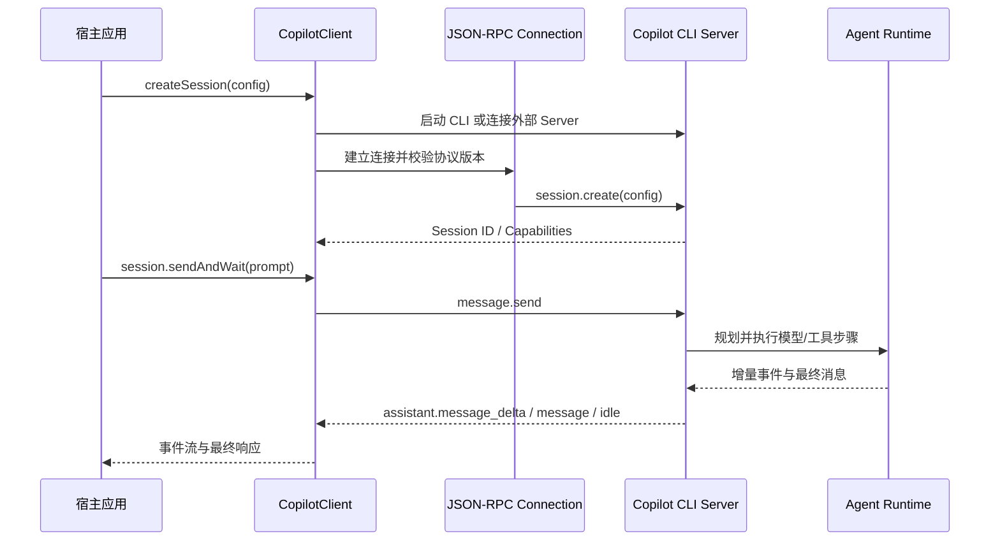
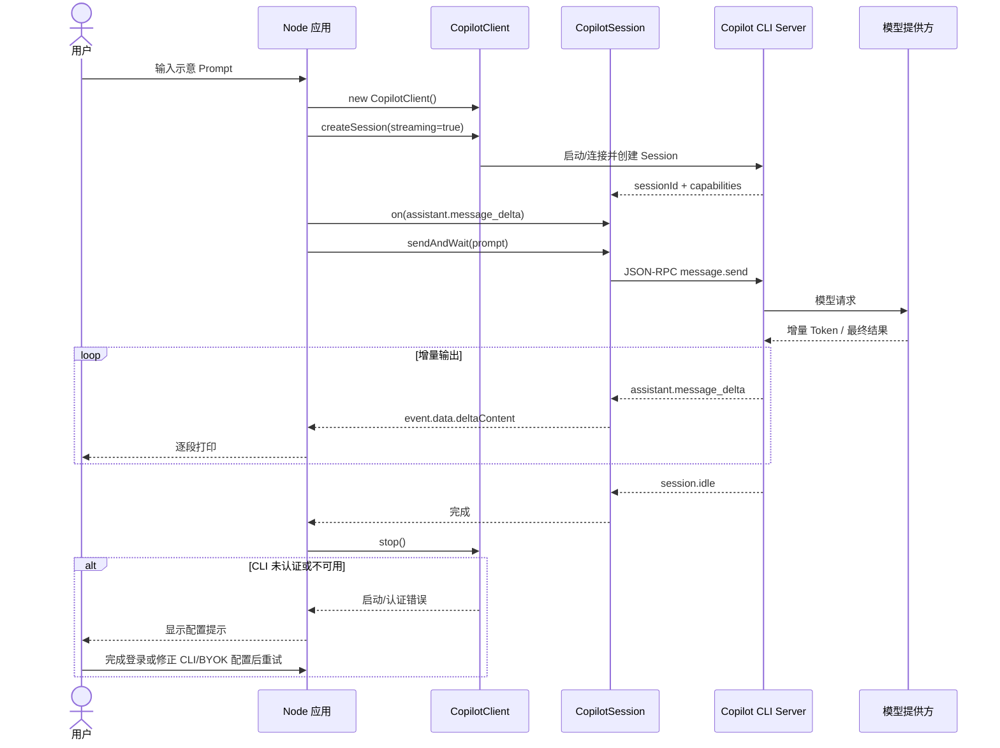

# github/copilot-sdk 项目深度解析

## 1. 项目概览

- 报告日期：2026-07-31
- 仓库地址：https://github.com/github/copilot-sdk
- Trending 原始排名：6
- Stars Today：7
- 项目定位：把 GitHub Copilot CLI 背后的 Agent Runtime 以多语言 SDK 形式嵌入应用与服务。
- 解决的问题：应用开发者不必从零实现会话、规划、工具调用、权限、流式事件和 CLI 生命周期管理。
- 目标用户：开发工具、内部平台、桌面应用、后端服务和 Agent 产品的工程团队。
- 当前成熟度：官方标记为 GA，按语义化版本发布；不同语言的打包和 CLI 分发方式仍有差异。
- 推荐结论：适合希望在产品中正式嵌入 Copilot Agent 工作流的团队；权限、认证、计费和运行时隔离必须由宿主应用认真设计。

## 2. 系统架构

### 2.1 架构概览

仓库不是一个单体服务，而是围绕同一 JSON-RPC 协议维护 Python、TypeScript、Go、.NET、Java 和 Rust 客户端。宿主应用调用语言 SDK；SDK 创建或连接 Copilot CLI 的 Server Mode，注册会话级回调和工具处理器；CLI Runtime 负责模型交互、规划、工具调用与事件生成，再通过 JSON-RPC 把状态和结果返回 SDK。

Node.js 实现可直接拉起随包分发的 Copilot CLI 平台包，也可连接外部 CLI Server。`CopilotClient` 管理进程、Socket/流式 JSON-RPC 连接、协议版本与会话；`CopilotSession` 管理单次会话、事件、消息、权限、工具和取消。

### 2.2 架构图

### 2.3 核心模块

| 模块 | 职责 | 代码位置 | 关键依赖 | 证据级别 |
|---|---|---|---|---|
| 多语言 SDK | 暴露各语言一致的 Client、Session、消息和事件概念 | `nodejs/`、`python/`、`go/`、`dotnet/`、`java/`、`rust/` | 各语言运行时 | High |
| Node Client | 拉起或连接 CLI Server，建立 JSON-RPC，创建/恢复会话，管理进程生命周期 | `nodejs/src/client.ts` | `vscode-jsonrpc`、Node child_process/net | High |
| Node Session | 发送消息、订阅事件、处理权限/工具/MCP 回调、取消和会话状态 | `nodejs/src/session.ts` | 生成的 RPC Client、事件类型 | High |
| 生成协议层 | 把 CLI 的 RPC API 映射为类型安全调用与通知 | `nodejs/src/generated/rpc.ts` 等生成目录 | JSON-RPC Schema/代码生成 | High |
| 类型与权限接口 | 定义 SessionConfig、PermissionHandler、Tool、Event、Provider 等公共契约 | `nodejs/src/types.ts` | TypeScript 类型、Zod/JSON Schema | High |
| CLI Runtime | 执行 Agent 规划、模型请求、工具调用和文件操作 | 外部/捆绑 `@github/copilot` CLI 包 | Copilot CLI、模型服务 | High（接口确认，CLI 内部实现不在本仓库） |
| 示例与测试 | 验证会话、配置、事件、取消、权限和多语言调用 | `docs/getting-started.md`、`nodejs/test/e2e/`、各语言 README/测试 | Vitest 等 | High |

### 2.4 数据与状态管理

- 会话状态由 Copilot CLI Runtime 持有，SDK 通过 Session ID 创建、恢复或连接会话。
- SDK 进程内保存事件订阅、权限处理器、自定义工具回调和 Provider Token Callback。
- 会话持久化能力由 CLI 与 Session API 提供；本仓库没有证据表明 SDK 自己维护独立数据库。
- 大型工具输出可配置落盘目录；文件系统适配器可以由宿主提供，但不能把它等同于统一持久化数据库。

### 2.5 外部集成与协议

- SDK 与 CLI Server：JSON-RPC，Node 实现使用 `vscode-jsonrpc`。
- 模型：Copilot 可用模型，或通过 BYOK 连接支持的提供方。
- 工具：CLI 内置工具、自定义 Tool、MCP Server、Hooks。
- 认证：Copilot CLI 已登录凭据、GitHub OAuth App Token、环境变量 Token 或 BYOK Key。

### 2.6 部署与运行形态

- Node.js、Python、.NET 默认可随 SDK 管理捆绑 CLI；Go、Java、Rust通常需要 PATH 中已有 CLI，部分语言也提供应用级打包能力。
- 可以由每个应用实例拉起本地 CLI 进程，也可以让多个 SDK Client 连接外部 CLI Server。
- 官方提供 Backend Services 与 Scaling 文档，但实际隔离、并发、凭据和资源配额仍由宿主系统负责。

## 3. 主线流程

### 3.1 核心流程图

### 3.2 关键步骤

1. 宿主构造 `CopilotClient`，可传入 CLI 路径、外部连接、Telemetry 和认证选项。
2. Client 解析捆绑 CLI 或外部地址，启动进程/Socket，创建 JSON-RPC Connection，并验证最低协议版本。
3. `createSession` 把模型、工具过滤、权限处理器、MCP、Provider 和系统消息配置转换为可序列化 RPC Payload。
4. `CopilotSession.send` 或 `sendAndWait` 提交 Prompt；CLI Runtime 生成事件。
5. SDK 将流式 Delta、完整消息、工具调用、权限请求、错误和 Idle 状态分发给应用。
6. 应用停止时断开 Session，并调用 `client.stop()` 回收由 SDK 启动的 CLI 进程。

### 3.3 异常与失败处理

- 找不到平台 CLI 包或指定二进制时，Client 抛出带安装/配置提示的错误。
- Server 协议版本低于最低版本时拒绝连接，避免静默不兼容。
- JSON-RPC 连接断开、请求超时或 Runtime 退出会向 Session/Client 传播异常。
- 工具权限可以批准、拒绝或自定义；拒绝后 Runtime 不应执行对应工具。
- 取消和硬 Runtime 错误会继续向上传播，源码明确避免把取消误写成成功的 `null` 结果。

## 4. 典型业务场景端到端执行链路

### 4.1 场景定义

| 项目 | 内容 |
|---|---|
| 场景名称 | Node.js 应用创建 Copilot 会话并流式回答一个简单问题 |
| 参与者 | 用户、Node.js 宿主应用、CopilotClient、CopilotSession、Copilot CLI Server、模型提供方 |
| 前置条件 | Node.js 20+；安装 `@github/copilot-sdk`；CLI 可用并已认证，或配置 BYOK；网络可访问相应模型服务 |
| 输入 | **示意输入**：`Tell me a short joke`；该句来自官方 Getting Started 的流式示例 |
| 期望结果 | 应用逐段打印回答，收到 `session.idle` 后结束当前轮次 |
| 成功判定 | 至少收到一条 `assistant.message_delta` 或完整 `assistant.message`，随后收到会话空闲事件，进程正常调用 `client.stop()` |

### 4.2 端到端时序图

### 4.3 执行步骤追踪

| 步骤 | 输入 | 执行组件 | 关键代码位置 | 状态或数据变化 | 输出 | 失败分支 | 证据级别 |
|---:|---|---|---|---|---|---|---|
| 1 | SDK Client Options | 宿主应用 / CopilotClient | `docs/getting-started.md`、`nodejs/src/client.ts` | 创建客户端对象，尚未建立会话 | Client 实例 | CLI 包无法解析，抛出安装或路径错误 | High |
| 2 | SessionConfig：`streaming: true`、模型等 | CopilotClient | `nodejs/src/client.ts` | 启动/连接 CLI，建立 JSON-RPC，创建 Session ID | CopilotSession | 认证失败、协议版本不兼容、连接失败 | High |
| 3 | 事件处理函数 | CopilotSession | `nodejs/src/session.ts`、Getting Started | 注册 `assistant.message_delta` 与 `session.idle` 监听 | Subscription | 处理器自身异常由宿主负责 | High |
| 4 | **示意 Prompt** | `sendAndWait` | `docs/getting-started.md`、`nodejs/src/session.ts` | Prompt 进入 CLI 会话 | RPC 请求 | 请求超时、连接断开、取消 | High |
| 5 | Prompt + Session Context | Copilot CLI Runtime | README Architecture（CLI 内部源码不在本仓库） | Runtime 调用模型并生成事件 | Delta / Message | 模型提供方错误或额度不足向上返回 | Medium |
| 6 | Delta Event | Session Event Dispatcher | `nodejs/src/session.ts` | 应用输出缓冲区持续增加 | 用户看到流式文本 | Event Handler 错误不应被当作模型成功 | High |
| 7 | Idle Event | CopilotSession | Getting Started | 当前轮次标记完成 | 最终响应 | 未收到 Idle 时由调用超时/取消策略处理 | High |
| 8 | Stop | CopilotClient | `nodejs/src/client.ts` | 断开 Connection；回收 SDK 启动的 CLI 子进程 | 资源释放 | 子进程未及时退出时进入超时/强制回收逻辑 | High |

### 4.4 关键状态与数据变化

- `未连接` → `CLI 已启动/外部 Server 已连接`。
- `无会话` → `Session ID 已建立`。
- `等待输入` → `请求执行中` → 多个 `assistant.message_delta` → `session.idle`。
- 宿主输出缓冲区随 Delta 增长；本场景未发现 SDK 自己写入业务数据库。
- 结束时 Connection 和由 SDK 管理的 CLI 进程被释放。

### 4.5 失败传播、重试与回滚

- CLI 不存在、认证无效或 Server 无法连接时，Session 不会创建，错误直接返回宿主；用户修正安装、登录、Token 或 BYOK 配置后重新创建 Client/Session。
- 工具调用被 Permission Handler 拒绝时，只阻断该工具动作；应用可把拒绝原因反馈给用户或让 Agent 改走无权限方案。
- 已发送请求可取消；取消属于失败终态，不应被包装成成功响应。
- 本场景没有数据库事务，因此没有业务回滚；清理重点是关闭会话、连接和子进程。

### 4.6 最终业务结果

用户在宿主应用中看到 Copilot 的流式回答，而应用开发者只处理 Client、Session 和事件，不必自己实现模型流、Agent Runtime 和 JSON-RPC 细节。失败时用户得到明确的认证、CLI、权限或连接错误，而不是一段假装成功的空文本。

### 4.7 最小复现与验证方法

1. 按官方 Getting Started 创建 Node.js 工程并安装 `@github/copilot-sdk` 与 `tsx`。
2. 确认 Copilot CLI 已认证，或配置官方支持的 BYOK。
3. 复制官方流式示例，运行 `npx tsx index.ts`。
4. 验证输出是逐段出现，并在结束时进入 `session.idle`。
5. 失败验证：临时提供无效 CLI 路径或撤销认证，确认 Session 创建失败且应用收到错误；修正后重新运行。

## 5. 技术栈

| 层次 | 技术 | 用途 | 是否核心 | 证据位置 |
|---|---|---|---|---|
| 语言与运行时 | TypeScript/Node、Python、Go、.NET、Java、Rust | 提供多语言 SDK | 是 | 根 README、各语言目录 |
| 协议 | JSON-RPC | SDK 与 Copilot CLI Server 通信 | 是 | README Architecture、`nodejs/src/client.ts` |
| Node 通信 | `vscode-jsonrpc`、Stream/Socket | 创建 MessageConnection、RPC Reader/Writer | 是 | `nodejs/package.json`、`nodejs/src/client.ts` |
| Agent Runtime | Copilot CLI Server | 规划、模型调用、工具执行、事件生成 | 是 | README；捆绑 `@github/copilot` 依赖 |
| 类型/校验 | TypeScript、Zod、JSON Schema | 工具参数和公共 API 契约 | 是 | `nodejs/package.json`、`client.ts` |
| 扩展协议 | MCP、自定义 Tool、Hooks | 接入外部能力与执行策略 | 可选核心 | README、docs/features |
| 测试 | Vitest、E2E Tests | 会话、配置、事件、取消与 RPC 验证 | 否 | `nodejs/test/e2e/`、package scripts |
| 构建发布 | esbuild、npm/PyPI/NuGet/Maven/crates | 各语言包构建与分发 | 是 | `nodejs/package.json`、根 README |

## 6. 创新点

### 创新点 1

- 类型：工程整合创新
- 传统方案：应用团队分别拼装模型 SDK、Agent Loop、工具执行、会话与事件协议。
- 当前方案：复用 Copilot CLI 的 Agent Runtime，并用多语言 SDK 暴露一致抽象。
- 实际收益：减少重复编排代码，应用更快接入成熟的规划和工具能力。
- 证据：根 README 的 Architecture 与各语言 SDK；Node Client/Session 实现。
- 局限：Runtime 是外部/捆绑 CLI，调试和版本兼容仍跨越进程与包边界。

### 创新点 2

- 类型：协议与开发体验创新
- 传统方案：Agent 只能作为独立 CLI 使用，应用难以获得结构化事件和权限回调。
- 当前方案：通过 JSON-RPC 暴露 Session、Streaming Event、Permission、Tool、MCP 和 Hook。
- 实际收益：宿主应用可以把 Agent 变成产品内的可控组件。
- 证据：`client.ts`、`session.ts`、生成 RPC 和 Getting Started。
- 局限：公共协议和 CLI 版本必须协同升级；外部 Server 部署需要额外运维。

### 创新点 3

- 类型：安全工作流创新
- 传统方案：默认执行所有工具，权限常写死在 Prompt 或外围脚本。
- 当前方案：Session 级 Permission Handler、工具过滤和 Pre-tool Hooks 可在执行边界批准或拒绝。
- 实际收益：应用可以实施按用户、工具和场景区分的权限策略。
- 证据：README FAQ、公共 Types 和权限文档。
- 局限：框架提供闸门，不替应用定义正确策略；`approve all` 只适合受控示例。

## 7. 应用场景

### 适合

- 开发工具中嵌入代码分析、修改和测试 Agent。
- 内部平台通过结构化事件管理 Copilot 会话。
- 需要自定义工具、MCP 或审批策略的 Agent 产品。

### 可以尝试

- 多租户后台 Agent 服务，但需隔离 CLI 进程、工作目录、Token 和资源配额。
- 长时任务与会话恢复，需要验证持久化、取消和外部 Server 扩缩容。
- BYOK 企业接入，需要单独评估密钥存储和提供方兼容性。

### 暂不建议

- 无权限隔离就让 Agent 访问生产文件系统或高风险工具。
- 把 SDK 当作无需 Copilot/BYOK 认证和成本控制的免费 Runtime。
- 在没有协议兼容测试的情况下混用任意 CLI 与 SDK 版本。

## 8. 第一次阅读与验证建议

1. 先读根 README 的 Architecture、认证和 CLI 分发差异。
2. 按 `docs/getting-started.md` 跑最小消息和流式示例。
3. 选择一种语言，阅读 Client 与 Session；Node 可从 `nodejs/src/client.ts`、`session.ts` 开始。
4. 查看 `nodejs/test/e2e/` 中 Session Config、Request Handler、Cancel 和 Event 测试。
5. 再读权限、Hooks、MCP、Session Persistence 和 Scaling 文档，并模拟拒绝权限、断连和取消。

## 9. 风险与限制

- 安全：默认工具能力较强，宿主必须实现最小权限、工作目录隔离、危险命令审批和凭据保护。
- 性能：每实例 CLI 进程的内存、启动和并发成本需压测；外部 Server 模式也需容量规划。
- 许可证：仓库为 MIT；模型、Copilot 订阅、第三方 Provider 与工具仍受各自条款约束。
- 维护状态：官方活跃维护且标记 GA，但多语言 SDK 可能存在功能到达时间差。
- 生产可用性：Runtime 具备生产定位，不代表宿主应用自动获得多租户隔离、审计和故障恢复。

## 10. Evidence Notes

- 根 README 明确六种 SDK、JSON-RPC 架构、CLI 生命周期、认证、BYOK、工具与 GA 状态。
- `nodejs/src/client.ts` 证实 Node Client 拉起/连接 CLI、使用 `vscode-jsonrpc`、校验协议和管理进程。
- `nodejs/src/session.ts` 证实 Session Event、权限、工具、取消和硬错误传播机制。
- `docs/getting-started.md` 提供官方最小消息、流式事件和多语言运行示例。
- `nodejs/package.json` 证实 `@github/copilot`、`vscode-jsonrpc`、Zod、构建与测试依赖。
- CLI Runtime 的内部规划和模型实现不在本仓库；分析只确认其公开接口与 SDK 调用边界。

## 11. Honest Caveat

本次没有运行真实 Copilot 订阅或 BYOK 请求，也没有独立压测多会话、外部 CLI Server、工具审批延迟和断线恢复。架构与 SDK 调用链由源码和官方示例交叉确认；CLI Runtime 内部的规划、模型路由和工具实现只能按官方接口说明描述，不能假装已经逐行审完另一个分发包。

## 12. 可信度

- Architecture Confidence: High
- Flow Confidence: High
- Innovation Confidence: Medium