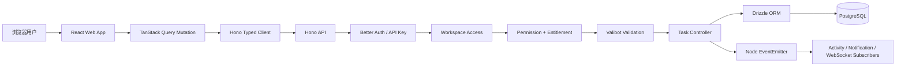
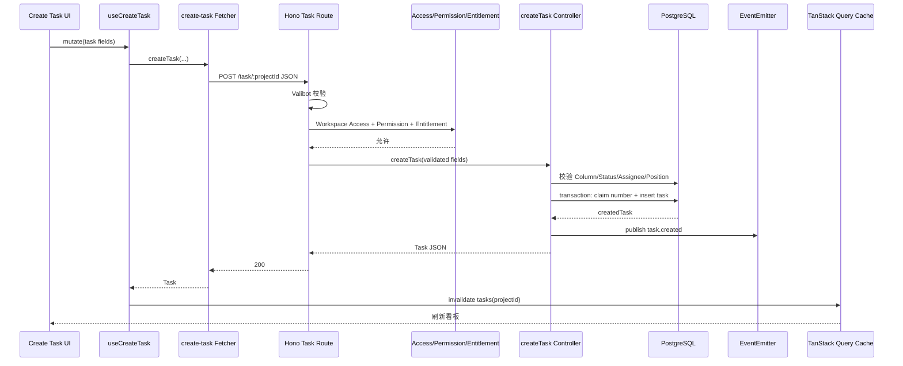
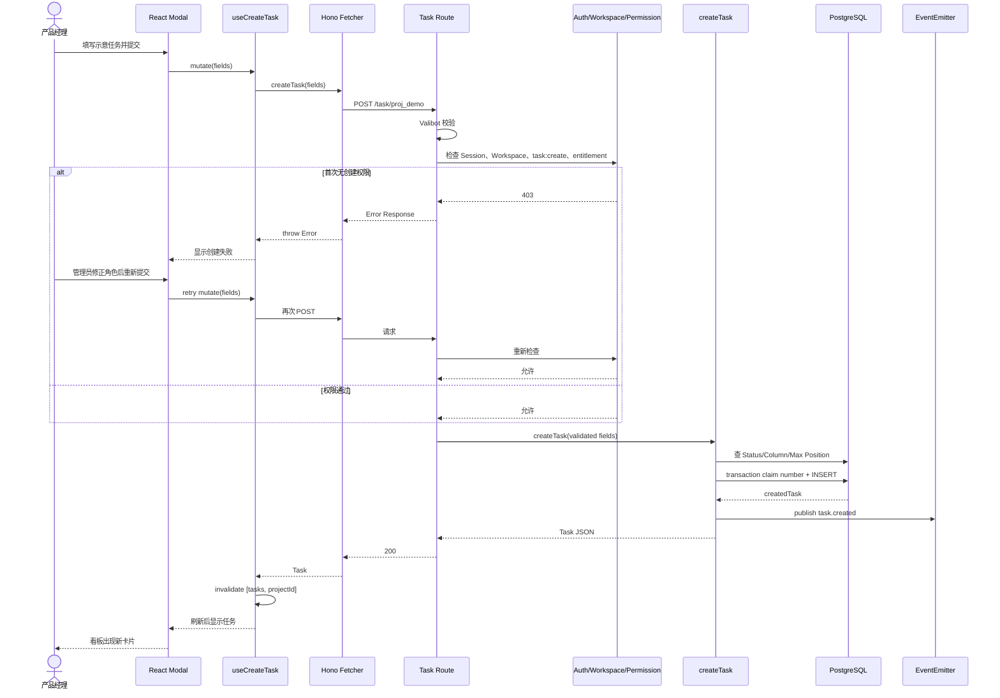

# usekaneo/kaneo 项目深度解析

## 1. 项目概览

- 报告日期：2026-07-31
- 仓库地址：https://github.com/usekaneo/kaneo
- Trending 原始排名：9
- Stars Today：188
- 项目定位：轻量、可自托管的项目管理平台，围绕工作区、项目、列、任务和协作事件组织产品研发。
- 解决的问题：减少传统项目管理工具的复杂配置和界面负担，同时保留权限、API、任务状态和自托管能力。
- 目标用户：小中型产品团队、内部研发团队、自托管用户和需要开放 API 的组织。
- 当前成熟度：快速迭代中的可用产品，提供 Docker、分离镜像、Helm、Cloud 与 API；高级功能和 entitlement 边界仍在演进。
- 推荐结论：适合重视简洁、自托管和可扩展 API 的团队；权限、数据库备份、事件扩展和版本迁移必须在生产前验证。

## 2. 系统架构

### 2.1 架构概览

Kaneo 是 pnpm/Turbo Monorepo。Web 应用使用 React 体系和 TanStack Query，通过 Hono 类型化 Client 调用 API；API 由 Node.js + Hono 提供，Valibot 和 Hono OpenAPI 负责请求校验与接口描述，Better Auth/API Key 处理身份，工作区中间件与权限模块处理资源边界。领域数据由 Drizzle ORM 写入 PostgreSQL。

任务创建成功后，API 通过 Node.js `EventEmitter` 发布 `task.created` 进程内事件。该事件总线不是 Redis、Kafka 或外部队列；扩展订阅者和 WebSocket 通知可以监听事件，但跨进程可靠性不能凭目录名脑补。部署上可使用包含 Web/API 的 Kaneo 镜像加 PostgreSQL，也可用分离镜像或 Helm。

### 2.2 架构图

### 2.3 核心模块

| 模块 | 职责 | 代码位置 | 关键依赖 | 证据级别 |
|---|---|---|---|---|
| Web UI | 工作区、看板、任务表单和交互 | `apps/web/src/` | React、TanStack Query | High |
| Create Task Modal/Mutation | 收集字段、调用 Fetcher，成功后使任务查询失效并刷新 | `apps/web/src/components/shared/modals/create-task-modal.tsx`、`apps/web/src/hooks/mutations/task/use-create-task.ts` | TanStack Query | High |
| Typed Fetcher | 使用 Hono Client 发送 `POST /task/:projectId` 并把非 2xx 转为 Error | `apps/web/src/fetchers/task/create-task.ts` | `@kaneo/libs`、Hono Client | High |
| API Entry | 组装 Hono、CORS、认证、OpenAPI、WebSocket 和领域路由 | `apps/api/src/index.ts` | Hono、Better Auth、Sentry | High |
| Task Routes | 定义任务 CRUD、Valibot Schema、Workspace Access、Permission 与 Entitlement | `apps/api/src/task/index.ts` | Hono OpenAPI、Valibot | High |
| Create Task Controller | 校验状态，解析 Assignee/Column/Position，在事务中分配编号并插入任务 | `apps/api/src/task/controllers/create-task.ts` | Drizzle ORM | High |
| Database Layer | Schema、连接、迁移与 PostgreSQL 操作 | `apps/api/src/database/` | Drizzle、pg | High |
| Event Bus | 发布和订阅进程内领域事件，附加 initiatorId | `apps/api/src/events/index.ts` | Node EventEmitter、AsyncLocalStorage | High |
| 权限层 | 验证工作区访问、角色操作权限和商业 entitlement | `apps/api/src/utils/workspace-access-middleware.ts`、`require-workspace-permission`、billing middleware | Better Auth、permissions package | High |
| 部署 | 单 Kaneo 镜像 + PostgreSQL、分离镜像、Helm | README、`charts/kaneo/` | Docker、Kubernetes | High |

### 2.4 数据与状态管理

- PostgreSQL 保存 Workspace、Project、Column、Task、User、Label、Comment 等领域数据。
- `createTask` 先查询 Assignee 名称、目标 Column 和当前最大 Position，然后在 Drizzle Transaction 内分配 Task Number 并插入任务。
- Web 端使用 TanStack Query 缓存任务列表；创建成功后使 `['tasks', projectId]` 查询失效并重新获取。
- `task.created` 通过进程内 EventEmitter 发布，不具备外部消息队列的持久化和跨进程保证。
- API 依赖中出现 Redis，但本次任务创建主链路没有证据表明必须经过 Redis，因此未将 Redis画入主流程。

### 2.5 外部集成与协议

- Web ↔ API：HTTP JSON，Hono 类型化 Client；API 可导出 OpenAPI。
- 认证：Better Auth、Session、API Key。
- 集成：GitHub、Gitea、Slack、Discord、Telegram、通用 Webhook、MCP 等路由在 API Entry 注册。
- 实时：Hono WebSocket 模块与仓库内 WS Adapter；本次只确认入口和适配层存在，没有把每个任务事件都断言为必然广播。
- 文件：可选 S3 兼容对象存储用于任务资产。

### 2.6 部署与运行形态

- 快速部署：`drim setup`。
- Docker Compose：`kaneo` 容器 + PostgreSQL 16，应用默认监听 5173。
- 高级部署：独立 API/Web 镜像和 Kubernetes Helm Chart。
- 生产必需配置包括 PostgreSQL 密码、`AUTH_SECRET`、客户端 URL/CORS、可选对象存储和集成凭据。

## 3. 主线流程

### 3.1 核心流程图

### 3.2 关键步骤

1. 用户在创建任务 Modal 中填写标题、描述、状态、优先级、日期和负责人。
2. `useCreateTask` 调用 Fetcher；Fetcher 通过 Hono Client 向 `POST /task/:projectId` 发送 JSON。
3. Route 用 Valibot 校验字段，随后执行工作区访问、`task:create` 权限与 entitlement 检查。
4. Controller 验证 Status 是否属于项目，查找 Assignee、Column 和同列最大 Position。
5. Drizzle Transaction 内分配递增 Task Number，插入 Task 并返回记录。
6. API 发布 `task.created`，返回 JSON；Web 使任务查询缓存失效，重新获取看板数据。

### 3.3 异常与失败处理

- Web Fetcher 在缺少 Project ID 时本地抛错，不发请求。
- 非 2xx Response 被 Fetcher 读取为文本并抛给 TanStack Mutation，UI 可显示失败。
- Valibot 字段不合法、未登录、无工作区访问、无任务创建权限或 entitlement 不满足时，请求在 Controller 前终止。
- Status/Column 不合法时 `assertValidTaskStatus` 抛错。
- 事务中的编号分配或 INSERT 失败会回滚任务创建。
- 任务已提交后，Event Subscriber 错误被订阅包装器记录，不回滚已创建任务；这属于“数据成功、派生动作降级”。

## 4. 典型业务场景端到端执行链路

### 4.1 场景定义

| 项目 | 内容 |
|---|---|
| 场景名称 | 产品经理在项目看板创建高优先级任务，并在权限失败后修正角色重试 |
| 参与者 | 产品经理、React Web、TanStack Query、Hono Client、Hono API、认证与工作区权限中间件、Task Controller、PostgreSQL、进程内 Event Bus |
| 前置条件 | 用户已登录并属于目标 Workspace；Project 和目标 Column 已存在；API、PostgreSQL 正常；成功路径下角色拥有 `task:create` 权限与 entitlement |
| 输入 | **示意输入**：标题“修复结账页重复扣款”、描述“复现并补充回归测试”、状态 `to-do`、优先级 `high`、Project ID `proj_demo`；字段格式来自源码，值均为示意 |
| 期望结果 | 新任务获得项目内编号与末尾 Position，返回到 Web，任务列表缓存失效并显示新卡片 |
| 成功判定 | API 返回 200 Task JSON；PostgreSQL 中存在该 Task；Task Number 唯一；刷新任务查询后看板出现新任务 |

### 4.2 端到端时序图

### 4.3 执行步骤追踪

| 步骤 | 输入 | 执行组件 | 关键代码位置 | 状态或数据变化 | 输出 | 失败分支 | 证据级别 |
|---:|---|---|---|---|---|---|---|
| 1 | **示意任务字段** | Create Task Modal | `apps/web/src/components/shared/modals/create-task-modal.tsx` | 表单本地状态形成 | Submit Action | 必填字段未满足时 UI 阻止或后端拒绝 | High |
| 2 | 字段 + Project ID | `useCreateTask` | `apps/web/src/hooks/mutations/task/use-create-task.ts` | Mutation 进入 pending | Fetcher Promise | 网络/Fetcher Error 进入 mutation error | High |
| 3 | Project ID + JSON | Fetcher | `apps/web/src/fetchers/task/create-task.ts` | 发出 HTTP POST | Response | Project ID 为空本地 Error；非 2xx 转 Error | High |
| 4 | Route Param + JSON | Hono/Valibot | `apps/api/src/task/index.ts` | 输入变为校验后的 typed values | Validated Request | 字段类型/优先级不合法，4xx | High |
| 5 | 用户与 Project | Workspace Access/Permission/Entitlement | Task Route 中间件链 | 无业务写入；确认访问决策 | 允许/拒绝 | 401/403；用户修正身份或角色后重试 | High |
| 6 | Status/Project/User | createTask Controller | `apps/api/src/task/controllers/create-task.ts` | 查询 Assignee、Column、Max Position | resolvedStatus、nextPosition | Status 不属于项目，抛错 | High |
| 7 | Task Values | Drizzle Transaction | 同上、`claim-task-numbers` | 分配 Task Number；INSERT Task；事务提交 | createdTask | 编号/数据库失败，事务回滚 | High |
| 8 | createdTask | Event Bus | `apps/api/src/events/index.ts` | 发布 `task.created`，附加 initiatorId | 订阅者收到内存事件 | Subscriber Error 被记录；Task 不回滚 | High |
| 9 | Task JSON | API → Fetcher | Task Route/Fetcher | HTTP Response 完成 | Task Object | 传输断开时客户端可重查任务列表确认 | High |
| 10 | Project ID | TanStack Query | `use-create-task.ts` | `['tasks', projectId]` 标记失效并重新获取 | 更新后的看板 | Refetch 失败时 Task 已存在，但 UI 暂未刷新 | High |

### 4.4 关键状态与数据变化

- Web Mutation：idle → pending → error（首次 403）→ pending（重试）→ success。
- API：未授权请求在写入前结束；权限通过后进入 Controller。
- 数据库：目标列末尾 Position 被计算；项目 Task Number 递增；新 Task 在事务内一次性写入。
- Event Bus：发布 `task.created` 的瞬时进程内事件；没有持久消息记录证据。
- Client Cache：对应项目任务查询失效，重新获取后包含新 Task。

### 4.5 失败传播、重试与回滚

- 权限失败不会触发数据库写入，客户端在角色修正后可用相同表单再次提交。
- 数据库事务失败会回滚编号分配与 Task INSERT，API 返回错误。
- 事件订阅者失败不回滚已创建 Task；订阅包装器记录错误。这意味着通知或派生活动可能降级，需要通过后续查询或补偿机制检查。
- API 成功但客户端刷新失败时，用户不应盲目再次创建；先重新查询任务列表，避免重复任务。

### 4.6 最终业务结果

产品经理最终在项目看板看到一张带唯一编号、正确状态、优先级和位置的新任务。系统在写入前完成认证、工作区和操作权限检查；权限不足时不会留下半条数据。任务创建成功后，即使某个进程内事件订阅者出错，核心 Task 仍保存在 PostgreSQL，用户可通过刷新确认。

### 4.7 最小复现与验证方法

1. 按 README 用 Docker Compose 启动 Kaneo 与 PostgreSQL，设置 `POSTGRES_PASSWORD` 和 `AUTH_SECRET`。
2. 创建 Workspace、Project、Column 和两个角色：一个无 `task:create`，一个有权限。
3. 使用无权限角色提交上述 **示意任务**，确认 API 返回 403 且数据库没有新 Task。
4. 调整角色后重试，确认 API 返回 Task、编号唯一、Position 位于列末尾。
5. 刷新浏览器或查询 `GET /tasks/:projectId`，确认新任务可见。
6. 在开发环境给测试 Event Subscriber 注入受控异常，确认核心 Task 仍存在，同时日志记录订阅错误。

## 5. 技术栈

| 层次 | 技术 | 用途 | 是否核心 | 证据位置 |
|---|---|---|---|---|
| 语言与运行时 | TypeScript、Node.js 20+ | Web、API、共享类型 | 是 | 根/API `package.json` |
| 前端 | React、TanStack Query | UI、Server State、Mutation | 是 | `apps/web/`、`use-create-task.ts` |
| API | Hono、Hono Client、Hono OpenAPI | 路由、类型化客户端、接口文档 | 是 | `apps/api/src/index.ts`、task routes |
| 校验 | Valibot | Param/Query/JSON 输入校验 | 是 | `apps/api/src/task/index.ts` |
| 认证 | Better Auth、API Key | Session 与程序化访问 | 是 | API package、entry |
| 权限 | Workspace Access、`@kaneo/permissions`、Entitlement | 资源边界和操作授权 | 是 | Task Route 中间件 |
| 数据 | PostgreSQL、Drizzle ORM | 领域持久化、事务和迁移 | 是 | API package、database、create-task |
| 事件 | Node EventEmitter、AsyncLocalStorage | 进程内领域事件和发起者上下文 | 是 | `apps/api/src/events/index.ts` |
| 实时 | Hono WebSocket + Adapter | 客户端连接和可选事件推送 | 可选核心 | API entry、`apps/api/src/ws/` |
| 文件 | AWS S3 SDK / 兼容存储 | 任务资产上传 | 可选 | API package、storage/s3 |
| 构建 | pnpm、Turbo、esbuild | Monorepo 构建与任务调度 | 是 | 根/API package |
| 部署 | Docker、Helm、drim | 自托管与 Kubernetes | 是 | README、charts |
| 可观测性 | Sentry、Console Logging | API 错误和事件错误记录 | 可选 | API entry/events |

## 6. 创新点

### 创新点 1

- 类型：开发体验创新
- 传统方案：前后端分别维护请求 DTO，接口变化容易漂移。
- 当前方案：Hono Route 与 Client 共享类型，Web Fetcher 用 `InferRequestType` 推导创建任务请求。
- 实际收益：减少手写 API 类型和字段不一致。
- 证据：`apps/web/src/fetchers/task/create-task.ts` 与 `apps/api/src/task/index.ts`。
- 局限：共享类型只能保证编译期契约，权限、数据库和部署错误仍需运行时处理。

### 创新点 2

- 类型：工作流与安全整合
- 传统方案：Controller 内散落身份、资源和角色判断。
- 当前方案：Valibot、Workspace Access、细粒度 Permission 与 Entitlement 组成明确中间件链。
- 实际收益：业务 Controller 聚焦任务创建，安全边界更容易审计。
- 证据：Task POST Route 的中间件顺序。
- 局限：策略正确性仍依赖角色配置和 entitlement 设计；中间件多也会增加调试路径。

### 创新点 3

- 类型：工程整合创新
- 传统方案：创建任务只写一行数据，编号、位置和事件在不同地方零散处理。
- 当前方案：Controller 同时验证 Column/Status、计算 Position、事务分配 Task Number、写入后发布领域事件。
- 实际收益：看板顺序和项目内编号在核心写入链路中保持一致。
- 证据：`create-task.ts`。
- 局限：事件是进程内的，跨实例可靠派生处理需要额外架构；当前不能当作持久队列。

## 7. 应用场景

### 适合

- 小中型产品团队的看板与任务管理。
- 希望自托管并保留数据控制权的组织。
- 需要类型化 API、Webhook、代码托管集成或 MCP 扩展的内部平台。

### 可以尝试

- 多团队、多工作区部署，需要验证角色模型、搜索和通知规模。
- Kubernetes 生产部署，需要补齐 HA PostgreSQL、备份、对象存储与监控。
- 复杂自动化和外部事件，需要评估进程内 EventEmitter 是否应替换/补充持久队列。

### 暂不建议

- 把进程内事件当作跨实例可靠消息系统。
- 未验证迁移、备份和权限矩阵就承载关键合规项目。
- 只因界面简洁就默认它已覆盖大型企业的全部项目治理需求。

## 8. 第一次阅读与验证建议

1. 先读 README、Environment Setup 和 Helm Chart，明确部署组件。
2. 从 `apps/api/src/index.ts` 看认证、错误处理和路由装配。
3. 沿 `create-task-modal` → `use-create-task` → Web Fetcher → Task Route → `create-task.ts` 追完整链路。
4. 阅读 Database Schema、`claim-task-numbers` 和 Task Integration Tests，验证编号与并发行为。
5. 测试 401、403、非法 Status、数据库失败、事件订阅失败和客户端 Refetch 失败。

## 9. 风险与限制

- 安全：`AUTH_SECRET`、API Key、Workspace Permission、CORS 和集成 Webhook 必须正确配置。
- 性能：任务查询、排序、搜索和 WebSocket 连接在多工作区规模下需压测；进程内事件订阅数也有限制。
- 许可证：仓库为 MIT；Cloud、商业 entitlement 和第三方集成服务条款需单独确认。
- 维护状态：活跃快速迭代，版本迁移和 API 变化需要跟踪 Release/Changelog。
- 生产可用性：提供容器和 Helm 不等于自动高可用；数据库备份、滚动升级、密钥和对象存储需自行设计。

## 10. Evidence Notes

- README 确认产品定位、MIT、自托管、Docker Compose、分离镜像和 Helm。
- 根/API `package.json` 确认 pnpm/Turbo、Hono、Drizzle、PostgreSQL、Better Auth、Valibot、WebSocket、S3 和测试工具。
- `apps/api/src/index.ts` 确认 Hono Entry、CORS、统一错误处理、认证、OpenAPI、WebSocket 与领域路由。
- `apps/api/src/task/index.ts` 确认创建任务的 Schema、Workspace Access、Permission、Entitlement 和 Controller 调用。
- `apps/api/src/task/controllers/create-task.ts` 确认 Status/Column/Position、事务编号、INSERT 与 `task.created`。
- `apps/api/src/events/index.ts` 明确使用 Node EventEmitter，而不是外部队列。
- Web Mutation 与 Fetcher确认前端请求、Error 传播和 Query Invalidation。

## 11. Honest Caveat

本次没有启动 Kaneo、执行数据库迁移或模拟多实例 WebSocket/事件行为。创建任务链路的前端、路由、中间件、事务与缓存刷新均由源码确认；通知、Activity、插件和跨进程事件的完整消费链没有逐一追完，因此没有把进程内 EventEmitter 画成“可靠消息队列”，也没有假装一次 `docker compose up` 就等于生产验收。

## 12. 可信度

- Architecture Confidence: High
- Flow Confidence: High
- Innovation Confidence: Medium