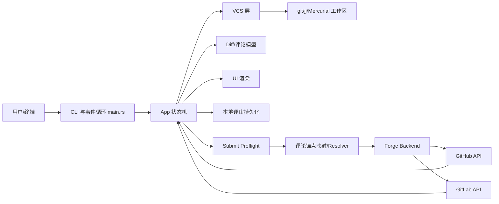
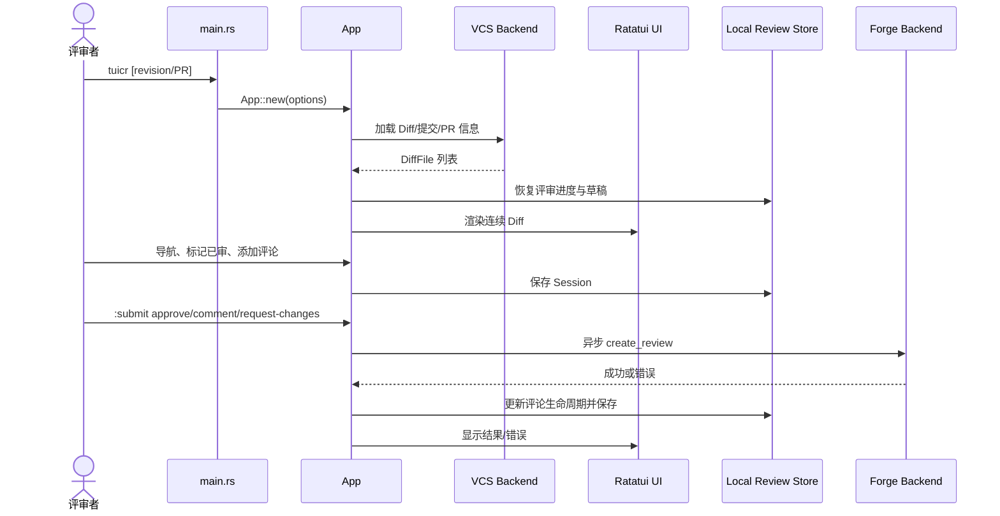
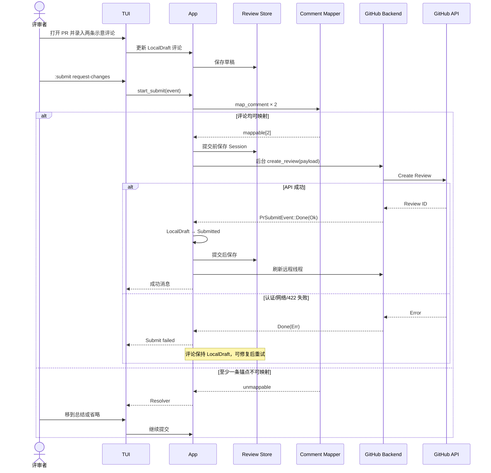

# agavra/tuicr 项目深度解析

## 1. 项目概览

- 报告日期：2026-08-01
- 仓库地址：https://github.com/agavra/tuicr
- Trending 原始排名：8
- Stars Today：335
- 项目定位：支持 Vim 键位、连续 Diff、本地草稿和 GitHub/GitLab 提交的终端代码评审工具。
- 解决的问题：大型变更在网页中跳转成本高、草稿评论容易丢、终端用户需要在同一界面完成阅读、评论与提交。
- 目标用户：终端重度用户、代码审查者、维护者和需要离线预审的团队。
- 当前成熟度：活跃 Rust 项目，已有完整 TUI、VCS/Forge 抽象、持久化、提交链路和测试。
- 推荐结论：代码组织与评审状态机值得研究；平台 API、Diff 锚点和远程变化仍是主要复杂度来源。

## 2. 系统架构

### 2.1 架构概览

`src/main.rs` 负责 CLI 解析、终端能力检测、配置和主题加载、构造 `App` 并驱动事件循环。`App` 聚合 Diff、评论、评审会话、输入模式和远程提交状态。`vcs` 层读取 git/jj/Mercurial 变更，`forge` 层封装 GitHub/GitLab PR/MR 查询与评审提交，`persistence`/`review_store` 保存本地草稿和已审状态，`ui` 渲染 TUI。提交前，`app/submit.rs` 会把本地评论映射到当前 Diff，无法映射的评论进入 resolver；确认后先保存本地 Session，再由后台线程调用 Forge，成功后转换评论生命周期并重新抓取远程线程。

### 2.2 架构图

### 2.3 核心模块

| 模块 | 职责 | 代码位置 | 关键依赖 | 证据级别 |
|---|---|---|---|---|
| CLI 与事件循环 | 参数、终端生命周期、键盘/鼠标事件与周期轮询 | `src/main.rs`、`src/cli.rs` | crossterm、ratatui | High |
| App 状态机 | Diff、焦点、输入模式、评论和提交状态 | `src/app/`、`src/app.rs` | model、handler、ui | High |
| 输入/Handler | 将按键映射为 Action 并修改 App | `src/input/`、`src/handler.rs` | keymap、Action | High |
| VCS | 读取工作区、提交范围和 PR Diff | `src/vcs/` | git、jj、Mercurial | High |
| Forge | GitHub/GitLab PR/MR、线程和 Create Review | `src/forge/` | gh/glab 或 API 后端 | High |
| 评论与提交 | 评论锚点、预检、Resolver、异步提交 | `src/app/comments.rs`、`src/app/submit.rs`、`src/forge/submit.rs` | Diff 模型、Forge traits | High |
| 持久化 | 保存评审会话、草稿和已审状态 | `src/persistence/`、`src/review_store.rs` | 本地文件 | High |
| 输出 | 将评审导出为 Markdown/stdout/剪贴板 | `src/output/` | Markdown renderer | High |

### 2.4 数据与状态管理

- `App` 是前台状态中心，包含 `input_mode`、`diff_source`、`diff_files`、`session`、`submit_state` 和 `pr_submit_state`。
- 本地评论有生命周期：至少包括 `LocalDraft`、`PushedDraft`、`Submitted`；只有成功提交后才切换状态。
- 提交前调用 `save_current_session_merging_external()`，即使网络失败，草稿仍尽量保留。
- 后台线程通过 `mpsc` 返回 `PrSubmitEvent`；主线程轮询并应用结果，避免网络调用阻塞 TUI。
- 没有证据表明项目使用数据库、Redis 或服务端队列；持久化是本地评审状态文件。

### 2.5 外部集成与协议

- VCS：git、Jujutsu 和 Mercurial。
- Forge：GitHub PR 与 GitLab MR，创建 Review、读取远程线程和 PR 信息。
- 输出：平台提交、剪贴板、Markdown 与 stdout。
- 编辑器：评论可交给外部编辑器；具体行为由本地配置决定。

### 2.6 部署与运行形态

- 单机终端二进制，在本地仓库或指定 PR/MR 上运行。
- 通过平台 CLI/认证或配置的 Forge 后端访问远程 API。
- 无常驻后端服务；更新检查在后台线程执行，评审提交也在短生命周期线程中完成。

## 3. 主线流程

### 3.1 核心流程图

### 3.2 关键步骤

1. 入口解析 revision、working tree、PR target、路径过滤和输出模式。
2. `App::new` 选择 VCS backend，加载 Diff 与已有评审 Session。
3. 事件循环将按键映射为 Action，Handler 更新焦点、评论、已审状态和 UI。
4. 提交前遍历本地草稿，将文件、单行或范围评论映射到当前显示 Diff。
5. 无法映射的评论进入 Resolver，可移到总结或省略。
6. 确认后先持久化 Session，再后台调用 Forge `create_review`。
7. 主线程收到结果：成功则锁定评论、保存并刷新远程线程；失败则草稿继续保留。

### 3.3 异常与失败处理

- 非 PR 模式调用 `:submit` 会显示警告。
- 只读、关闭、合并等 PR 状态阻止提交。
- 没有评论时，除 Approve 外的提交动作会被拒绝。
- 评论锚点过期时进入 Resolver，不直接把错误位置发给平台。
- 网络失败不转换评论生命周期，本地仍保持 `LocalDraft`。
- PR 在提交期间被重新加载且 head 变化时，会丢弃过期结果，防止修改错误 Session。

## 4. 典型业务场景端到端执行链路

### 4.1 场景定义

| 项目 | 内容 |
|---|---|
| 场景名称 | 在终端审查 GitHub PR，提交带两条行级评论的“Request changes” |
| 参与者 | 评审者、tuicr TUI、App 状态机、本地 Review Store、GitHub Forge Backend、GitHub API |
| 前置条件 | 本地已安装 tuicr 与 GitHub 认证工具；能读取目标 PR；PR 可写且未关闭；Diff 已加载 |
| 输入 | **示意命令**：`tuicr 128`；两条**示意评论**分别锚定 `src/a.rs` 新行 42 与 `src/b.rs` 新行 18；提交动作 `request-changes` |
| 期望结果 | 两条可映射评论和总结被作为一次 GitHub Review 提交，本地评论状态变为 Submitted |
| 成功判定 | GitHub 返回 Review ID；tuicr 显示成功消息；本地 Session 保存 Review ID；刷新后远程线程可见 |

### 4.2 端到端时序图

### 4.3 执行步骤追踪

| 步骤 | 输入 | 执行组件 | 关键代码位置 | 状态或数据变化 | 输出 | 失败分支 | 证据级别 |
|---:|---|---|---|---|---|---|---|
| 1 | **示意 PR 128** | CLI/App 初始化 | `src/main.rs`、`App::new` | 创建 DiffSource、加载配置和 Session | 连续 Diff | PR/认证读取失败 | High |
| 2 | 两条**示意评论** | 评论 Handler | `src/handler.rs`、`src/app/comments.rs` | Session 新增 `LocalDraft` | TUI 标注 | 编辑取消或无效行 | Medium |
| 3 | `request-changes` | `start_submit` | `src/app/submit.rs` | 构建 SubmitState，计算 commit_id | mappable/unmappable | 非 PR、只读、空评审 | High |
| 4 | 评论+Diff | `map_comment` | `src/forge/submit.rs`、`app/submit.rs` | 评论转换为平台 InlineComment | JSON payload 部分 | 锚点不在当前 Diff → Resolver | High |
| 5 | Resolver 选择 | App | `src/app/submit.rs` | 不可映射评论转总结或省略 | 可提交状态 | 用户取消则返回 Normal | High |
| 6 | payload | `spawn_pr_submit` | `src/app/submit.rs` | 提交前持久化；设置 InFlight；启动线程 | 后台请求 | 本地保存失败被容忍；启动构建错误向上返回 | High |
| 7 | CreateReviewRequest | Forge Backend | `src/forge/traits.rs`、GitHub backend | 远程创建 Review | Review ID | 认证、网络、422 等错误 | High |
| 8 | `Done` 事件 | `poll_pr_submit_events` | `src/app/submit.rs` | 校验 repository/PR/head 快照 | 应用或丢弃结果 | Head 已变化 → 丢弃 stale result | High |
| 9 | Review ID | `finish_pr_submit` | `src/app/submit.rs` | 评论变 Submitted，写 remote_review_id，保存 Session | 成功消息、刷新线程 | Error 时保持 LocalDraft | High |

### 4.4 关键状态与数据变化

- `input_mode`：Normal → SubmitActionPicker/SubmitResolver/SubmitConfirm → Normal。
- 评论生命周期：`LocalDraft` 只有在远程成功后才变为 `Submitted`；Draft 事件则变 `PushedDraft`。
- `SubmitState` 保存 event、可映射评论、不可映射评论、Resolver 选择和 commit SHA。
- `SubmitInFlightState` 快照 repository、PR number、head SHA 和评论 ID，用于防止过期结果污染新 Session。

### 4.5 失败传播、重试与回滚

- 平台失败通过后台 channel 回到主线程，UI 显示粘性错误。
- 没有把失败评论标成已提交，所以用户可以保持原草稿再次提交。
- 提交前保存降低网络失败导致草稿丢失的概率。
- 对于 PR head 变化，程序选择丢弃过期响应，不自动把旧锚点重放到新 Diff；用户需刷新、重新映射后再试。
- 远程 Review 创建可能已成功但客户端响应丢失，这是典型不确定状态；源码没有展示幂等键，重试前应先刷新远程线程，避免重复 Review。

### 4.6 最终业务结果

成功时，GitHub 上出现一次 Request Changes Review，包含两条行级评论；本地草稿转为锁定的 Submitted 状态，并在远程线程刷新后去重。失败时，评审内容留在本地，不拿“网络没回话”冒充“评论已经送达”。

### 4.7 最小复现与验证方法

1. 在测试仓库创建一个含两处文本修改的 PR，并配置 GitHub CLI 认证。
2. 运行 `tuicr <PR编号>`，分别在两个新增行创建**示意评论**。
3. 执行提交并选择 Request changes，确认 GitHub 上生成 Review。
4. 再创建评论后断网提交，确认错误出现且评论仍是本地草稿。
5. 修改 PR head 后在旧界面提交，验证 stale-result 或锚点 Resolver 分支；测试仓库里折腾，别拿生产 PR 当蹦床。

## 5. 技术栈

| 层次 | 技术 | 用途 | 是否核心 | 证据位置 |
|---|---|---|---|---|
| 语言 | Rust | 主程序与状态机 | 是 | Cargo、`src/` |
| TUI | ratatui、crossterm | 渲染与终端事件 | 是 | `main.rs`、`ui/` |
| VCS | git/jj/Mercurial | 读取 Diff 与提交 | 是 | `src/vcs/` |
| Forge | GitHub/GitLab API/CLI | PR/MR 信息与 Review 提交 | 是 | `src/forge/` |
| 状态 | App + 本地 Session | 评论、已审和 UI 状态 | 是 | `src/app/`、persistence |
| 并发 | std::thread + mpsc | 更新检查与远程提交 | 是 | `main.rs`、`app/submit.rs` |
| 输出 | Markdown/clipboard/stdout | 导出评审 | 否 | `src/output/` |

## 6. 创新点

### 创新点 1

- 类型：交互创新
- 传统方案：按文件页面来回跳，评论和已审状态依赖网页。
- 当前方案：把文件组成连续 Diff 流，配合 Vim 键位和本地已审状态。
- 实际收益：减少上下文切换，适合长评审和键盘工作流。
- 证据：README 的 continuous diff、键位和 persisted reviewed tracking。
- 局限：终端对富媒体、复杂建议和平台专属 UI 的表达能力较弱。

### 创新点 2

- 类型：可靠性创新
- 传统方案：直接提交评论，过期锚点由平台返回 422。
- 当前方案：先按当前 Diff 映射评论，不可映射项进入 Resolver；提交前保存本地草稿。
- 实际收益：减少评论丢失和错误锚点。
- 证据：`start_submit`、`map_comment`、Resolver 与 pre-submit save。
- 局限：Diff 大幅变化时仍需人工决定迁移或省略。

### 创新点 3

- 类型：工程整合创新
- 传统方案：GitHub/GitLab、git/jj/hg 各用不同评审工具。
- 当前方案：通过 VCS 与 Forge 抽象在同一 TUI 中统一流程。
- 实际收益：保留一致操作习惯并支持多后端。
- 证据：`src/vcs/`、`src/forge/` 与 README。
- 局限：不同平台语义不完全相同，抽象层需要持续追赶 API。

## 7. 应用场景

### 适合

- 终端内审查本地变更、提交范围、GitHub PR 与 GitLab MR。
- 需要持久化草稿、离线预审和 Markdown 输出的维护者。

### 可以尝试

- 团队推广为主评审入口；需先验证平台权限、建议语法和大 PR 性能。
- jj/Mercurial 工作流；需按团队分支模型做回归。

### 暂不建议

- 高度依赖平台网页中的安全扫描、富媒体和复杂建议编辑的评审。
- 无法可靠配置平台认证或不允许本地保存评审草稿的环境。

## 8. 第一次阅读与验证建议

1. 先读 README 的命令、键位、Session 与提交说明。
2. 再读 `src/main.rs`，理解初始化与事件循环。
3. 顺着 `src/app/diff_load.rs`、`comments.rs` 和 `session.rs` 看状态建立。
4. 重点阅读 `src/app/submit.rs` 与 `src/forge/submit.rs`，这是最有价值的可靠性链路。
5. 在测试 PR 上依次验证成功、锚点失效、断网和 head 更新四个分支。

## 9. 风险与限制

- 安全：本地草稿可能含敏感代码；持久化目录和剪贴板输出需要保护。
- 性能：超大 Diff、复杂语法高亮和远程线程数量需实测。
- 许可证：MIT。
- 维护状态：活跃，但 Forge API 与 VCS 兼容性会持续变化。
- 生产可用性：适合开发者本地工具；不是集中式审计、合规或代码托管服务。

## 10. Evidence Notes

- `src/main.rs` 直接证明 CLI、配置、主题、App 构造、后台更新和 Handler 分层。
- `src/app/submit.rs` 直接证明评论映射、Resolver、提交前保存、后台 Forge 请求、stale result 丢弃、评论生命周期和失败保留草稿。
- 仓库目录直接证明 `vcs`、`forge`、`persistence`、`output`、`ui` 和测试模块存在。
- 未虚构服务器、数据库、缓存或消息队列；图中的 channel 是进程内 `std::sync::mpsc`。

## 11. Honest Caveat

本报告未实际向 GitHub/GitLab 提交 Review，也没有逐个验证 jj、Mercurial 和所有平台认证路径。典型业务中的 PR 编号、文件名、行号和评论内容均为**示意**。源码对 GitHub 提交流程证据很强，但平台 API 的实时行为和速率限制仍需在测试仓库验证。

## 12. 可信度

- Architecture Confidence: High
- Flow Confidence: High
- Innovation Confidence: Medium