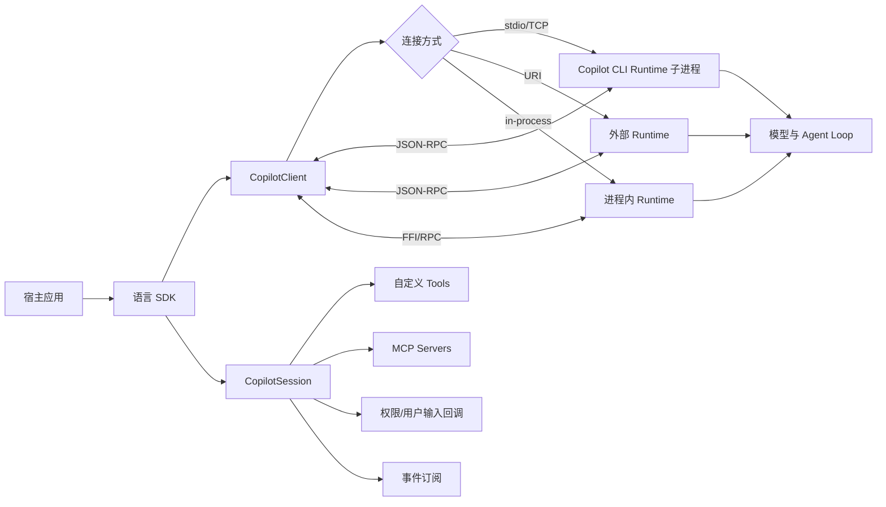
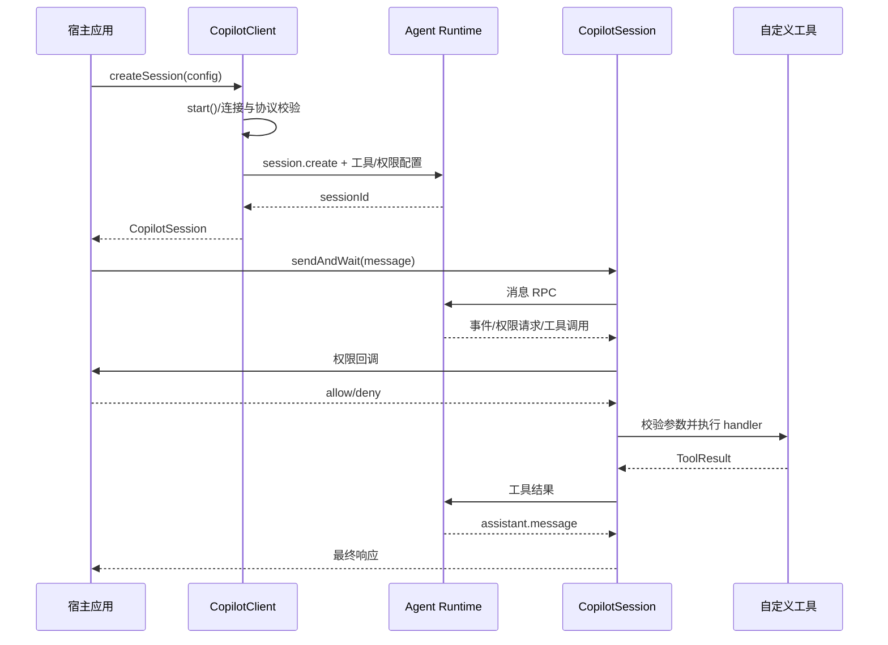
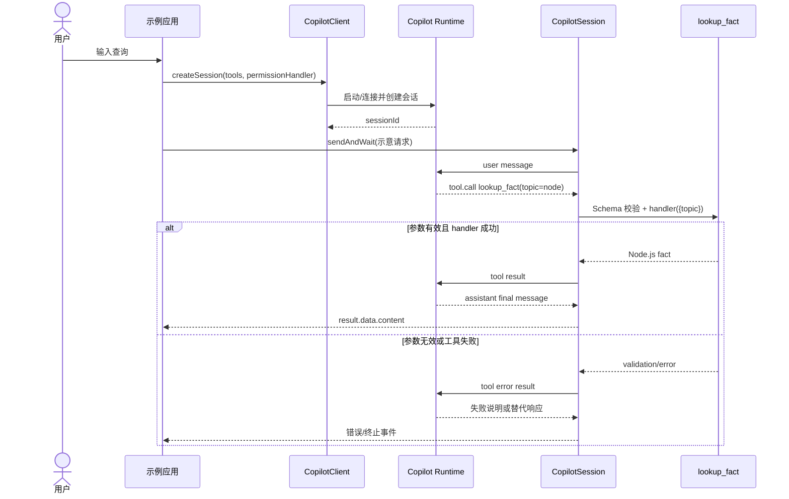

# github/copilot-sdk 项目深度解析

## 1. 项目概览

- 报告日期：2026-08-01
- 仓库地址：https://github.com/github/copilot-sdk
- Trending 原始排名：6
- Stars Today：7
- 项目定位：把 GitHub Copilot CLI 背后的 Agent Runtime 以多语言 SDK 形式嵌入应用与服务。
- 解决的问题：避免每个产品重复实现会话、工具调用、权限请求、事件流、持久化与 Runtime 生命周期管理。
- 目标用户：IDE、内部开发平台、自动化服务、桌面应用和需要嵌入编码 Agent 的团队。
- 当前成熟度：公开预览期的工程化 SDK；接口和协议仍可能演进。
- 推荐结论：源码边界清晰、示例与测试较全，适合研究 Agent Runtime 嵌入；生产使用必须收紧权限并验证版本兼容。

## 2. 系统架构

### 2.1 架构概览

仓库不是单一 Node.js 库，而是围绕同一 Copilot Agent Runtime 提供 Node.js、Python、Go、.NET、Java 与 Rust SDK。以 Node.js 实现为例，`CopilotClient` 负责启动或连接 Runtime、建立 JSON-RPC 通道、校验协议版本并管理 Session；`CopilotSession` 负责消息、事件、权限、工具和中止；自定义 Tool、MCP、Session FS 与认证回调通过 SDK 边界注入。Runtime 承担模型交互、规划与工具编排，SDK 应用负责权限决策和具体业务工具。

### 2.2 架构图

### 2.3 核心模块

| 模块 | 职责 | 代码位置 | 关键依赖 | 证据级别 |
|---|---|---|---|---|
| 多语言 SDK | 提供相近的客户端与会话 API | `nodejs/`、`python/`、`go/`、`dotnet/`、`java/`、`rust/` | 各语言运行时 | High |
| CopilotClient | Runtime 启停、连接、协议校验、Session 管理 | `nodejs/src/client.ts` | `child_process`、`net`、`vscode-jsonrpc` | High |
| CopilotSession | 消息、事件、权限、工具、取消和 Factory API | `nodejs/src/session.ts` | generated RPC、types、telemetry | High |
| RPC 协议层 | SDK 与 Runtime 的请求、通知和类型契约 | `nodejs/src/generated/rpc.ts`、协议定义与版本文件 | JSON-RPC | High |
| Tool 层 | 参数 Schema、处理器和工具结果回传 | `nodejs/src/toolSet.ts`、`defineTool`、示例 | Zod/JSON Schema | High |
| Session FS | 将宿主提供的文件与 SQLite 能力适配给会话 | `nodejs/src/sessionFsProvider.ts`、`client.ts` | Provider Adapter | High |
| 示例与 E2E | 验证会话、工具结果、文件系统等行为 | `nodejs/examples/`、`nodejs/test/e2e/` | 测试 Runtime | High |

### 2.4 数据与状态管理

- 活跃会话由 `CopilotClient` 内部 Session 集合管理。
- 会话持久化由 Runtime 与配置的 `baseDirectory` / `sessionFs` 共同决定；源码明确要求 `empty` 模式提供显式持久化位置。
- 工具参数越过 RPC 边界前转换为 JSON Schema；回调函数不会直接序列化，而是由 SDK 本地保存并通过标志在需要时被 Runtime 回调。
- 未发现项目自身要求业务数据库；持久化形态取决于 Runtime 与宿主提供方，不能擅自补画 PostgreSQL、Redis 或队列。

### 2.5 外部集成与协议

- SDK 与 Runtime 使用版本化 JSON-RPC 通信。
- 支持 MCP Server 配置、自定义 Tool、GitHub 身份认证、BYOK 和外部 Runtime URI。
- Node.js 客户端可通过 stdio、TCP、URI 或 in-process 连接；不同模式有明确的环境变量、认证和工作目录限制。

### 2.6 部署与运行形态

1. 默认：SDK 启动捆绑或指定路径的 Copilot CLI Runtime 子进程，以 stdio 连接。
2. TCP：SDK 启动或连接 TCP Runtime，并可使用连接令牌。
3. 外部服务：通过 URI 连接由其他进程管理的 Runtime，认证也由外部服务管理。
4. 进程内：在支持的宿主中加载 FFI Runtime；此模式不能按客户端修改进程级工作目录或环境变量。

## 3. 主线流程

### 3.1 核心流程图

### 3.2 关键步骤

1. `CopilotClient` 解析连接配置，禁止不兼容的认证、环境变量或工作目录组合。
2. 首次创建 Session 时自动 `start()`：启动 Runtime 或连接外部 Runtime，随后校验最小协议版本。
3. `createSession` 把工具、MCP、权限回调和持久化配置注册到会话。
4. `sendAndWait` 将消息交给 Runtime；Runtime 运行 Agent Loop，并通过事件流要求权限或调用工具。
5. SDK 在本地调用 Tool handler，再把结构化结果返回 Runtime。
6. Runtime 继续推理并返回终止消息，SDK 将结果交给宿主。

### 3.3 异常与失败处理

- 协议版本低于 SDK 最低版本时拒绝连接。
- Runtime 启动、连接或 RPC 错误使 Client 进入 error 状态并向调用方抛出。
- 权限回调可拒绝敏感操作；示例中的 `approveAll` 只适合演示。
- `stop()` 会断开活跃 Session，并对断开失败最多重试三次；进程内模式会先中止进行中的 turn，避免持久化文件句柄遗留。
- Factory 并行或流水线会区分普通子任务失败与取消、资源上限、持久化失败等致命错误，后者继续向上抛出。

## 4. 典型业务场景端到端执行链路

### 4.1 场景定义

| 项目 | 内容 |
|---|---|
| 场景名称 | 应用要求 Copilot 调用本地事实查询工具并返回答案 |
| 参与者 | 应用开发者、宿主应用、CopilotClient、CopilotSession、Agent Runtime、自定义 `lookup_fact` 工具 |
| 前置条件 | 已安装兼容 SDK 与 Runtime；用户已完成所需认证；工具已用 Zod Schema 注册；权限策略已配置 |
| 输入 | **示意请求**：`Use lookup_fact to tell me about 'node'`；官方示例使用同样文本与工具名 |
| 期望结果 | Runtime 选择工具，SDK 执行本地 handler，并返回包含 Node.js 事实的最终回答 |
| 成功判定 | 收到终止响应；事件流出现工具调用及结果；最终 `result.data.content` 含工具返回的信息 |

### 4.2 端到端时序图

### 4.3 执行步骤追踪

| 步骤 | 输入 | 执行组件 | 关键代码位置 | 状态或数据变化 | 输出 | 失败分支 | 证据级别 |
|---:|---|---|---|---|---|---|---|
| 1 | Tool 定义 | `defineTool` | `nodejs/examples/basic-example.ts` | 生成名称、描述、Zod 参数与 handler | 可注册 Tool | Schema 不合法则初始化失败 | High |
| 2 | Client 配置 | `CopilotClient` | `nodejs/src/client.ts` | 保存连接、认证、工作目录、持久化配置 | Client 实例 | 配置组合冲突立即抛错 | High |
| 3 | Session 配置 | `createSession` | 示例、`client.ts` | Runtime 启动并登记工具/权限 | sessionId | 启动、认证或协议不兼容失败 | High |
| 4 | **示意请求** | `sendAndWait` | `nodejs/examples/basic-example.ts`、`session.ts` | 会话进入执行 turn | Runtime 消息 | 连接中断或会话错误 | High |
| 5 | `topic=node` | Runtime → Tool | `session.ts`、Tool handler | 参数校验；读取内存 `facts` 映射 | ToolResult | 校验失败或 handler 抛错 | High |
| 6 | ToolResult | Agent Runtime | RPC 协议层 | Agent 上下文加入观察结果 | 最终回答 | 模型无法完成则返回错误事件 | Medium |
| 7 | assistant message | Session → App | 示例的 `result2.data.content` | turn 结束 | 用户可见文本 | 无终止事件时由超时/取消处理 | High |

### 4.4 关键状态与数据变化

- Tool 注册信息从本地对象转换为可跨 RPC 的 Schema，handler 仍保留在宿主进程。
- Session 从创建状态进入执行 turn；事件订阅持续收到 Runtime 通知。
- 工具结果被加入 Agent 的当前执行上下文，但示例没有业务数据库写入。
- `facts` 是示例进程内对象，不代表 SDK 内建知识库或缓存。

### 4.5 失败传播、重试与回滚

- 若 Runtime 无法启动或协议不匹配，Session 不会创建，错误直接回到应用。
- 若权限处理器拒绝调用，工具不执行，Runtime 获得拒绝结果并可改写计划或向用户说明。
- 若 Tool 参数无法通过 Schema 或 handler 抛错，错误通过工具结果/会话事件传播；应用可决定重试新 turn。
- SDK 不会自动回滚 Tool 的外部副作用。涉及文件、部署或数据库写入的 Tool 必须由宿主自行实现幂等、事务或补偿。

### 4.6 最终业务结果

用户得到一条由 Runtime 组织、但事实内容来自宿主本地 Tool 的回答；应用同时保留事件流，可用于 UI 更新、审计或调试。这个场景证明 SDK 的价值不只是“发一句话”，而是把 Agent 规划与宿主业务能力接在同一条受权限控制的链路上。

### 4.7 最小复现与验证方法

1. 安装 Node.js SDK 与兼容 Copilot Runtime，完成官方要求的认证。
2. 复制 `nodejs/examples/basic-example.ts`。
3. 先运行普通算术请求，确认会话通信正常。
4. 再运行官方示例中的 `lookup_fact` 请求，观察 `tool.call`、工具结果和最终响应事件。
5. 把权限处理从 `approveAll` 改为显式拒绝该工具，确认失败分支能回到事件流且 handler 未执行。

## 5. 技术栈

| 层次 | 技术 | 用途 | 是否核心 | 证据位置 |
|---|---|---|---|---|
| 语言与运行时 | TS/Node、Python、Go、.NET、Java、Rust | 多语言宿主集成 | 是 | 各语言目录、README |
| 通信 | JSON-RPC、stdio、TCP、URI、FFI | SDK 与 Runtime 通信 | 是 | `nodejs/src/client.ts` |
| Agent 能力 | Copilot CLI Runtime | 规划、模型交互、工具编排 | 是 | README、client/session |
| 工具 | Zod/JSON Schema、Tool handler | 定义并执行宿主能力 | 是 | basic example、types |
| 协议扩展 | MCP | 接入外部工具服务 | 可选核心 | docs、client config |
| 状态 | Runtime Session、Session FS | 会话与持久化 | 是 | client、session persistence docs |
| 测试 | E2E tests | 验证工具与会话文件系统 | 否 | `nodejs/test/e2e/` |

## 6. 创新点

### 创新点 1

- 类型：工程整合创新
- 传统方案：每种语言各自封装模型 API，再重复实现 Agent Loop、工具、权限与会话。
- 当前方案：六种语言围绕同一 Runtime 和版本化协议提供相近 API。
- 实际收益：产品可以复用成熟 Runtime，同时保留宿主语言和业务工具。
- 证据：多语言目录、共同的 Session 概念与协议文件。
- 局限：Runtime 与 SDK 版本必须兼容，接口仍可能变化。

### 创新点 2

- 类型：架构创新
- 传统方案：Agent 与宿主业务逻辑混在同一进程或服务中。
- 当前方案：通过 RPC/FFI 边界分离 Runtime 与宿主；权限、Tool handler 和 Session FS 由宿主注入。
- 实际收益：连接形态可替换，权限边界更明确，也便于服务化。
- 证据：`client.ts` 的多连接模式和回调适配。
- 局限：边界增加协议兼容、调试和进程管理成本。

### 创新点 3

- 类型：安全工作流创新
- 传统方案：示例 Agent 常默认工具全放行。
- 当前方案：权限请求是一等回调，宿主可对每个操作决策。
- 实际收益：能把 Agent 行为纳入产品权限和审计体系。
- 证据：SessionConfig 与官方示例中的 `onPermissionRequest`。
- 局限：安全性取决于宿主实现；`approveAll` 仍可能被误用。

## 7. 应用场景

### 适合

- IDE、代码托管或内部平台嵌入编码 Agent。
- 需要自定义工具、MCP、事件 UI 与权限策略的应用。
- 多语言团队希望共享同一 Agent Runtime 能力。

### 可以尝试

- 后端多租户 Agent 服务；需要明确 Session 隔离、配额和持久化目录。
- 远程 Runtime 集群；需要额外验证认证、网络隔离、扩缩容与版本发布策略。

### 暂不建议

- 未实现精细权限却允许 Agent 操作生产基础设施。
- 不能接受 Copilot 产品条款、认证依赖或预览期 API 变化的核心系统。

## 8. 第一次阅读与验证建议

1. 先读根 README、`docs/getting-started.md` 与连接/认证文档。
2. 再读 `nodejs/examples/basic-example.ts`，建立最小心智模型。
3. 沿 `nodejs/src/client.ts` 追 Runtime 启动、连接与协议校验。
4. 沿 `nodejs/src/session.ts` 追消息、工具、权限、取消和事件。
5. 运行工具结果与 Session FS E2E 测试，最后再替换成自己的只读工具。

## 9. 风险与限制

- 安全：Tool 能力可触及文件、Shell 或外部系统；必须最小权限、参数校验、人工确认和审计。
- 性能：额外 Runtime 进程与 RPC 有开销；并发、长会话与大工具输出需压测。
- 许可证：仓库为 MIT，但 Copilot 服务、账号与模型提供商另有条款。
- 维护状态：快速演进，协议与 SDK 版本必须成套升级。
- 生产可用性：适合试点和受控集成；高可用、多租户隔离和灾难恢复需要宿主自行完成。

## 10. Evidence Notes

- 官方示例直接展示 `defineTool`、`CopilotClient`、`createSession`、事件订阅与 `sendAndWait`。
- `nodejs/src/client.ts` 直接证明 child process、Socket、JSON-RPC、协议校验、四种连接形态、Session FS 与关闭重试。
- `nodejs/src/session.ts` 直接证明会话事件、权限、Tool、取消及 Factory 失败传播。
- 架构图未加入仓库没有强制要求的数据库、缓存、消息队列或可观测性后端。

## 11. Honest Caveat

本报告基于公开源码、官方示例与文档的静态阅读，没有实际调用付费 Copilot 服务，也没有验证所有语言 SDK 的行为完全一致。典型场景中的请求文本取自官方示例；涉及生产并发、认证刷新、远程 Runtime 故障与外部 Tool 副作用的结论仍需在目标环境复测。

## 12. 可信度

- Architecture Confidence: High
- Flow Confidence: High
- Innovation Confidence: Medium