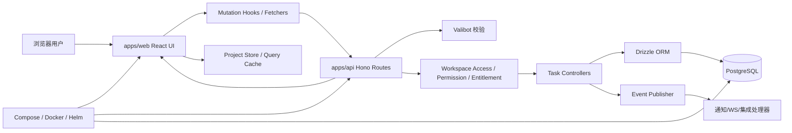
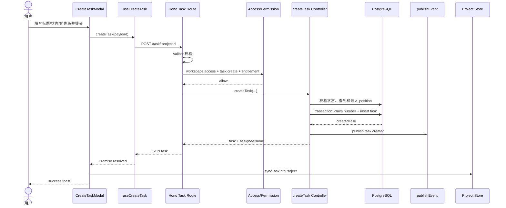

# usekaneo/kaneo 项目深度解析

## 1. 项目概览

- 报告日期：2026-08-01
- 仓库地址：https://github.com/usekaneo/kaneo
- Trending 原始排名：9
- Stars Today：194
- 项目定位：轻量、自托管、以项目/看板/任务为核心的开源项目管理平台。
- 解决的问题：提供比大型项目管理套件更克制的任务协作体验，同时让组织控制数据和部署环境。
- 目标用户：小型产品团队、内部项目组、个人和需要自托管看板的组织。
- 当前成熟度：活跃 monorepo，具有 Web、API、数据库迁移、集成、部署与测试资产。
- 推荐结论：业务模块完整，创建任务链路能从 React Modal 追到 Hono Route、权限、Drizzle 事务和事件发布；适合研究轻量协作系统。

## 2. 系统架构

### 2.1 架构概览

Kaneo 采用 TypeScript monorepo。`apps/web` 是基于 React/TanStack Router 的前端，使用 hooks、fetchers、query client 和本地 project store 组织交互；`apps/api` 以 Hono 暴露任务、项目、工作区、标签、通知和集成 API，使用 Valibot 做输入校验、workspace middleware 做访问和权限判断；数据层通过 Drizzle ORM 操作 PostgreSQL。任务创建在事务内分配项目内编号并插入记录，成功后调用 `publishEvent("task.created")`，供通知、WebSocket 或集成模块消费。仓库还提供 Docker Compose、独立 Dockerfile、Helm Chart 和部署目录。

### 2.2 架构图



### 2.3 核心模块

| 模块 | 职责 | 代码位置 | 关键依赖 | 证据级别 |
|---|---|---|---|---|
| Web 应用 | 页面、Modal、看板和用户交互 | `apps/web/src/` | React、TanStack Router、i18n | High |
| Web 数据层 | Mutation、Query、HTTP fetch 与缓存 | `apps/web/src/hooks/`、`fetchers/`、`query-client/` | TanStack Query | High |
| API 入口 | 装配路由、中间件、认证和模块 | `apps/api/src/index.ts` | Hono | High |
| Task Route | 输入 Schema、权限与 Controller 编排 | `apps/api/src/task/index.ts` | Hono OpenAPI、Valibot | High |
| Task Controller | 状态校验、位置计算、事务插入和事件发布 | `apps/api/src/task/controllers/create-task.ts` | Drizzle ORM | High |
| 数据库 | Schema、迁移与连接 | `apps/api/src/database/`、`apps/api/drizzle/` | PostgreSQL、Drizzle | High |
| 事件与实时 | 领域事件、通知与 WebSocket 模块 | `apps/api/src/events/`、`notification/`、`ws/` | 项目内部事件层 | Medium |
| 部署 | 本地与集群部署 | `compose.yml`、Dockerfile、`charts/kaneo/`、`deploy/` | Docker、Helm | High |

### 2.4 数据与状态管理

- 业务持久化由 PostgreSQL + Drizzle ORM 完成，Schema 包含 project、column、task、workspace、user 等表。
- 前端 `useProjectStore` 持有当前 Project/Columns/Tasks，用 Immer 在创建成功后同步插入目标列。
- Query Hooks 与 Mutation Hooks 负责服务端状态获取和写入；具体缓存失效策略需按各 Hook 阅读。
- 创建任务时先查目标 Column 与同列最大 position，事务内调用 `claimTaskNumber` 并插入 Task。
- `publishEvent("task.created")` 在数据库事务成功后触发；源码证明有事件发布，但不能据此虚构 Kafka、RabbitMQ 或外部队列。

### 2.5 外部集成与协议

- HTTP JSON API，使用 Hono OpenAPI 描述 Route。
- 认证、Workspace Access、Permission 与 Entitlement 由 API middleware 串联。
- 仓库包含 GitHub、Gitea、Slack、Discord、Telegram 和 generic webhook 等集成模块；具体是否启用取决于部署配置。
- WebSocket 模块用于实时能力，但本次未逐条验证 task.created 到客户端刷新所经过的每个 Handler。

### 2.6 部署与运行形态

1. Docker Compose：Web、API、PostgreSQL 及仓库配置要求的配套服务组合运行。
2. 独立镜像：`apps/web/Dockerfile` 与 `apps/api/Dockerfile` 分别构建前端和 API。
3. Kubernetes：`charts/kaneo/` 提供 Helm 资源。
4. 开发环境：pnpm/Turbo monorepo 统一启动、构建和测试。

## 3. 主线流程

### 3.1 核心流程图



### 3.2 关键步骤

1. Modal 从显式 `projectId`、当前 Project 或 Route 解析目标项目。
2. 用户提交时，前端检查标题、Project 和 Workspace，调用 `useCreateTask`；若此前为图片上传创建过 planned draft，则改走 update。
3. API 的 `POST /:projectId` 用 Valibot 校验字段，并执行 workspace access、task create permission 和 entitlement middleware。
4. Controller 校验状态是否属于 Project，查找列与当前最大 position。
5. 数据库事务内领取项目级任务编号并插入 Task。
6. 插入成功后发布 `task.created` 领域事件并返回 Task。
7. 前端把标准化 Task 放入目标 Column，显示成功；标签创建是后续逐个操作，单个标签失败只记录错误，不撤销已创建 Task。

### 3.3 异常与失败处理

- 前端缺少标题、Project 或 Workspace 时不提交。
- 用户无创建权限时 Modal 不渲染；API 仍二次执行权限检查。
- 状态不属于 Project 时 `assertValidTaskStatus` 拒绝。
- 数据库未返回 Task 时抛出 HTTP 500。
- 主 Task 创建失败进入 Modal catch，重置 `didSubmitRef` 并显示 error toast。
- 标签创建失败不会回滚 Task，只在控制台记录，这是一种明确的部分成功语义。
- 若用于图片上传的 planned draft 被用户放弃，Modal 关闭时尝试删除；清理失败被忽略。

## 4. 典型业务场景端到端执行链路

### 4.1 场景定义

| 项目 | 内容 |
|---|---|
| 场景名称 | 团队成员在 To-do 列创建高优先级任务并添加两个标签 |
| 参与者 | 团队成员、CreateTaskModal、Web Mutation Hook、Hono API、权限中间件、Task Controller、PostgreSQL、事件发布器、前端 Project Store |
| 前置条件 | 用户已登录；拥有 Workspace 的 task:create 权限；Project 存在 `to-do` Column；部署数据库可用 |
| 输入 | **示意数据**：标题“修复导出超时”、描述“超过 10k 行时超时”、priority=`high`、status=`to-do`、标签=`bug`,`backend` |
| 期望结果 | Task 获得项目内编号和列内 position，写入数据库，事件发布，前端看板立即出现卡片；标签随后关联 |
| 成功判定 | API 返回 Task ID/number/position；数据库存在 Task；前端目标列出现任务；至少主 Task 成功，标签失败会被明确识别为部分成功 |

### 4.2 端到端时序图

```mermaid
sequenceDiagram
    actor U as 团队成员
    participant M as CreateTaskModal
    participant API as POST /task/:projectId
    participant MW as Access/Permission/Entitlement
    participant C as createTask
    participant DB as PostgreSQL
    participant EV as Event Publisher
    participant LS as Label API
    participant ST as Project Store

    U->>M: 输入示意任务并提交
    M->>API: JSON payload
    API->>MW: 校验访问与 task:create
    alt 无权限或配额不满足
        MW-->>API: 401/403/entitlement error
        API-->>M: Error
        M-->>U: error toast
    else 允许
        MW-->>API: allow
        API->>C: createTask
        C->>DB: 查列、最大 position
        C->>DB: BEGIN; claim number; INSERT; COMMIT
        alt 事务失败
            DB-->>C: Error/Rollback
            C-->>API: 500/error
            API-->>M: Error
            M-->>U: error toast，可修复后重试
        else 任务成功
            DB-->>C: Task
            C->>EV: publish task.created
            C-->>API: Task JSON
            API-->>M: 200 Task
            loop 每个示意标签
                M->>LS: createLabel(taskId)
                alt 标签成功
                    LS-->>M: Label
                else 标签失败
                    LS-->>M: Error
                    Note over M: 记录错误，不回滚主任务
                end
            end
            M->>ST: syncTaskIntoProject
            M-->>U: success toast
        end
    end
```

### 4.3 执行步骤追踪

| 步骤 | 输入 | 执行组件 | 关键代码位置 | 状态或数据变化 | 输出 | 失败分支 | 证据级别 |
|---:|---|---|---|---|---|---|---|
| 1 | **示意标题/描述/标签** | CreateTaskModal | `apps/web/src/components/shared/modals/create-task-modal.tsx` | React state 收集字段 | 表单 payload | 缺标题/项目/Workspace 不提交 | High |
| 2 | Submit Event | `handleSubmit` | 同上 | `didSubmitRef=true`，选择 create 或 update draft | Mutation Promise | catch 后 `didSubmitRef=false` + toast | High |
| 3 | JSON payload | Hono Route | `apps/api/src/task/index.ts` | Valibot 解析日期、priority、status | 已验证参数 | 400 Schema error | High |
| 4 | projectId/user | Middleware | `task/index.ts`、workspace utils | 验证 workspace access、task:create、entitlement | allow | 401/403/配额失败 | High |
| 5 | status/projectId | Controller | `create-task.ts` | 校验状态、解析 column | column 或 fallback status | 无效 status 抛错 | High |
| 6 | 当前 Task 集合 | Drizzle 查询 | `create-task.ts` | 计算 `nextPosition=max+1` | position | 查询失败向上抛 | High |
| 7 | 项目 ID | DB Transaction | `claim-task-numbers.ts`、`create-task.ts` | 领取 number 并插入 Task；成功提交 | createdTask | 任一步失败事务回滚 | High |
| 8 | createdTask | Event Publisher | `publishEvent("task.created")` | 发出领域事件 | 通知/实时消费者可处理 | 发布失败的传播语义需进一步逐文件验证 | Medium |
| 9 | Task JSON | Modal | `handleSubmit` | 标准化 Task；逐个创建标签 | Task + Labels | 标签失败不回滚 Task | High |
| 10 | savedTask | Project Store | `syncTaskIntoProject` | 移除旧卡片并插入目标 Column | UI 出现任务 | 找不到 target column 时不插入本地 Store | High |

### 4.4 关键状态与数据变化

- 数据库：新建一条 Task，带 `number`、`position`、`columnId`、priority、status 等字段。
- 前端：`draftTask`/`didSubmitRef` 控制草稿和关闭清理；成功后 Project Store 的目标列新增 Task。
- 领域事件：创建成功后发布 `task.created`，事件 payload 包含 taskId、currentUserId 与 type。
- 标签：在主任务成功后逐个创建，属于非原子后续步骤。

### 4.5 失败传播、重试与回滚

- 访问或权限失败在进入 Controller 前终止，不写数据库。
- Task 插入位于事务中，编号分配与插入一起回滚，避免只消耗编号却没任务的常见半截状态。
- 主任务 API 失败由 Promise reject 传播到 Modal，用户可修改后重新提交；源码没有展示客户端自动重试，因此不能假称有指数退避。
- 标签失败是部分成功：Task 保留，失败标签不关联。用户可稍后重试标签，不应重复创建 Task。
- 对包含图片的 planned draft，取消时尝试删除；删除失败被忽略，可能留下 planned Task，需要后台清理或人工检查。

### 4.6 最终业务结果

主任务成功后，团队得到一个带项目内编号、排序位置和高优先级的 To-do 卡片，前端立即同步；两个标签可能全部成功，也可能出现“任务成功、部分标签失败”。系统没有拿一盘菜没上齐就说整桌不存在，部分成功边界算是交代清楚了。

### 4.7 最小复现与验证方法

1. 用官方 Compose 在测试环境启动 Kaneo，创建 Workspace、Project 与 `to-do` Column。
2. 创建具有 task:create 权限的测试用户。
3. 通过 UI 输入上述**示意数据**并提交，检查 API 响应和数据库 Task 的 number/position。
4. 临时让标签 API 返回错误，确认 Task 仍存在且 UI 报告主任务成功，标签未全部关联。
5. 移除用户创建权限后重试，确认 Modal 防御和 API 403/权限分支均生效。

## 5. 技术栈

| 层次 | 技术 | 用途 | 是否核心 | 证据位置 |
|---|---|---|---|---|
| Monorepo | pnpm、Turbo | Web/API/Packages 构建 | 是 | 根 package/config |
| Web | React、TanStack Router、i18next | UI、路由与国际化 | 是 | `apps/web/src/` |
| 客户端状态 | Mutation/Query Hooks、Project Store、Immer | 服务端请求与看板同步 | 是 | hooks、store、Modal |
| API | Hono、Hono OpenAPI | HTTP 路由和文档 | 是 | `apps/api/src/index.ts`、模块 index |
| 校验 | Valibot | JSON/Param Schema | 是 | `task/index.ts` |
| 数据 | PostgreSQL、Drizzle ORM | 持久化与事务 | 是 | database、drizzle |
| 实时/事件 | 内部 publishEvent、WebSocket/notification modules | 领域事件与实时更新 | 可选核心 | events、ws、notification |
| 部署 | Docker Compose、Docker、Helm | 自托管 | 是 | compose、Dockerfile、charts |

## 6. 创新点

### 创新点 1

- 类型：产品与架构减法
- 传统方案：项目管理平台堆叠大量配置和流程。
- 当前方案：围绕 Workspace、Project、Column 和 Task 组织核心模块，同时保留自托管和集成扩展。
- 实际收益：降低日常操作与部署认知负担。
- 证据：README 定位、模块结构和任务链路。
- 局限：复杂企业流程、审计和权限矩阵可能不如大型平台完整。

### 创新点 2

- 类型：可靠性设计
- 传统方案：前端创建任务后再补编号或排序，容易产生半成品。
- 当前方案：Controller 在事务内领取项目级编号并插入 Task，插入后才发布事件。
- 实际收益：编号与 Task 记录保持一致，事件不会早于核心写入。
- 证据：`create-task.ts`。
- 局限：事件发布不在同一数据库事务内；发布失败与补偿策略需进一步验证。

### 创新点 3

- 类型：交互工程
- 传统方案：富文本附件要求先创建完整 Task，取消时容易留下垃圾数据。
- 当前方案：需要图片时先创建 `planned` draft，提交时更新，取消时尝试删除。
- 实际收益：编辑器可在最终提交前获得 taskId 并上传关联资源。
- 证据：Modal 的 `ensureDraftTask`、`handleSubmit`、`handleClose`。
- 局限：清理失败会遗留 planned draft。

## 7. 应用场景

### 适合

- 小团队看板、内部研发任务与自托管项目跟踪。
- 希望通过 API、Webhook 或聊天平台集成任务流的组织。

### 可以尝试

- Kubernetes 团队部署；需验证备份、升级与水平扩展。
- 与 GitHub/Gitea/Slack 等集成；需逐项审查权限和密钥管理。

### 暂不建议

- 需要成熟企业审计、复杂资源规划或严格合规认证但没有二次开发预算的组织。
- 未设计数据库备份、对象存储和密钥轮换就直接承载关键项目数据。

## 8. 第一次阅读与验证建议

1. 先读 README、根 monorepo 配置和 Compose。
2. 从 `apps/web/src/components/shared/modals/create-task-modal.tsx` 看用户动作。
3. 沿 `useCreateTask`/fetcher 进入 `apps/api/src/task/index.ts`。
4. 精读 `create-task.ts`、`claim-task-numbers.ts` 和数据库 Schema。
5. 再读 `events`、`ws`、notification 与 integration，确认 task.created 的实际消费链。
6. 在测试环境验证权限、事务失败、标签部分失败和 draft 清理。

## 9. 风险与限制

- 安全：Workspace 权限、集成 Token、Webhook、对象存储与 API 暴露需要严格配置。
- 性能：最大 position 查询、任务列表和实时事件在大项目规模下需压测。
- 许可证：MIT；第三方依赖与部署镜像仍需 SBOM/许可核验。
- 维护状态：活跃、模块变化快，升级需配合数据库迁移。
- 生产可用性：具备部署资产，但高可用、备份恢复、审计和容量规划由运营方负责。

## 10. Evidence Notes

- 根目录、`apps/`、`charts/`、`deploy/`、Compose 和测试证明该项目是完整软件系统。
- `create-task-modal.tsx` 直接证明表单、draft、标签部分成功、权限防御和 Project Store 同步。
- `task/index.ts` 直接证明 Schema 校验、Workspace Access、Permission 和 Entitlement 链。
- `create-task.ts` 直接证明 Drizzle 查询、事务、编号、position、Task 插入与 `task.created` 事件。
- 架构图未声明仓库没有证据的外部消息队列或独立微服务；事件消费者以项目内模块概括。

## 11. Honest Caveat

本报告基于公开源码静态分析，没有实际启动整套 Compose 或 Helm，也没有逐文件追完 `publishEvent` 到每个通知、WebSocket 和第三方集成消费者。因此 Architecture 与任务创建主流程证据很强，但“创建事件如何实时到达所有浏览器”的完整链路只给 Medium 证据。场景标题、描述、标签和值均明确为**示意数据**。

## 12. 可信度

- Architecture Confidence: High
- Flow Confidence: High
- Innovation Confidence: Medium