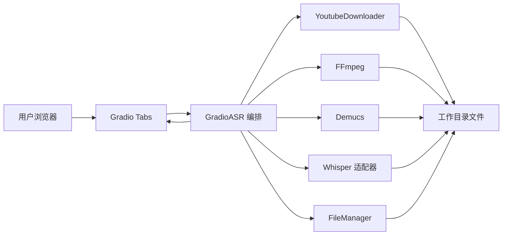
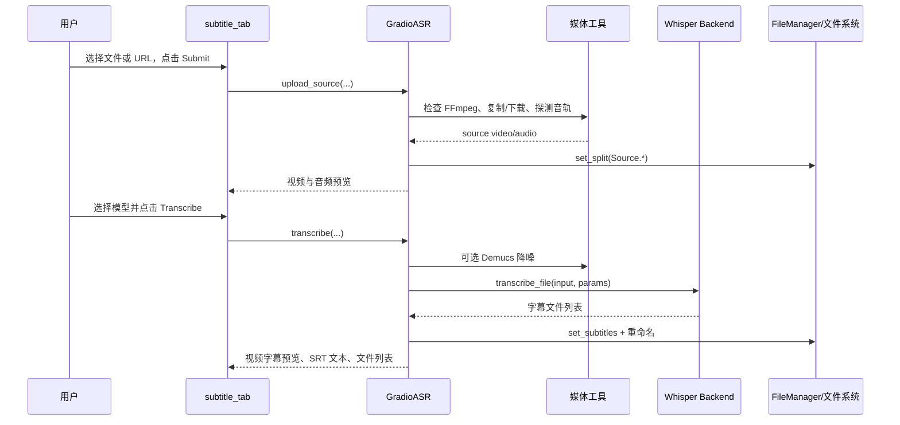
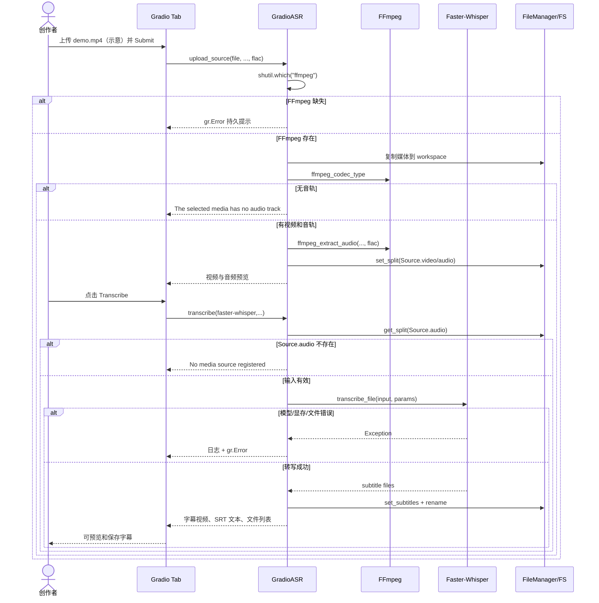

# abus-aikorea/voice-pro 项目深度解析

## 1. 项目概览

- 报告日期：2026-08-02
- 仓库地址：https://github.com/abus-aikorea/voice-pro
- Trending 原始排名：9
- Stars Today：58
- 项目定位：面向创作者的本地 AI 语音与多媒体处理 WebUI。
- 解决的问题：把视频下载、音频提取、人声分离、语音识别、字幕、翻译、TTS 与声音克隆集中在一个可操作界面，减少用户在多个 CLI 工具间搬文件。
- 目标用户：视频创作者、字幕与配音人员、语音模型实验者。
- 当前成熟度：功能丰富但环境依赖重；README 明确主要验证 Windows + NVIDIA GPU，并提示当前维护可能暂停。
- 推荐结论：适合源码研究和本地试验，不宜未经验证直接当作跨平台生产媒体服务。

## 2. 系统架构

### 2.1 架构概览

Voice-Pro 是 Python 单机应用。Gradio Tab 负责收集文件、麦克风或 YouTube URL，并把按钮事件绑定到领域编排类；字幕场景中 `GradioASR` 组合 `YoutubeDownloader`、FFmpeg、Demucs、三种 Whisper 适配器和 `FileManager`。中间产物与结果保存在工作目录文件系统，`FileManager` 只在进程内保存路径索引。项目没有证据支持独立数据库、缓存、队列或微服务。

### 2.2 架构图

### 2.3 核心模块

| 模块 | 职责 | 代码位置 | 关键依赖 | 证据级别 |
|---|---|---|---|---|
| 字幕 Tab | 构建输入、模型和输出控件，绑定事件 | `app/tab_subtitle.py` | Gradio、GradioASR | High |
| ASR 编排 | 输入登记、音轨提取、降噪、转写、SRT 回传 | `app/gradio_asr.py` | downloader、ffmpeg、demucs、Whisper | High |
| 文件状态 | 保存 source/split/subtitle/translation 等路径索引 | `app/abus_files.py` | 文件系统 | High |
| Whisper 适配 | Faster-Whisper、Whisper、Timestamped 后端 | `app/abus_asr_*.py` | 对应模型库 | Medium |
| 媒体下载 | 从 YouTube URL 下载媒体 | `app/abus_downloader.py` | yt-dlp | Medium |
| 音视频处理 | 探测 codec、提取音频、兼容性处理 | `app/abus_ffmpeg.py` | FFmpeg | Medium |
| 人声分离 | 可选 htdemucs/htdemucs_ft 降噪 | `app/abus_demucs.py` | Demucs | Medium |
| 基础 UI | 主题、CSS、JS 和通用状态 | `src/ui.py` | Gradio、Torch、YAML | High |

### 2.4 数据与状态管理

- `FileManager` 用字典保存逻辑名到文件路径的映射，例如 `Source.audio`、`.srt`、translations 和 dubbings。
- 音视频、分离音轨和字幕是工作目录中的实际文件。
- `UserConfig` 保存模型、语言、compute type、降噪级别等偏好；本报告未追踪其完整持久化格式。
- 没有数据库证据；进程重启后的工作目录保留与状态恢复行为需按配置和文件实现进一步验证。

### 2.5 外部集成与协议

- FFmpeg：媒体探测和音频抽取。
- yt-dlp：YouTube 下载。
- Whisper/Faster-Whisper/Whisper-Timestamped：ASR。
- Demucs：可选人声分离。
- Hugging Face/模型仓库：首次下载模型。
- 其他 Tab 可使用 Deep Translator、Azure、Edge-TTS、F5-TTS、CosyVoice 和 Kokoro；它们不是本次字幕案例的必经组件。

### 2.6 部署与运行形态

单机 Gradio WebUI，Python 3.12。`pyproject.toml` 提供 CPU/GPU 依赖组，但 README 指出主要验证 Windows + NVIDIA GPU；大量模型和媒体依赖使首次安装与磁盘占用较高。它不是容器化多租户服务。

## 3. 主线流程

### 3.1 核心流程图

### 3.2 关键步骤

1. `subtitle_tab` 创建媒体、URL、模型、语言、compute type 与降噪控件，并绑定 Submit/Transcribe。
2. `upload_source` 检查 `ffmpeg` 是否可执行；随后从本地文件、麦克风或 URL 选择一种输入。
3. `_upload` 把输入复制到 workspace，调用 codec 探测；视频输入抽取指定格式音频，纯音频直接登记。
4. `transcribe` 从 `FileManager` 读取 `Source.audio`，无输入时阻止执行。
5. 根据降噪级别可先运行 Demucs，随后创建 `WhisperParameters` 并选择 ASR 后端。
6. 后端产出字幕文件，`FileManager.set_subtitles` 按语言重命名并登记路径。
7. 返回可选带字幕视频、SRT 文本和全部文件列表。

### 3.3 异常与失败处理

- 未安装 FFmpeg：持久错误 Toast，要求先配置。
- 未上传文件、录音或 URL：直接提示提供媒体。
- 媒体无音轨：拒绝进入 ASR。
- 用户未先 Submit 就点 Transcribe：提示未登记媒体。
- 下载、FFmpeg、Demucs 或模型异常：捕获后记录日志，并以不会自动消失的 Gradio Error 回传。
- README 说明翻译端的免费 Google 端点有退避重试，但这不是本次 ASR 主线的代码结论。

## 4. 典型业务场景端到端执行链路

### 4.1 场景定义

| 项目 | 内容 |
|---|---|
| 场景名称 | 创作者上传本地视频并生成英文 SRT 字幕 |
| 参与者 | 创作者、浏览器、Gradio 字幕 Tab、GradioASR、FFmpeg、可选 Demucs、Faster-Whisper、FileManager、文件系统 |
| 前置条件 | 已按项目方式安装 Python 3.12 环境；FFmpeg 可执行；所选 Whisper 模型可用；机器有足够内存/显存 |
| 输入 | 本地 `demo.mp4`、音频格式 `flac`、ASR `faster-whisper`、语言 `english`、denoise=0；文件名与参数值为示意 |
| 期望结果 | 工作目录生成抽取音频和英文 SRT；界面显示 SRT 文本与可下载文件 |
| 成功判定 | SRT 文件存在且含至少一个时间轴片段；界面返回文件列表；视频预览在兼容时挂载字幕 |

### 4.2 端到端时序图

### 4.3 执行步骤追踪

| 步骤 | 输入 | 执行组件 | 关键代码位置 | 状态或数据变化 | 输出 | 失败分支 | 证据级别 |
|---:|---|---|---|---|---|---|---|
| 1 | 本地文件与选项 | Gradio Button binding | `app/tab_subtitle.py` | UI 事件产生 | 调用 upload_source | 浏览器未提交文件 | High |
| 2 | 环境 PATH | `shutil.which` | `app/gradio_asr.py` | 无持久化 | FFmpeg 可用性 | 缺失→持久 Error | High |
| 3 | file object | `_upload` / copy helper | `app/gradio_asr.py` | 媒体复制到 workspace | source_file | 复制或路径异常 | High |
| 4 | source_file | `ffmpeg_codec_type` | `app/gradio_asr.py`、`abus_ffmpeg.py` | 设置 has_audio/has_video | codec 类型 | 无音轨→停止 | High |
| 5 | 视频文件 | `ffmpeg_extract_audio` | `app/gradio_asr.py` | 新建 flac/wav/mp3 文件 | Source.audio | FFmpeg 错误→Toast | High |
| 6 | 文件路径 | `FileManager.set_split` | `app/abus_files.py` | 进程内路径字典更新 | 预览输入 | 进程异常丢失内存状态 | High |
| 7 | 模型/语言/compute | `transcribe` | `app/gradio_asr.py` | UserConfig 偏好更新 | WhisperParameters | 无 Source.audio→停止 | High |
| 8 | 音频、denoise | `_denoise` | `app/gradio_asr.py` | 可选创建人声/伴奏文件 | ASR input | Demucs 异常→Toast | High |
| 9 | ASR input + params | `transcribe_file` | `abus_asr_faster_whisper.py` 等 | 模型推理并生成字幕临时文件 | subtitle files | 模型下载/显存/推理异常 | Medium |
| 10 | 字幕文件 | `set_subtitles` | `app/abus_files.py` | 按语言重命名并记录扩展名 | `.srt` 路径 | 文件重命名失败 | High |
| 11 | SRT 路径 | `_read_subtitle_file` | `app/gradio_asr.py` | 读取文本 | UI 文本与文件列表 | 文件不存在/编码异常 | High |

### 4.4 关键状态与数据变化

- Workspace 新增原视频副本、抽取音频和 SRT。
- `FileManager.splits` 写入 `Source.video`、`Source.audio`；`subtitles` 写入 `.srt` 等扩展名到路径。
- UserConfig 写入 ASR 引擎、模型、语言、compute type 与降噪级别。
- 没有数据库和外部队列；模型缓存位置与生命周期由依赖库和项目配置决定。

### 4.5 失败传播、重试与回滚

输入与环境错误在执行前阻止后续步骤。模型或媒体异常被统一转成 Gradio Error，当前调用结束；已经复制或生成的中间文件不会自动事务回滚。用户修复环境、改小模型或重新提交后可以重试。若下载或模型文件中断，README 声称部分下载具备自愈，但本次未逐函数验证，不能把它当所有阶段的通用重试机制。

### 4.6 最终业务结果

创作者获得可阅读、可保存的 SRT 和相关媒体文件，兼容视频还会在 Gradio Video 组件中带字幕预览。成功判定同时要求文件产出和可观察内容，不是仅返回 HTTP 200。

### 4.7 最小复现与验证方法

1. 优先在 README 明确验证过的 Windows + NVIDIA 环境，按项目脚本安装；确认 `ffmpeg -version` 成功。
2. 使用 10–20 秒、包含清晰英语的自有测试视频，避免版权与隐私问题。
3. 打开 Subtitle Tab，上传文件并 Submit；确认输入音频预览出现。
4. 选择较小 Whisper 模型、denoise=0，点击 Transcribe。
5. 检查 SRT 是否存在时间轴和文本；再直接刷新页面后点击 Transcribe，验证未登记媒体错误分支。
6. 在测试环境临时移除 FFmpeg PATH，确认持久错误提示；验证后恢复环境。

## 5. 技术栈

| 层次 | 技术 | 用途 | 是否核心 | 证据位置 |
|---|---|---|---|---|
| 语言与运行时 | Python 3.12 | 应用与模型编排 | 是 | `pyproject.toml` |
| Web UI | Gradio 6.20 | Tabs、事件、预览与错误反馈 | 是 | `pyproject.toml`、`tab_subtitle.py` |
| ASR | Faster-Whisper、Whisper、Whisper-Timestamped | 音频转文字与字幕 | 是 | `pyproject.toml`、`gradio_asr.py` |
| 媒体 | FFmpeg、yt-dlp | 音频提取、探测与下载 | 是 | `pyproject.toml`、`gradio_asr.py` |
| 音源处理 | Demucs | 可选人声分离/降噪 | 否 | `pyproject.toml`、`gradio_asr.py` |
| 状态 | 文件系统 + FileManager 字典 | 保存中间产物和路径索引 | 是 | `abus_files.py` |
| AI 语音 | F5-TTS、CosyVoice、Kokoro、Edge-TTS | 其他 Tab 的合成与克隆 | 否（对本案例） | `pyproject.toml` |
| 安装 | uv、锁文件、CPU/GPU extras | 依赖解析与运行环境 | 是 | `pyproject.toml`、README |
| 日志 | structlog | 调试与错误记录 | 否 | `pyproject.toml`、源码 |

## 6. 创新点

### 创新点 1

- 类型：工程整合创新
- 传统方案：下载、FFmpeg、分离、ASR、翻译和 TTS 分散在多个 CLI 和目录。
- 当前方案：以 Gradio Tab 和共享文件路径模型把工具串成创作者工作台。
- 实际收益：减少手工搬文件和格式转换，非开发用户更容易完成完整媒体任务。
- 证据：`tab_subtitle.py`、`gradio_asr.py` 和依赖清单。
- 局限：耦合大量重量级依赖，升级一个模型库可能牵动整个环境。

### 创新点 2

- 类型：可替换后端与用户体验整合
- 传统方案：ASR 界面与单一 Whisper 实现绑定。
- 当前方案：同一编排类按配置切换 Faster-Whisper、官方 Whisper 和 Timestamped 实现，并统一输出字幕文件。
- 实际收益：用户可在速度、时间戳能力和兼容性之间选择。
- 证据：`switch_case`、`update_whisper_models`、`transcribe`。
- 局限：适配层接口统一不代表不同后端结果、显存和语言行为一致。

## 7. 应用场景

### 适合

- 本地视频字幕和音频转写。
- 创作者进行小批量多语言配音实验。
- 研究不同 ASR/TTS 后端的工作流差异。

### 可以尝试

- 内部内容团队工作台，但要补权限、任务隔离、备份和资源配额。
- CPU 路径和非 Windows 平台，需逐项验证依赖与性能。

### 暂不建议

- 未隔离用户文件的公开多租户服务。
- 对 SLA、跨平台一致性或高并发有硬要求的生产系统。
- 未确认 GPL 义务和 README 许可证冲突前的闭源分发。

## 8. 第一次阅读与验证建议

1. 先看 README 的平台、维护和安装边界，再看 `pyproject.toml` 的固定版本。
2. 从 `app/tab_subtitle.py` 理解 UI 输入输出。
3. 追 `app/gradio_asr.py` 的 upload/transcribe 主线。
4. 看 `app/abus_files.py` 明确状态只是文件路径索引。
5. 最后读具体 Whisper 适配器，并用短音频验证输出和错误 Toast。

## 9. 风险与限制

- 安全：处理不可信媒体与 URL 会触发下载器、编解码器和模型解析；公开服务需沙箱与文件隔离。
- 性能：模型、Demucs 和 TTS 对显存、CPU、磁盘占用明显；未独立压测。
- 许可证：仓库 `LICENSE` 是 GPL-3.0，但 README 元数据写 LGPL，存在冲突，需维护者或法律确认。
- 维护状态：README 明确称因其他项目开发，更新暂时可能无法进行。
- 生产可用性：更像桌面式本地工具集，不是具备任务队列、租户隔离和可观测性的服务平台。

## 10. Evidence Notes

- `README.md`：产品范围、平台限制、维护状态和版本说明。
- `pyproject.toml`：Python 版本、Gradio、Whisper、FFmpeg、Demucs、TTS 与 uv 依赖。
- `app/tab_subtitle.py`：UI 组件和 Submit/Transcribe 事件绑定。
- `app/gradio_asr.py`：上传、音轨、降噪、ASR、SRT 与失败路径。
- `app/abus_files.py`：内存路径字典和字幕重命名。
- `LICENSE`：GPL v3 正文。

## 11. Honest Caveat

本报告没有安装数十个依赖、下载模型或运行 GPU 推理。具体 Whisper 后端的 `transcribe_file` 内部实现、模型缓存、自愈下载和其他配音 Tab 未全部追踪。README 的“Windows + NVIDIA 可用”与许可证信息也存在需要维护者进一步澄清的边界，因此只把字幕主线标为高可信，不把整体跨平台与生产能力写成已验证事实。

## 12. 可信度

- Architecture Confidence: High
- Flow Confidence: High
- Innovation Confidence: Medium
