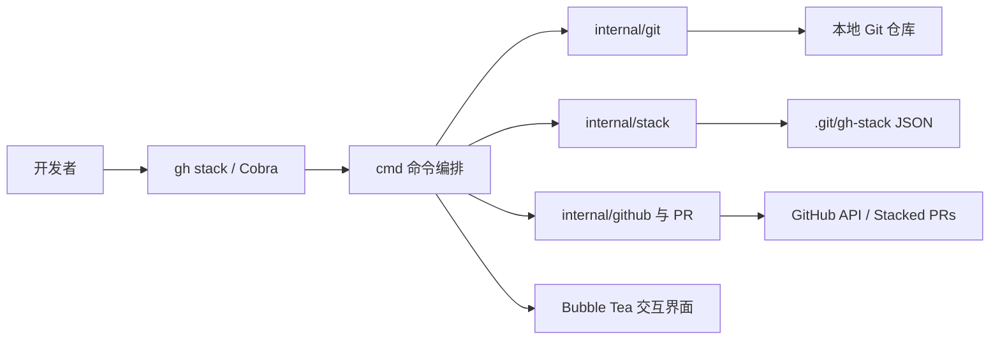
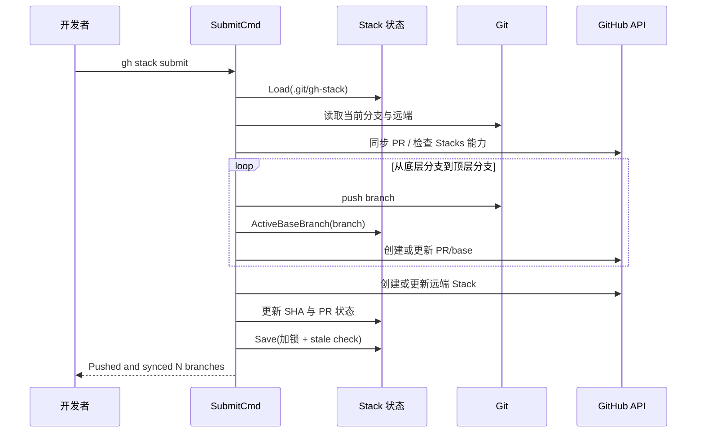
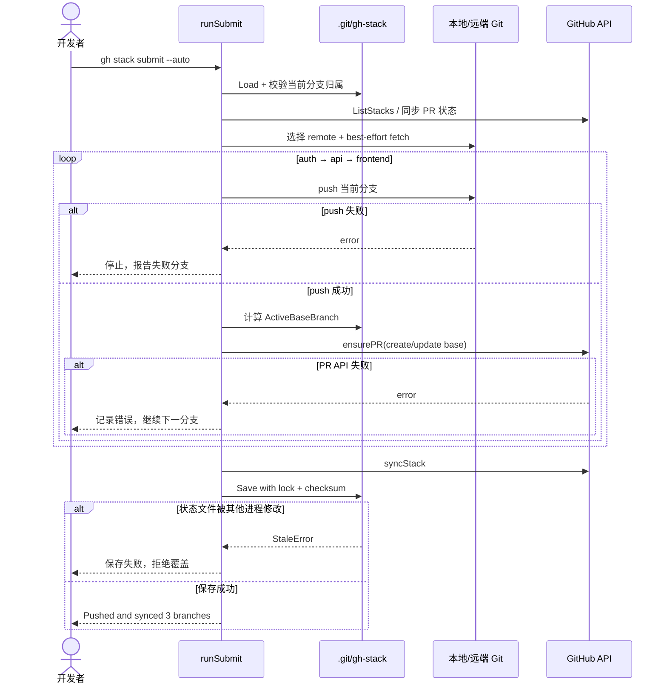

# github/gh-stack 项目深度解析

## 1. 项目概览

- 报告日期：2026-08-02
- 仓库地址：https://github.com/github/gh-stack
- Trending 原始排名：7
- Stars Today：46
- 项目定位：管理堆叠分支与逐层 Pull Request 的 GitHub CLI 扩展。
- 解决的问题：大型变更拆成多个依赖 PR 后，分支顺序、PR base、重定基、推送和远端 Stack 状态很容易靠人工维护到“一桌线头”。
- 目标用户：使用 GitHub 和 `gh` CLI、希望保持小 PR 评审粒度的开发团队。
- 当前成熟度：早期可用的官方 GitHub CLI 扩展，源码、测试和远端 API 路径较完整。
- 推荐结论：值得研究。它把 Git 图、PR 图和本地元数据放进一条可验证的工作流，工程边界清楚。

## 2. 系统架构

### 2.1 架构概览

`gh stack` 是单进程 Go CLI。Cobra 根命令把 `init/add/submit/sync/rebase` 等子命令交给 `cmd/` 层；命令层调用 `internal/git` 操作本地仓库，调用 `internal/github` 与 GitHub API 通信，并通过 `internal/stack` 读取和保存 `.git/gh-stack`。交互场景使用 Bubble Tea TUI。没有独立数据库、缓存、消息队列或后台服务。

### 2.2 架构图

### 2.3 核心模块

| 模块 | 职责 | 代码位置 | 关键依赖 | 证据级别 |
|---|---|---|---|---|
| CLI 入口 | 注册命令组、错误与退出码 | `cmd/root.go` | Cobra、config | High |
| Submit 编排 | 校验 Stack、推送分支、创建/更新 PR、同步远端 | `cmd/submit.go` | git、github、pr、stack | High |
| Stack 领域模型 | 表示 trunk、分支顺序、PR 引用和 active base | `internal/stack/stack.go` | encoding/json | High |
| 本地持久化 | 加载/保存 `.git/gh-stack`，加锁并检测陈旧写入 | `internal/stack/stack.go` | 文件锁、SHA-256 | High |
| Git 适配 | 分支、fetch、push、rebase 等本地操作 | `internal/git/` | Git 可执行程序 | Medium |
| GitHub 适配 | PR 与远端 Stack 查询、创建和更新 | `internal/github/`、`internal/pr/` | go-gh、GraphQL | Medium |
| 交互界面 | 编辑 PR 标题、说明、draft 状态和提交选择 | `internal/tui/submitview/` | Bubble Tea、Lip Gloss | High |

### 2.4 数据与状态管理

核心状态是 `.git/gh-stack` JSON：包含 schemaVersion、仓库标识、Stack 列表、trunk、按序分支和关联 PR。`Load` 保存文件内容的 SHA-256；`Save` 在独占锁内重新读取并比较校验和，若其他进程改过文件则返回 stale error。这是本地文件级乐观并发控制，不是数据库事务。

远端事实来自 GitHub PR 与 Stack API。分支是否进入 merge queue 是命令运行时从 API 填入的瞬态状态，不写回 JSON。

### 2.5 外部集成与协议

- 本地 Git 命令与 `.git` 目录。
- GitHub CLI 的认证与仓库上下文。
- GitHub REST/GraphQL 及 Stacked PRs 能力。
- 终端交互协议由 Bubble Tea 事件循环承载。

### 2.6 部署与运行形态

作为 `gh` 扩展安装并在开发者机器执行，无服务端部署。要求 GitHub CLI v2+、本地 Git 仓库和可访问的远端仓库。

## 3. 主线流程

### 3.1 核心流程图

### 3.2 关键步骤

1. `runSubmit` 定位 Git 目录，读取 `.git/gh-stack`，确认当前分支只属于一个 Stack。
2. 建立 GitHub 客户端，验证仓库是否可用 Stacked PRs，并同步已合并或排队的 PR 状态。
3. 选择远端，跳过 merged/queued 分支；交互模式可打开 PR 草稿编辑器。
4. 按 Stack 从底到顶逐分支 `git.Push`，用 `ActiveBaseBranch` 计算当前有效 base，再调用 `ensurePR` 创建或修正 PR。
5. 同步远端 Stack，更新本地 base SHA/PR 状态，最后保存本地 JSON。

### 3.3 异常与失败处理

- 不在 Git 仓库、找不到 Stack 或分支属于多个 Stack：立即返回明确错误。
- GitHub Stacks 不可用：交互模式可降级创建普通 PR；非交互模式停止。
- 单个分支 push 失败：停止后续提交，避免在远端制造半套分支链。
- `ensurePR` 失败：记录错误后继续其他分支，因此可能出现部分 PR 成功、部分失败。
- 本地状态保存遇到锁超时或陈旧校验：返回保存错误，避免覆盖并发命令写入。

## 4. 典型业务场景端到端执行链路

### 4.1 场景定义

| 项目 | 内容 |
|---|---|
| 场景名称 | 开发者将三层功能分支提交为逐层评审的 GitHub PR Stack |
| 参与者 | 开发者、`gh stack` CLI、本地 Git、`.git/gh-stack`、GitHub API |
| 前置条件 | 已安装 `gh` 与扩展；已登录 GitHub；本地 Stack 含 `auth-layer → api-endpoints → frontend`；仓库有 push/PR 权限 |
| 输入 | 命令 `gh stack submit --auto`；分支名为示意，但命令格式为官方格式 |
| 期望结果 | 三个分支依次推送，生成或更新三个 PR，base 分别为 `main`、`auth-layer`、`api-endpoints` |
| 成功判定 | 终端显示同步成功；三个 PR 可在 GitHub 查看且 base 链正确；`.git/gh-stack` 保存 PR 引用和最新 SHA |

### 4.2 端到端时序图

### 4.3 执行步骤追踪

| 步骤 | 输入 | 执行组件 | 关键代码位置 | 状态或数据变化 | 输出 | 失败分支 | 证据级别 |
|---:|---|---|---|---|---|---|---|
| 1 | `gh stack submit --auto` | Cobra/SubmitCmd | `cmd/root.go`、`cmd/submit.go` | 创建 submitOptions | 进入 `runSubmit` | 参数或上下文错误 | High |
| 2 | Git 目录 | `stack.Load` | `internal/stack/stack.go` | JSON 解析并记录 loadChecksum | StackFile | 文件损坏/版本过高 | High |
| 3 | 当前分支 | `FindAllStacksForBranch` | `cmd/submit.go`、`internal/stack/stack.go` | 无持久化变化 | 唯一 Stack | 无 Stack或多个 Stack | High |
| 4 | GitHub 认证 | `cfg.GitHubClient`、`ListStacks` | `cmd/submit.go` | 拉取远端能力和 PR 状态 | stacksAvailable | API 不可用时降级或停止 | High |
| 5 | active branches | `git.FetchBranches` | `cmd/submit.go`、`internal/git/` | 更新远端跟踪引用 | best-effort fetch | 失败被忽略 | High |
| 6 | 当前分支 | `git.Push` | `cmd/submit.go` | 远端分支更新 | push 成功 | 失败立即停止 | High |
| 7 | Stack 顺序 | `ActiveBaseBranch` | `internal/stack/stack.go` | 计算跳过 merged/queued 后的 base | base branch | 无有效祖先则回到 trunk | High |
| 8 | branch/base/draft | `ensurePR` | `cmd/submit.go`、`internal/pr/` | 创建 PR 或修正 base/draft | PR 引用 | API 错误记录后继续 | Medium |
| 9 | 完成的 PR 链 | `syncStack` | `cmd/submit.go`、`internal/github/` | 远端 Stack 创建或更新 | Stack ID/number | API 失败可能导致本地远端不一致 | Medium |
| 10 | 新 SHA 与 PR 状态 | `stack.Save` | `internal/stack/stack.go` | 加锁、stale check、写 JSON | 最新本地元数据 | LockError/StaleError | High |

### 4.4 关键状态与数据变化

- 远端 Git：三个分支按顺序被推送。
- GitHub：每个分支对应 PR；base 形成 `main ← auth ← api ← frontend`。
- 本地 JSON：BranchRef 的 Base、Head、PullRequest number/ID/URL 更新。
- 没有发现数据库、缓存或消息队列；终端输出是主要用户反馈。

### 4.5 失败传播、重试与回滚

Push 失败会直接中止，用户修复网络、权限或 non-fast-forward 后重新运行；已成功推送的前序分支不会自动回滚。PR API 失败是非致命分支，命令继续处理后续分支，用户可再次运行 submit 进行幂等式补齐。状态文件并发冲突不会强写，需重新加载后重试。

### 4.6 最终业务结果

评审者看到三张各自只包含一层变化的 PR；开发者仍在原分支上，Stack 元数据可供后续 `sync/rebase/view` 使用。成功不是“命令没报错”，而是 PR base 链和本地状态都一致。

### 4.7 最小复现与验证方法

1. 在测试仓库安装扩展：`gh extension install github/gh-stack`。
2. 执行 `gh stack init auth-layer`，提交一个小改动；再用 `gh stack add api-endpoints` 和 `gh stack add frontend` 各提交一次。
3. 执行 `gh stack submit --auto`。
4. 在 GitHub 检查三个 PR 的 base；查看 `.git/gh-stack` 是否出现 PR 编号和 SHA。
5. 为验证失败分支，可在无 push 权限的测试远端运行，确认命令在 push 失败处停止；不要在生产仓库故意破坏权限。

## 5. 技术栈

| 层次 | 技术 | 用途 | 是否核心 | 证据位置 |
|---|---|---|---|---|
| 语言与运行时 | Go 1.26 | CLI 与领域逻辑 | 是 | `go.mod` |
| CLI | Cobra | 命令、flags、help、退出 | 是 | `cmd/root.go` |
| 本地版本控制 | Git | 分支、push、fetch、rebase | 是 | `internal/git/` |
| 远端通信 | go-gh、GraphQL | GitHub PR 与 Stack API | 是 | `go.mod`、`cmd/submit.go` |
| 状态 | JSON 文件 | 保存 Stack 与 PR 引用 | 是 | `internal/stack/stack.go` |
| 并发保护 | 文件锁 + SHA-256 | 防并发覆盖 | 是 | `internal/stack/stack.go` |
| 终端 UI | Bubble Tea、Lip Gloss | 交互式 PR 草稿编辑 | 否 | `go.mod`、`internal/tui/` |
| 测试 | testify | 命令和状态逻辑测试 | 否 | `go.mod`、`*_test.go` |

## 6. 创新点

### 创新点 1

- 类型：工作流创新
- 传统方案：团队手动维护分支父子关系和 PR base，靠文档或聊天提醒评审顺序。
- 当前方案：用显式 Stack 领域模型统一本地分支链与远端 PR 链。
- 实际收益：减少 base 配错和重复 rebase，评审者只看当前层 diff。
- 证据：README、`Stack.BaseBranch/ActiveBaseBranch`、`runSubmit`。
- 局限：仍要求团队理解堆叠 PR，跨工具或非 GitHub 流程兼容性有限。

### 创新点 2

- 类型：工程可靠性创新
- 传统方案：CLI 直接覆盖本地状态文件，并发运行容易丢更新。
- 当前方案：短时文件锁配合加载时校验和，保存前检测 stale content。
- 实际收益：避免两个命令把对方的 Stack 元数据悄悄抹掉。
- 证据：`Load`、`Save`、`checkStale`。
- 局限：只保护本地文件窗口，不能提供本地 Git 与 GitHub API 的跨系统事务。

## 7. 应用场景

### 适合

- 大功能拆成依赖式小 PR。
- 平台团队、SDK 或跨层重构，需要按顺序合并。
- 已经使用 GitHub CLI 的团队。

### 可以尝试

- 与 CI、合并队列和 Agent 编码流程结合，但要验证权限与状态同步。
- 大型 monorepo 的堆叠变更，先用测试仓库评估冲突频率。

### 暂不建议

- 不愿维护线性分支链的团队。
- 非 GitHub 托管或禁止 CLI 写 PR 的环境。
- 把它当作自动冲突解决器；冲突和语义合并仍需要人处理。

## 8. 第一次阅读与验证建议

1. 先读 README 的 Stack 模型和 `submit` 行为。
2. 看 `cmd/root.go` 理解命令边界，再看 `cmd/submit.go` 主线编排。
3. 看 `internal/stack/stack.go` 的数据结构、锁和并发检查。
4. 运行三分支最小示例，并核对 GitHub PR base。
5. 阅读 `submit_test.go` 与 `rebase_test.go`，验证异常路径是否覆盖你的团队场景。

## 9. 风险与限制

- 安全：继承 GitHub CLI 凭据与本地 Git 权限；误配置远端可能推送到错误仓库。
- 性能：主要受 Git 网络和 API 次数影响，未发现针对超大 Stack 的公开基准。
- 许可证：MIT。
- 维护状态：官方 GitHub 组织项目，仍处于快速迭代阶段。
- 生产可用性：适合开发工作流，但本地 Git、远端 PR 和 Stack API 之间没有原子事务。

## 10. Evidence Notes

- `README.md`：用户模型、命令和 `.git/gh-stack` 说明。
- `cmd/root.go`：命令注册和运行入口。
- `cmd/submit.go`：提交主线、错误策略和顺序 push。
- `internal/stack/stack.go`：领域模型、JSON 持久化、锁和 stale check。
- `go.mod`：Cobra、go-gh、GraphQL、Bubble Tea 等依赖。
- `LICENSE`：MIT。

## 11. Honest Caveat

本报告做了源码静态追踪，没有在真实 GitHub Stacked PRs 生产仓库执行三层提交，也没有覆盖所有 `ensurePR`、远端 Stack API 和 rebase 细节。GitHub API 内部实现与服务端一致性不在仓库源码中，因此相关部分只按客户端调用边界描述。

## 12. 可信度

- Architecture Confidence: High
- Flow Confidence: High
- Innovation Confidence: Medium
