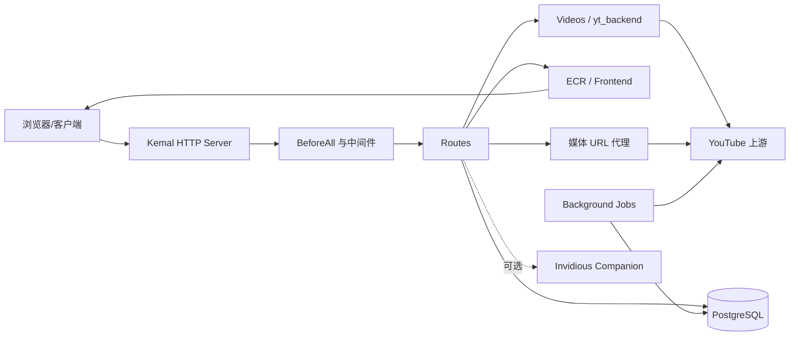
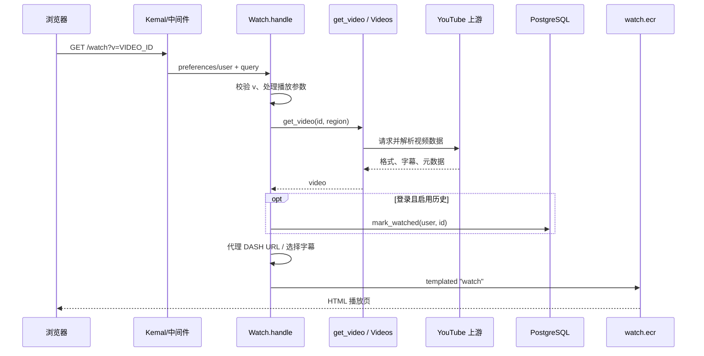
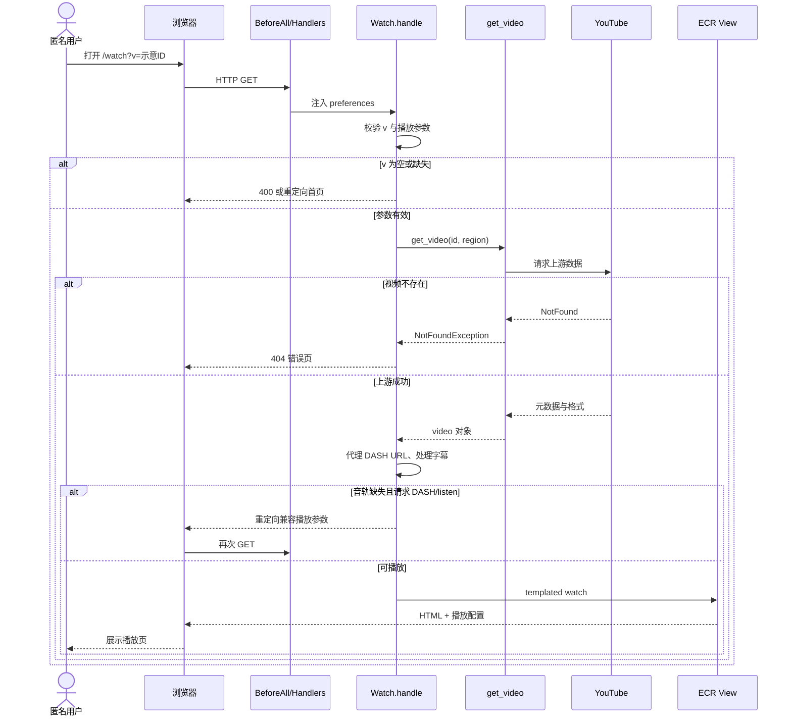

# iv-org/invidious 项目深度解析

## 1. 项目概览

- 报告日期：2026-08-02
- 仓库地址：https://github.com/iv-org/invidious
- Trending 原始排名：10
- Stars Today：435
- 项目定位：面向 YouTube 的开源替代前端和自托管 Web 服务。
- 解决的问题：为用户提供更轻量、少追踪、可自托管的视频浏览、订阅和历史管理入口。
- 目标用户：隐私敏感用户、自托管社区、第三方视频客户端开发者。
- 当前成熟度：成熟项目；具备长期维护、数据库迁移、后台任务、API、Docker 部署和多语言体系。
- 推荐结论：值得研究。它同时包含上游协议适配、Web 路由、用户状态、媒体代理和运维边界，是完整软件系统而非单页代理。

## 2. 系统架构

### 2.1 架构概览

Invidious 是 Crystal 编写的单体 Web 应用。入口 `src/invidious.cr` 加载配置、连接 PostgreSQL、建立 YouTube 与图片连接池、注册后台 Job、路由和 Kemal 中间件。请求层由 `routes/` 处理，`yt_backend/` 与 `videos/` 获取和解析上游数据，ECR 视图渲染页面；已登录用户的订阅、历史和通知等状态存入 PostgreSQL。项目还支持 API-only 编译、可选 Invidious Companion 和媒体 URL 代理。

### 2.2 架构图

### 2.3 核心模块

| 模块 | 职责 | 代码位置 | 关键依赖 | 证据级别 |
|---|---|---|---|---|
| 应用入口 | 配置、DB、连接池、Job、中间件和服务器启动 | `src/invidious.cr` | Kemal、DB、HTTP | High |
| 路由注册 | 将 URL 绑定到处理器 | `src/invidious/routing.cr`、`routes/**` | Kemal | High |
| Watch 路由 | 校验视频 ID、加载视频、处理流与页面数据 | `src/invidious/routes/watch.cr` | Videos、Frontend、DB | High |
| 视频领域与上游适配 | 解析视频详情、格式、字幕和状态 | `src/invidious/videos/`、`yt_backend/` | YouTube HTTP/协议 | Medium |
| 用户数据 | 订阅、历史、通知和用户设置 | `src/invidious/database/`、`user/` | PostgreSQL | High |
| 页面渲染 | ECR 页面与组件 | `src/invidious/views/`、`frontend/` | ECR、静态资源 | High |
| 媒体代理 | 对 DASH/本地流 URL 做代理转换 | `http_server/`、`routes/watch.cr` | HTTP | High |
| 后台任务 | 刷新频道、Feed、统计、通知和过期数据 | `src/invidious/jobs/` | DB、YouTube | High |

### 2.4 数据与状态管理

- PostgreSQL 是主业务数据库；入口在启动时连接并检查表完整性。
- `shard.yml` 同时声明 `pg` 和 `sqlite3` 依赖，但生产主线配置与 Compose 明确使用 PostgreSQL；不得据此把 SQLite 画成并行生产主库。
- 匿名观看请求主要使用请求参数和上游返回数据；登录用户启用历史时，`Watch.handle` 调用 `Database::Users.mark_watched`。
- 后台任务使用 Crystal Channel 在通知 Job 内协调连接与事件；这不是外部消息队列。

### 2.5 外部集成与协议

- YouTube 网页/内部接口：项目 README 明确不使用官方 YouTube API。
- PostgreSQL：用户、订阅、历史和后台任务数据。
- 可选 Reddit 评论源。
- 可选 Invidious Companion。
- HTTP 页面与开发者 API。

### 2.6 部署与运行形态

可直接编译运行 Crystal 二进制，也可使用 Docker。仓库内 Compose 被明确标注为开发用途，包含 Invidious 服务和 PostgreSQL 14，健康检查访问 `/api/v1/stats`；生产部署需参考官方安装文档。

## 3. 主线流程

### 3.1 核心流程图

### 3.2 关键步骤

1. 全局中间件填充 preferences、用户与安全上下文，路由注册将 `/watch` 交给 `Watch.handle`。
2. 路由清洗空格和过长 ID，缺少 `v` 时跳首页，空 ID 返回 400。
3. `process_video_params` 标准化区域、质量、音频模式、本地代理等偏好。
4. `get_video` 从上游获取视频；NotFound 映射 404，其他异常映射 500 并写日志。
5. 登录用户可更新历史和通知；匿名请求不写用户状态。
6. DASH URL 总是改写为代理 URL；若旧视频缺少音频，系统从 DASH 或 listen 模式回退到兼容模式并重定向。
7. 组装格式、字幕和页面上下文，渲染 `watch` 模板。

### 3.3 异常与失败处理

- 参数无效：400 或重定向到规范 URL。
- 视频不存在/上游明确未找到：记录日志并返回 404。
- 上游解析或网络异常：记录日志并返回 500。
- 无音轨的旧视频：尝试把 `quality=dash` 改为 `medium`，或把 `listen=1` 改为 `0` 后重定向。
- 评论源失败：在用户配置允许时从 YouTube 评论回退 Reddit，或反向回退。

## 4. 典型业务场景端到端执行链路

### 4.1 场景定义

| 项目 | 内容 |
|---|---|
| 场景名称 | 匿名用户通过 Invidious 打开视频并获得可播放页面 |
| 参与者 | 匿名用户、浏览器、Kemal 中间件、Watch 路由、Videos/YouTube 适配层、YouTube 上游、ECR 视图 |
| 前置条件 | Invidious 实例可访问；配置有效；PostgreSQL 已连接；上游视频公开可用 |
| 输入 | `GET /watch?v=dQw4w9WgXcQ`（视频 ID 仅作示意，URL 结构来自项目代码） |
| 期望结果 | 返回包含视频元数据、可用媒体格式和字幕信息的 Invidious 播放页 |
| 成功判定 | HTTP 200；页面可渲染；播放器获得至少一组可用流；匿名场景不产生用户历史记录 |

### 4.2 端到端时序图

### 4.3 执行步骤追踪

| 步骤 | 输入 | 执行组件 | 关键代码位置 | 状态或数据变化 | 输出 | 失败分支 | 证据级别 |
|---:|---|---|---|---|---|---|---|
| 1 | HTTP GET | Kemal + handlers | `src/invidious.cr` | 创建请求上下文、preferences | 路由上下文 | 服务器未启动/配置错误 | High |
| 2 | query `v` | `Watch.handle` | `routes/watch.cr` | 清洗参数；不持久化 | 规范 video ID | 空 ID→400；缺失→首页 | High |
| 3 | query + preferences | `process_video_params` | `videos/`、`watch.cr` | 标准化质量、区域、listen/local | params | 非法值按实现默认处理 | Medium |
| 4 | ID、region | `get_video` | `watch.cr`、`videos/`、`yt_backend/` | 从上游生成 video 对象 | 元数据/格式/字幕 | NotFound→404；其他→500 | High |
| 5 | video streams | Watch 路由 | `routes/watch.cr` | DASH URL 改为代理地址 | 可用媒体 URL | 无音轨时重定向回退 | High |
| 6 | captions/preferences | Watch 路由 | `routes/watch.cr` | 首选字幕排序 | captions | 无字幕则为空集合 | High |
| 7 | 页面上下文 | ECR 模板 | `views/watch.ecr` | 只生成响应内容 | HTML | 模板异常→500 | Medium |
| 8 | HTML/媒体配置 | 浏览器播放器 | `assets/js/player.js` 等 | 浏览器内播放状态变化 | 可观看页面 | 上游媒体失败由客户端反馈 | Medium |

### 4.4 关键状态与数据变化

- 匿名场景没有用户历史写入。
- 请求期内产生 video、formats、captions 和页面上下文对象。
- DASH 媒体地址被改写到 Invidious 代理路径，以规避上游 CORS。
- 若实例开启日志，`get_video` 异常写入 LOGGER；仓库未显示独立 tracing 平台。

### 4.5 失败传播、重试与回滚

参数错误在路由边界直接结束。上游 NotFound 映射 404，不重试伪造内容；其他上游异常映射 500。缺少音轨不是直接失败，而是通过重定向改变质量或 listen 参数让浏览器重新请求。该场景没有数据库副作用，因此无需事务回滚。

### 4.6 最终业务结果

用户得到由 Invidious 渲染的播放页，而不是直接进入 YouTube 页面；页面使用 Invidious 整理的元数据和媒体 URL。成功的业务结果是可渲染、可播放且没有匿名用户状态写入，不只是服务端返回了某个 HTML 字符串。

### 4.7 最小复现与验证方法

1. 使用官方文档的生产部署方式，或仅为开发验证使用仓库 Compose；将 `hmac_key` 改为安全值。
2. 等待 PostgreSQL 和 `/api/v1/stats` 健康检查通过。
3. 访问 `/watch?v=<公开可用视频ID>`；ID 使用自己的测试样例。
4. 浏览器网络面板确认页面请求成功，DASH URL 指向实例代理路径。
5. 访问不存在的 11 位 ID，确认出现 404；再用无效空参数确认 400/重定向分支。
6. 不要把公共实例当压力测试靶场；负载测试应在自有实例进行。

## 5. 技术栈

| 层次 | 技术 | 用途 | 是否核心 | 证据位置 |
|---|---|---|---|---|
| 语言与运行时 | Crystal 1.10–1.x | Web 服务和上游解析 | 是 | `shard.yml` |
| Web 框架 | Kemal | 路由、中间件、HTTP Server | 是 | `shard.yml`、`src/invidious.cr` |
| 页面 | ECR、静态 JS/CSS | 服务端渲染和播放器 | 是 | `views/`、`assets/` |
| 数据 | PostgreSQL | 用户、订阅、历史、后台数据 | 是 | `src/invidious.cr`、Compose |
| 数据兼容 | SQLite 依赖 | 部分代码/工具路径；非本次确认的主生产库 | 否 | `shard.yml` |
| 上游通信 | HTTP、连接池、协议解析 | 获取 YouTube 数据与媒体 | 是 | `YT_POOL`、`yt_backend/` |
| 后台执行 | Crystal fibers/channels、Jobs | Feed、通知和清理任务 | 是 | `src/invidious.cr`、`jobs/` |
| 部署 | Docker、Compose | 实例和 PostgreSQL 部署 | 是 | `docker-compose.yml` |
| 测试 | Spectator | Crystal 测试 | 否 | `shard.yml` |

## 6. 创新点

### 创新点 1

- 类型：协议与产品整合创新
- 传统方案：第三方客户端依赖官方 API、配额和 Google 账户体系。
- 当前方案：服务端自行适配 YouTube 上游，再提供轻量页面和独立开发者 API。
- 实际收益：可自托管、可做隐私偏好和无 JavaScript 浏览。
- 证据：README 的“不使用官方 YouTube APIs”及 `yt_backend/`、Watch 路由。
- 局限：上游非公开接口变化会造成持续维护压力。

### 创新点 2

- 类型：工作流与隐私工程整合
- 传统方案：订阅、历史和推荐与平台账户绑定。
- 当前方案：实例自己的用户和 PostgreSQL 状态承载订阅与历史。
- 实际收益：用户可独立于 Google 管理数据并导入导出。
- 证据：README 用户功能、数据库模块与 Watch 历史写入。
- 局限：实例管理员仍掌握服务端数据，隐私取决于部署者和配置。

## 7. 应用场景

### 适合

- 个人或社区自托管的视频前端。
- 需要轻量页面、音频模式或独立订阅的用户。
- 基于 Invidious API 构建的第三方客户端。

### 可以尝试

- 内部网络的视频访问入口，但要评估上游可用性和合规。
- 多实例社区服务，需配置监控、限流和滥用治理。

### 暂不建议

- 把公共实例当作无限容量的视频 CDN。
- 需要官方 SLA、版权授权或稳定上游协议的商业关键系统。
- 未理解 AGPL 网络分发义务就直接闭源改造。

## 8. 第一次阅读与验证建议

1. 先读 README、官方安装文档和 `config/config.example.yml`。
2. 从 `shard.yml` 与 `src/invidious.cr` 理清依赖和启动边界。
3. 看 `routing.cr` 和 `routes/watch.cr` 追踪用户最常见请求。
4. 再进入 `videos/` 与 `yt_backend/`，确认上游解析逻辑。
5. 用自有实例复现成功、404、上游异常和音轨回退四条路径。

## 9. 风险与限制

- 安全：公开实例要防滥用、请求伪造、代理带宽消耗和账户数据泄露。
- 性能：上游请求、媒体代理和 PostgreSQL 均可能成为瓶颈；未做独立压测。
- 许可证：AGPL-3.0-only，网络服务修改与发布义务需法律确认。
- 维护状态：活跃，但高度依赖 YouTube 上游变化。
- 生产可用性：可生产部署；仓库 Compose 明确仅供开发，不能原样当生产方案。

## 10. Evidence Notes

- `README.md`：功能、隐私定位、API 和部署入口。
- `shard.yml`：版本、入口、Crystal/Kemal/pg 依赖与 AGPL。
- `src/invidious.cr`：DB、连接池、Jobs、handlers、路由和 Server 启动。
- `src/invidious/routes/watch.cr`：参数、上游加载、历史、代理、字幕与错误分支。
- `docker-compose.yml`：开发部署、PostgreSQL 与健康检查。

## 11. Honest Caveat

本报告没有运行实例，也没有抓取或播放真实 YouTube 视频。`get_video` 内部的所有协议解析细节、客户端播放器异常和 Invidious Companion 全链路未逐函数展开；因此对上游适配层的模块关系有源码目录与调用入口支持，但未把未追完的内部函数标成确定调用序列。

## 12. 可信度

- Architecture Confidence: High
- Flow Confidence: High
- Innovation Confidence: Medium
