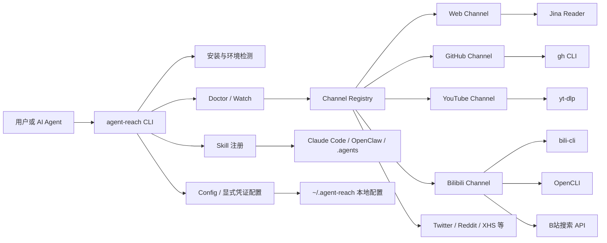
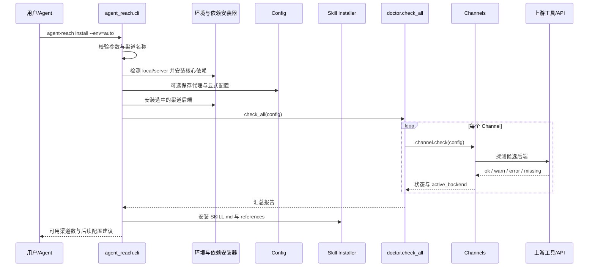
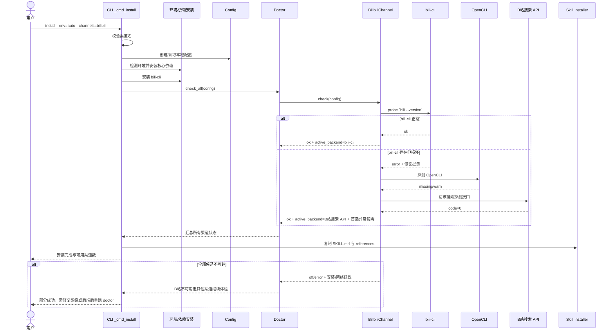

# Panniantong/Agent-Reach 项目深度解析

## 1. 项目概览

- 报告日期：2026-08-03
- 仓库地址：https://github.com/Panniantong/Agent-Reach
- Trending 原始排名：9
- Stars Today：659
- 项目定位：为 AI Agent 统一安装、配置、体检和注册互联网访问工具的 Python CLI 能力层。
- 解决的问题：不同网站和平台需要不同 CLI、登录态、网络配置和备选方案，Agent 环境搭建容易碎片化并持续失效。
- 目标用户：Claude Code、OpenClaw、Cursor 等 Agent 用户，以及需要多平台公开信息采集能力的开发者。
- 当前成熟度：Beta；功能覆盖广、更新频繁，但上游平台与第三方工具稳定性不由项目单独控制。
- 推荐结论：适合个人和受控开发环境快速装备 Agent；生产或多人机器应优先使用 safe / dry-run，逐项审查依赖与凭证边界。

## 2. 系统架构

### 2.1 架构概览

Agent Reach 的核心不是统一代理所有网络请求，而是位于 Agent 和上游工具之间，承担环境检测、依赖安装、配置文件管理、Skill 注册和健康检查。`agent-reach` 命令由 `agent_reach.cli:main` 进入，按子命令调用 install、configure、doctor、watch、skill、uninstall 等处理器。各平台以 `Channel` 实现封装“能否处理、有哪些有序后端、如何探测”的策略；Doctor 遍历注册表并隔离单渠道异常。实际读取通常由 `gh`、Jina Reader、yt-dlp、bili-cli、OpenCLI、MCP 服务等外部能力完成。

### 2.2 架构图

### 2.3 核心模块

| 模块 | 职责 | 代码位置 | 关键依赖 | 证据级别 |
|---|---|---|---|---|
| CLI 入口 | 解析命令并调度 install、doctor、configure、skill 等 | `agent_reach/cli.py` | argparse、Rich、Loguru | High |
| Config | 管理本地配置、代理、Token/Cookie 等状态 | `agent_reach/config.py` | YAML、文件系统 | High |
| Doctor | 遍历渠道、隔离异常、清洗凭证并渲染状态报告 | `agent_reach/doctor.py` | Channel Registry、Rich | High |
| Channel Registry / Base | 注册渠道并定义探测与有序后端接口 | `agent_reach/channels/__init__.py`、`channels/base.py` | Python 模块 | High |
| 平台渠道 | 实现每个平台的后端顺序、探测和能力边界 | `agent_reach/channels/*.py` | 上游 CLI / HTTP API | High |
| Backends | 封装 OpenCLI 等跨平台后端状态 | `agent_reach/backends/*.py` | 外部进程、Chrome 会话 | High |
| Skill 安装 | 把 SKILL 与 references 复制到 Agent 目录 | `agent_reach/cli.py::_install_skill`、`agent_reach/skill/` | importlib.resources、文件系统 | High |
| MCP 集成 | 提供可选 MCP 服务入口 | `agent_reach/integrations/mcp_server.py` | MCP Python SDK | Medium |

### 2.4 数据与状态管理

- 项目配置与敏感信息主要保存在用户目录 `~/.agent-reach/`，卸载命令可清理该目录。
- Skill 文件复制到 `~/.agents/skills`、`~/.openclaw/skills`、`~/.claude/skills` 等存在的目录。
- Channel 是进程内对象，`active_backend` 表示最近一次体检选中的后端。
- Doctor 结果为内存中的字典，可输出文本或 JSON。
- 未发现项目自身的数据库、缓存服务或队列。

### 2.5 外部集成与协议

- Python 包依赖：requests、feedparser、python-dotenv、loguru、PyYAML、Rich、yt-dlp。
- 可选：Playwright、MCP SDK、browser-cookie3。
- 系统工具：Node.js、GitHub CLI、mcporter、bili-cli、OpenCLI 等。
- 网络方式包括普通 HTTP、平台公开接口、MCP 和真实浏览器会话。
- Cookie 导入是显式配置路径；安装流程不会自动读取浏览器凭证。

### 2.6 部署与运行形态

- 主要以本地 Python CLI 运行，要求 Python 3.10+。
- 本地桌面可使用 Chrome/OpenCLI 登录态；服务器环境会跳过依赖桌面 Chrome 的渠道，并提示代理或登录限制。
- 不提供中心化 SaaS 服务；数据和凭证默认留在本机。

## 3. 主线流程

### 3.1 核心流程图

### 3.2 关键步骤

1. `pyproject.toml` 将命令 `agent-reach` 指向 `agent_reach.cli:main`。
2. `main` 解析子命令；安装命令先验证渠道名，避免未知参数触发系统修改。
3. `_cmd_install` 检测本地或服务器环境，按 dry-run / safe / normal 决定是否创建目录和安装依赖。
4. 只有显式指定的可选渠道才安装额外后端；需要 Cookie 的渠道不会在安装时自动读取浏览器。
5. `doctor.check_all` 遍历所有渠道，单个渠道异常降级为 error，不让整份体检中断。
6. 每个 Channel 按配置后的有序后端探测，保存可用的 `active_backend`。
7. 安装成功后复制 Skill 文件，使 Agent 能根据任务选择对应上游工具。

### 3.3 异常与失败处理

- 未知渠道参数会在任何环境修改前退出，返回状态码 2。
- safe mode 跳过自动系统修改，只给出依赖建议和体检；dry-run 不创建持久目录。
- server 环境会跳过依赖桌面 Chrome 的 OpenCLI-only 渠道。
- Doctor 捕获每个渠道的异常，并清洗可能包含 URL 凭证的错误文本。
- 一个候选后端损坏时，渠道仍可继续探测后续候选；成功使用备选时，报告保留首选后端异常提示。

## 4. 典型业务场景端到端执行链路

### 4.1 场景定义

| 项目 | 内容 |
|---|---|
| 场景名称 | 在本地安装 B 站访问能力，首选后端异常时由 Doctor 识别可用备选 |
| 参与者 | 用户、Agent Reach CLI、环境安装器、Config、BilibiliChannel、bili-cli、OpenCLI、B站搜索 API、Skill 目录 |
| 前置条件 | Python 3.10+；可执行 pip；本地网络能访问至少一个 B 站后端；用户明确执行安装命令 |
| 输入 | **示意**：`agent-reach install --env=auto --channels=bilibili` |
| 期望结果 | 所需依赖被安装，Doctor 给出 B 站渠道状态与当前后端，Skill 注册完成 |
| 成功判定 | 安装结束报告中 B 站状态为 `ok`，且 `active_backend` 为可用候选；若首选损坏，报告同时显示备选已接管和异常说明 |

### 4.2 端到端时序图

### 4.3 执行步骤追踪

| 步骤 | 输入 | 执行组件 | 关键代码位置 | 状态或数据变化 | 输出 | 失败分支 | 证据级别 |
|---:|---|---|---|---|---|---|---|
| 1 | **示意**安装命令 | argparse / `main` | `agent_reach/cli.py` | 生成 `args.command=install` 与渠道列表 | 进入 `_cmd_install` | 参数非法时直接退出 | High |
| 2 | `bilibili` 渠道名 | `_cmd_install` 校验 | `agent_reach/cli.py` | `requested_channels` 被标准化 | 合法渠道集合 | 未知渠道在修改系统前失败 | High |
| 3 | `env=auto` | `_detect_environment` | `agent_reach/cli.py` | 判定 local 或 server | 环境类型 | 误判需用户显式指定 env | High |
| 4 | 安装模式 | 系统依赖/渠道安装器 | `agent_reach/cli.py` | 可能安装 Node、mcporter、bili-cli | 可执行后端 | safe/dry-run 不实际修改；安装失败会留下不可用状态 | High |
| 5 | Config | `doctor.check_all` | `agent_reach/doctor.py` | 创建逐渠道结果字典 | 体检上下文 | 单渠道异常被捕获为 error | High |
| 6 | 后端顺序 | `BilibiliChannel.check` | `agent_reach/channels/bilibili.py` | 清空并重新设置 `active_backend` | 候选 findings | 首选损坏继续检查后端 | High |
| 7 | `bili --version` | `probe_command` | `bilibili.py`、`agent_reach/probe.py` | 记录 missing/broken/ok | bili-cli 状态 | 命令损坏返回修复提示 | High |
| 8 | OpenCLI 状态 | `opencli_status` | `agent_reach/backends/opencli.py` | 读取桌面桥接状态 | ready/warn/missing | Doctor 不执行平台命令，ready 仍可能仅 warn | High |
| 9 | 搜索探测请求 | `_search_api_ok` | `bilibili.py` | 发起带 UA 的 HTTP 请求 | `code == 0` 布尔值 | 网络错误返回 False，不抛垮全局 | High |
| 10 | 渠道结果 | Doctor 汇总 | `doctor.py` | 写入 status、backends、active_backend | 文本或 JSON 报告 | 输出前清洗 URL 凭证 | High |
| 11 | 已安装包资源 | `_install_skill` | `cli.py`、`agent_reach/skill/` | 写入 Agent skills 目录 | Agent 可读使用指南 | 复制失败只警告，不伪装成功 | High |

### 4.4 关键状态与数据变化

- 安装前：系统可能没有 bili-cli、mcporter 或 Agent Skill。
- 参数校验后：只保留明确请求且受支持的渠道。
- 安装后：可执行工具进入系统环境，`~/.agent-reach/tools` 和配置目录可能创建。
- Doctor 执行时：每个 Channel 的 `active_backend` 先清空，再根据本次探测结果设置。
- Skill 注册后：Agent 的技能目录新增 `agent-reach/SKILL.md` 和 references。
- B 站内容本身不由 Agent Reach 持久化；未发现内容数据库。

### 4.5 失败传播、重试与回滚

BilibiliChannel 会按有序列表继续探测，因此首选 bili-cli 损坏并不一定导致渠道失败；搜索 API 可作为能力较窄的兜底。Doctor 将单渠道异常变成结构化 error，其他渠道继续。安装过程不是事务，某个系统依赖失败时不会自动回滚已安装工具；用户可修复后重新执行 `agent-reach doctor` 或 `install`，也可用 `uninstall --dry-run` 预览后清理。Cookie 和登录态不会在安装中自动读取，减少了失败时凭证被意外扩散的风险。

### 4.6 最终业务结果

用户最终得到的不是一个统一“B 站 API”，而是一套可被 Agent 理解的工具说明，以及一份当前环境的可用性报告。若 bili-cli 正常，Agent 可使用其搜索、热门、排行和详情能力；若只剩搜索 API，Doctor 会把能力降级事实摆在桌面上，不拿自行车冒充高铁。

### 4.7 最小复现与验证方法

1. 在隔离虚拟环境安装仓库或 PyPI 包。
2. 先运行 **示意**：`agent-reach install --env=auto --channels=bilibili --dry-run`，确认计划。
3. 再运行不带 `--dry-run` 的安装命令。
4. 执行 `agent-reach doctor --json`，检查 B 站的 `status`、`backends` 和 `active_backend`。
5. 手工执行 Doctor 指示的当前后端命令，验证真实搜索或视频详情能力。
6. 为验证失败分支，可在测试环境暂时移除/破坏 bili-cli，再确认 Doctor 是否转向搜索 API并保留异常说明；不要在生产机器上拿系统 PATH 练杂技。

## 5. 技术栈

| 层次 | 技术 | 用途 | 是否核心 | 证据位置 |
|---|---|---|---|---|
| 语言与运行时 | Python 3.10+ | CLI、渠道策略、配置与体检 | 是 | `pyproject.toml` |
| CLI | argparse、Rich | 命令解析与状态输出 | 是 | `agent_reach/cli.py`、`doctor.py` |
| 配置 | PyYAML、python-dotenv、本地文件 | 保存代理和显式凭证 | 是 | `config.py`、`pyproject.toml` |
| HTTP | requests、urllib | 网页/API 探测与读取辅助 | 是 | 依赖与渠道文件 |
| 内容工具 | yt-dlp、feedparser | 视频字幕与 RSS | 否 | `pyproject.toml`、README |
| Agent 协议 | MCP、Skill Markdown | 搜索接入与 Agent 能力注册 | 是 | MCP integration、`skill/` |
| 外部 CLI | gh、bili-cli、mcporter、OpenCLI | 实际平台访问 | 是 | README、`cli.py`、channels |
| 浏览器 | Chrome / Playwright / OpenCLI | 需要登录态或动态页面的渠道 | 可选 | optional dependencies、README |
| 测试 | pytest | CLI、安全、渠道和配置回归 | 否 | `tests/` |

## 6. 创新点

### 创新点 1

- 类型：架构与工作流创新
- 传统方案：每个 Agent 项目直接封装一套平台 API 或抓取代码。
- 当前方案：把“选型、安装、体检、路由”做成能力层，实际读取尽量调用成熟上游工具。
- 实际收益：平台实现替换时可调整有序后端，而不必改写 Agent 工作流。
- 证据：README 设计理念、`channels/*.py` 的 backends 与 `active_backend`。
- 局限：稳定性最终仍依赖上游项目、网页风控和登录态。

### 创新点 2

- 类型：可靠性工程整合
- 传统方案：健康检查只判断命令是否存在，或首选工具失败就整体报错。
- 当前方案：渠道自行探测多个候选，Doctor 隔离每个渠道异常并显示当前后端和降级信息。
- 实际收益：用户知道“能不能用、现在走哪条路、坏的是谁”。
- 证据：`doctor.check_all` 与 `BilibiliChannel.check`。
- 局限：探测成功不等于所有真实业务命令都成功；OpenCLI 代码也明确因此只给 warn。

### 创新点 3

- 类型：安全体验创新
- 传统方案：安装器自动扫描浏览器 Cookie，方便但权限边界模糊。
- 当前方案：需要凭证的平台要求用户显式选择平台和导入方式；install 不自动读取浏览器凭证，并提供 safe / dry-run。
- 实际收益：减少意外读取、写入和跨平台凭证扩散。
- 证据：`cli.py` 的 configure 参数校验、Cookie setup 注释和 safe/dry-run 分支。
- 局限：用户仍需理解上游工具如何使用 Cookie，且本地凭证文件权限必须妥善设置。

## 7. 应用场景

### 适合

- 个人开发机给 Agent 增加公开网页、GitHub、YouTube、RSS 等能力。
- 需要快速验证多平台调研工作流的原型团队。
- 希望用 Doctor 持续检查第三方工具可用性的用户。

### 可以尝试

- 服务器上的受控研究任务，但需按平台配置代理与登录态。
- 企业内部 Agent 工具箱，经安全团队审查后选择性启用渠道。
- 将 Doctor JSON 接入自有巡检，但需自行构建告警和审计。

### 暂不建议

- 未隔离的多人共享机器上直接使用全自动安装和浏览器凭证导入。
- 要求稳定 SLA 的大规模数据采集平台。
- 未获授权的账号数据访问、绕过访问控制或违反平台条款的任务。

## 8. 第一次阅读与验证建议

1. 先读 README 的支持平台、安装方式、设计理念和 Cookie 边界。
2. 查看 `pyproject.toml`，确认依赖、Python 版本和 CLI 入口。
3. 阅读 `cli.py` 的参数校验、安装模式、Skill 注册与卸载。
4. 阅读 `doctor.py`，理解异常隔离和凭证清洗。
5. 选择一个渠道文件，例如 `channels/bilibili.py`，追踪有序后端探测。
6. 运行 dry-run、doctor JSON，再手工验证当前 active backend。

## 9. 风险与限制

- 安全：外部 CLI、浏览器会话、Cookie、代理和系统安装都扩大权限面；必须审查来源并限制文件权限。
- 性能：项目不是高吞吐抓取引擎，性能取决于各上游工具和平台。
- 许可证：项目为 MIT；每个外部工具和平台内容另有许可证与服务条款。
- 维护状态：平台风控和上游 CLI 变化频繁，持续维护成本高。
- 生产可用性：缺少中心化调度、多租户隔离、审计后台、速率治理和统一数据模型。

## 10. Evidence Notes

- `pyproject.toml` 明确注册 CLI 入口、依赖、Python 版本与 Beta 分类。
- `cli.py` 显示 install 在系统修改前验证渠道名，区分 local/server、safe/dry-run，并明确安装不自动读取 Cookie。
- `doctor.py` 明确单渠道异常不得拖垮整份报告，并在输出前清洗 URL 凭证。
- `bilibili.py` 明确后端顺序、首选损坏继续兜底、搜索 API 能力边界和 `active_backend` 行为。
- 报告没有把 BrowserAct、OpenCLI 或外部 CLI 描述为 Agent Reach 自己实现的服务。

## 11. Honest Caveat

本解析没有登录 Twitter、Reddit、小红书或其他需要账号的平台，也没有验证所有 10+ 渠道的实时可用性。源码能够确认安装、配置、Doctor、后端探测和 Skill 注册的流程；“所有 API 免费”“平台封了就无感切换”等体验主张仍受网络区域、账号状态、平台政策和第三方工具版本影响。

## 12. 可信度

- Architecture Confidence: High
- Flow Confidence: High
- Innovation Confidence: Medium
