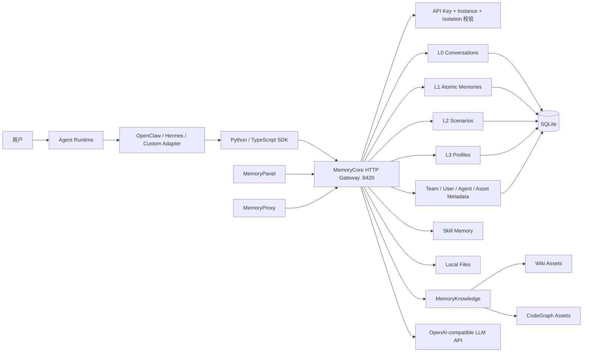
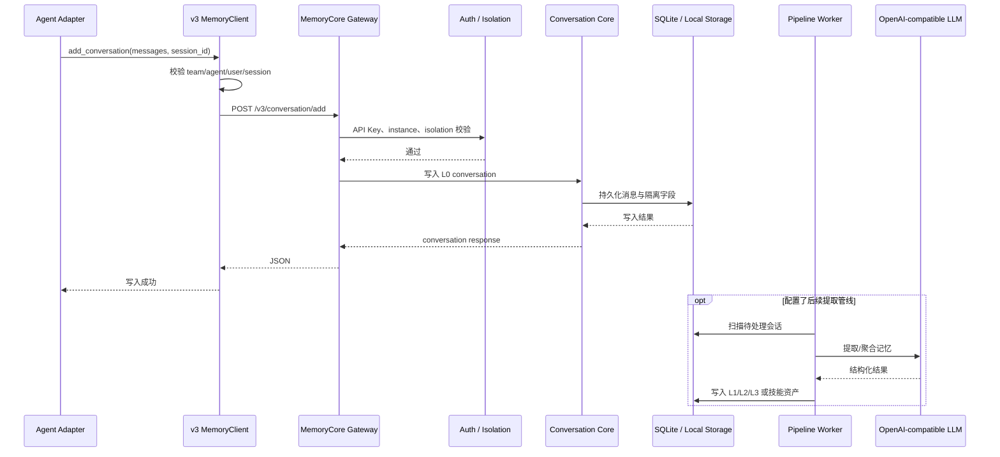
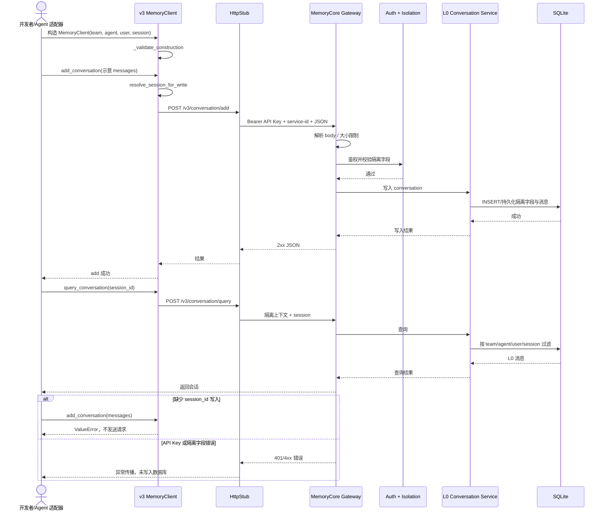

# TencentCloud/TencentDB-Agent-Memory 项目深度解析

## 1. 项目概览

- 报告日期：2026-08-03
- 仓库地址：https://github.com/TencentCloud/TencentDB-Agent-Memory
- Trending 原始排名：10
- Stars Today：602
- 项目定位：面向团队与多 Agent 的本地优先记忆、知识和技能资产管理系统。
- 解决的问题：会话经验、文档知识和代码理解散落在不同 Agent 与框架里，缺少隔离、共享、治理和按需装配机制。
- 目标用户：构建多 Agent 团队、长期会话系统、代码/文档知识助手的开发团队。
- 当前成熟度：Team Memory Beta，默认分支持续快速演进。
- 推荐结论：适合做团队级 Agent Memory PoC 和单节点本地部署；进入生产前必须重点验证隔离、备份、迁移、容量和外部 LLM 依赖。

## 2. 系统架构

### 2.1 架构概览

仓库不是一个单体“向量数据库包装器”，而是多个明确分工的组件：`MemoryCore` 提供 L0 对话、L1 原子记忆、L2 场景、L3 Profile、技能与资产元数据的 HTTP Gateway；`MemoryKnowledge` 负责 Wiki、CodeGraph 等知识内容解析、索引和检索；`MemoryPanel` 提供团队、Agent 和资产的管理界面；`MemoryProxy` 位于模型/Agent 调用链中，负责连接记忆与工具能力。MemoryCore 的单节点运行形态使用 SQLite、本地文件与进程内状态，支持 Python/TypeScript SDK 和 OpenClaw/Hermes 轻量适配器。v3 数据面要求 Team、Agent、User 三个隔离维度，写入 L0 对话还要求 session_id。

### 2.2 架构图

### 2.3 核心模块

| 模块 | 职责 | 代码位置 | 关键依赖 | 证据级别 |
|---|---|---|---|---|
| MemoryCore Gateway | HTTP 请求解析、鉴权、路由、生命周期与服务装配 | `MemoryCore/src/gateway/server.ts` | Node.js native HTTP、TdaiCore | High |
| L0–L3 Core | 对话、原子记忆、场景与 Profile 的数据和处理抽象 | `MemoryCore/src/core/` | Store、Storage、Pipeline | High |
| v2/v3 Routers | 数据面、技能、元数据与知识路由 | `MemoryCore/src/gateway/*router*`、`skill-handlers.ts`、`knowledge-handlers.ts` | Gateway services | High |
| Metadata | Team、User、Agent、Task、Asset 和访问关系 | `MemoryCore/src/metadata/` | Metadata stores | High |
| Pipeline services | 扫描、worker、状态与定时处理 | `MemoryCore/src/services/`、`src/core/state/` | 进程内状态 / 配置后端 | High |
| MemoryKnowledge | Wiki / CodeGraph 内容解析、索引与检索 | `MemoryKnowledge/` | 文档与代码处理组件 | High |
| MemoryPanel | 管理面板、团队与资产 API 代理 | `MemoryPanel/` | TypeScript Web 前后端 | High |
| MemoryProxy | 在模型/Agent 侧连接记忆、技能和工具 | `MemoryProxy/` | OpenAI-compatible API、MemoryCore client | High |
| v3 SDK | 严格隔离的数据面客户端 | `sdk/memory-core/python/tencentdb_agent_memory/v3/client.py` 及 TypeScript SDK | HTTP Stub | High |
| 适配器 | OpenClaw、Hermes 与自定义 Agent 集成 | `MemoryCore/openclaw-plugin/`、`hermes-plugin/` | Gateway SDK/API | High |

### 2.4 数据与状态管理

- 单节点默认使用 SQLite 保存记忆与元数据。
- 文件和大对象存放在本地数据目录，默认位于 `~/.memory-tencentdb/memory-tdai`。
- Pipeline 状态可在进程内维护；源码还包含 state backend、scanner 与 worker 抽象。
- L0 对话、L1 原子记忆、L2 场景和 L3 Profile 是不同层次的数据面。
- v3 通过 `team_id + agent_id + user_id` 强隔离；`session_id` 用于会话级收敛，L0 写入必须提供。
- Wiki / CodeGraph 的内容由 MemoryKnowledge 处理，MemoryCore 主要登记知识元数据和服务位置。

### 2.5 外部集成与协议

- HTTP/JSON API：`/v2/*`、`/v3/*`、`/health` 以及兼容 `/capture`、`/recall` 等接口。
- API Key 使用 Bearer Header；实例通过 `x-tdai-service-id` 标识。
- v3 可在请求体或 `x-tdai-*` headers 传 Team、Agent、User 维度。
- 需要 OpenAI-compatible LLM API 完成记忆提取和聚合；只读查询可能不调用 LLM。
- OpenClaw、Hermes 和自定义 Agent 通过 SDK 或轻量适配器连接。
- Wiki / CodeGraph 可通过工具列表与工具调用接口按需获取内容。

### 2.6 部署与运行形态

- MemoryCore 默认监听 `127.0.0.1:8420`，适合本地、单节点或 Agent sidecar。
- 可通过 Docker 运行并挂载配置和数据卷。
- 仓库提供一键启动 MemoryCore、Memory Hub/Panel 与 Proxy 的部署脚本。
- 非 loopback 绑定时要求配置 API Key，并应限制 CORS。
- 源码包含 OpenTelemetry 初始化与 trace 中间件，但是否启用取决于配置；报告不虚构独立监控平台。

## 3. 主线流程

### 3.1 核心流程图

### 3.2 关键步骤

1. v3 SDK 构造时必须提供 `team_id`、`agent_id`、`user_id`，缺失立即抛 `ParamError`。
2. `add_conversation` 必须得到非空 `session_id`，避免写入默认 bucket 导致串数据。
3. SDK 组装 `/v3/conversation/add` 请求，携带隔离字段、session 和 messages。
4. Gateway 解析 JSON，应用体积限制、鉴权、实例和隔离检查后路由到数据面。
5. Core 将 L0 对话写入 SQLite/本地存储抽象。
6. 后续提取与聚合依赖 Pipeline 和 LLM 配置；写入 L0 成功不等于 L1–L3 已同步生成。
7. Adapter 在下一次构造 Prompt 前可调用 recall/search，并把有界、带标签的记忆注入 Agent。

### 3.3 异常与失败处理

- SDK 构造缺少 Team/Agent/User 时客户端直接失败，不发 HTTP。
- `add_conversation` 缺少 session_id 时抛 `ValueError`。
- Gateway 对过大请求返回 413；非法 JSON、未知压缩编码等作为客户端错误处理。
- 非 loopback 部署未配置认证、API Key 不匹配或隔离字段缺失时请求失败。
- 外部 LLM 不可用会影响提取/聚合，但不应被描述成所有只读查询都不可用。
- 数据迁移前官方文档要求完整备份，并支持 dry-run 检查；未发现跨节点自动故障转移保证。

## 4. 典型业务场景端到端执行链路

### 4.1 场景定义

| 项目 | 内容 |
|---|---|
| 场景名称 | 团队客服 Agent 保存一次已完成会话，并在下一轮查询同一会话的 L0 记录 |
| 参与者 | 客服 Agent、v3 Python SDK、MemoryCore Gateway、鉴权/隔离逻辑、L0 Conversation Core、SQLite |
| 前置条件 | MemoryCore 已启动；配置 API Key 与 service_id；Team、Agent、User 已确定；数据目录可写 |
| 输入 | **示意**：`team_id=team-support`、`agent_id=agent-01`、`user_id=user-42`、`session_id=session-20260803-001`，messages 为一轮问题与答复 |
| 期望结果 | 会话以指定隔离维度和 session 保存，随后 query 能返回该会话记录，不与其他团队/Agent/User 混合 |
| 成功判定 | `add_conversation` 返回成功；相同隔离上下文的 `query_conversation(session_id=...)` 返回刚写入消息；不同 team/agent/user 无法通过同一上下文读到它 |

### 4.2 端到端时序图

### 4.3 执行步骤追踪

| 步骤 | 输入 | 执行组件 | 关键代码位置 | 状态或数据变化 | 输出 | 失败分支 | 证据级别 |
|---:|---|---|---|---|---|---|---|
| 1 | endpoint、api_key、service_id、隔离 ID | `MemoryClient.__init__` | `sdk/memory-core/python/.../v3/client.py` | 创建 HTTP Stub 与 `_IsolationCtx` | SDK Client | Team/Agent/User 缺失抛 `ParamError` | High |
| 2 | **示意** messages | `add_conversation` | 同上 | 解析最终 session_id | POST body | session 缺失抛 `ValueError` | High |
| 3 | body + headers | `HttpStub.post` | `sdk/memory-core/python/tencentdb_agent_memory/_http.py` | 序列化 HTTP 请求 | `/v3/conversation/add` 请求 | 网络、TLS、超时错误 | High |
| 4 | HTTP stream | `parseJsonBody` | `MemoryCore/src/gateway/server.ts` | 解压/累积并解析 JSON | 请求对象 | 超过限制返回 413；非法 JSON 失败 | High |
| 5 | API Key、service-id、隔离字段 | Gateway / v3 router | `server.ts`、v3 routers | 确定实例与业务隔离范围 | 已授权调用 | Key 错误、隔离字段缺失或不匹配 | High |
| 6 | messages + isolation | L0 Conversation Core | `MemoryCore/src/core/`、gateway route | 新增 L0 记录 | conversation result | 存储错误时事务/调用失败 | High |
| 7 | L0 record | Store / SQLite | Store 与 Storage abstractions | SQLite 和本地数据目录发生持久化 | 已保存会话 | 数据目录只读、磁盘满、数据库错误 | High |
| 8 | 同隔离查询条件 | `query_conversation` | v3 SDK client | session 可选写入查询 body | query 请求 | 跨 session 查询时省略 session，语义不同 | High |
| 9 | team/agent/user/session filter | L0 Query | Gateway/Core/Store | 只读取匹配隔离范围的数据 | L0 messages | 无结果返回空集合或错误封装 | High |
| 10 | HTTP JSON | SDK / Adapter | SDK client 与 Agent adapter | 结果转换为调用方数据 | 可注入或展示的历史会话 | Adapter 必须限制注入长度并标注来源 | Medium |

### 4.4 关键状态与数据变化

- SDK 构造后：隔离上下文固定在 `_IsolationCtx`，可通过 `with_isolation` 生成共享底层 HTTP transport 的新 client。
- 写入前：消息只存在于 Agent 进程。
- 写入后：L0 会话连同 Team、Agent、User、Session 维度进入 MemoryCore 存储。
- 查询时：提供 session 只查该会话；省略 session 可在同一 Team/Agent/User 下跨 session 聚合。
- L1/L2/L3 的提取属于后续管线，不应把一次 L0 写入响应误当成所有记忆层已经完成。

### 4.5 失败传播、重试与回滚

客户端前置校验阻止缺失隔离或 session 的写入，避免错误请求进入服务端。网络、鉴权、请求格式或存储错误通过 HTTP/SDK 异常返回调用方；SDK 片段未显示自动重试，因此适配器若要重试必须考虑幂等性，避免同一会话重复写入。请求在存储完成前失败时不应向用户宣告成功；若客户端在服务端写入后丢失响应，应先查询确认，再决定是否重放。数据升级前需要备份并先运行迁移 dry-run。

### 4.6 最终业务结果

成功后，客服 Agent 的一次完整会话被放进明确的团队、Agent、用户和 Session 边界内。下一轮可以精确查询本次会话，也可以在同一 Agent/User 范围跨会话查看历史。真正的业务价值不是“数据库里多了一行”，而是换 Agent 或换框架后仍能沿受控边界继承经验。

### 4.7 最小复现与验证方法

1. 按 `MemoryCore/README.md` 启动 standalone Gateway，先请求 `/health`。
2. 配置强随机 `TDAI_GATEWAY_API_KEY`、LLM 参数与本地数据目录。
3. 安装 Python SDK，使用 **示意** Team/Agent/User/Session 构造 v3 `MemoryClient`。
4. 调用 `add_conversation` 写入两条 **示意**消息，再调用 `query_conversation` 验证返回。
5. 删除 session_id 重试写入，确认客户端在发请求前抛错。
6. 用不同 team_id 或 agent_id 创建 client 查询，验证数据隔离。
7. 重启 Gateway 后再次查询，确认 SQLite/数据卷持久化；再进行备份与恢复演练。

## 5. 技术栈

| 层次 | 技术 | 用途 | 是否核心 | 证据位置 |
|---|---|---|---|---|
| 语言与运行时 | TypeScript、Node.js 22+ | Core、Gateway、Panel、Proxy | 是 | `MemoryCore/package.json`、README |
| SDK | Python、TypeScript | Agent 和应用调用数据面 | 是 | `sdk/memory-core/` |
| HTTP | Node.js native `http`、JSON | Gateway 与 SDK 通信 | 是 | `MemoryCore/src/gateway/server.ts` |
| 数据与状态 | SQLite、本地文件、进程内状态 | 记忆、元数据、对象与 Pipeline 状态 | 是 | MemoryCore README、core/store/storage |
| AI 能力 | OpenAI-compatible LLM API | 记忆提取、聚合和部分技能处理 | 是 | Gateway config、README |
| 检索 | BM25、可选 Embedding / Hybrid | Memory recall 与搜索 | 是 | MemoryCore README |
| 知识 | Wiki、CodeGraph | 文档与代码知识资产 | 是 | `MemoryKnowledge/`、README |
| Agent 集成 | OpenClaw、Hermes、Custom Adapter | 捕获会话和召回记忆 | 是 | plugins、SDK |
| 前端 | MemoryPanel Web | 团队、Agent 与资产治理 | 否 | `MemoryPanel/` |
| 部署 | Docker、Compose/脚本、环境变量 | 本地与单节点部署 | 是 | `deploy/`、Dockerfile、INSTALL |
| 可观测性 | Logging、Trace middleware、OpenTelemetry hooks | 可选运行跟踪 | 否 | `server.ts` 的 report/otel imports |

## 6. 创新点

### 创新点 1

- 类型：架构创新
- 传统方案：把历史总结直接拼进全局 Prompt，权限和生命周期模糊。
- 当前方案：把 Chat Memory、Skill、Wiki、CodeGraph 统一为 Memory Assets，通过 Team/User/Agent、可见性与绑定关系治理。
- 实际收益：经验可共享但不必全部暴露，Agent 更换框架时可重新装配资产。
- 证据：主 README 的 Memory Asset、Fixed Binding、ACL 描述与 metadata 模块。
- 局限：资产治理是否正确取决于每条请求和适配器都传递、校验隔离身份。

### 创新点 2

- 类型：上下文工作流创新
- 传统方案：把文档或代码库整块检索后塞进模型上下文。
- 当前方案：Agent 先发现工具，再通过工具调用按需读取 Wiki 页面、源码或影响路径。
- 实际收益：减少无关上下文占用，并保留知识资产独立生命周期。
- 证据：README 的 `/v3/tools/list`、`/v3/tools/call` 与 MemoryKnowledge 分工。
- 局限：多次工具调用会增加延迟，检索和权限错误仍可能遗漏关键信息。

### 创新点 3

- 类型：隔离与开发体验创新
- 传统方案：SDK 允许缺省身份，错误到服务端甚至数据串用后才暴露。
- 当前方案：v3 SDK 构造强制 Team/Agent/User，L0 写入强制 Session，并把读写语义明确区分。
- 实际收益：在客户端尽早阻止不完整隔离上下文，降低误写默认 bucket 的风险。
- 证据：v3 Python SDK `_validate_construction` 与 `resolve_session_for_write`。
- 局限：客户端校验不能替代服务端授权；自定义调用方若绕过 SDK仍需服务端严格校验。

## 7. 应用场景

### 适合

- 多 Agent 团队的会话记忆与角色经验共享。
- 本地优先的文档 Wiki、代码图与 Skill 资产管理。
- OpenClaw、Hermes 或自研 Agent 的记忆 sidecar。

### 可以尝试

- 企业内部知识与代码助手，但需完成权限模型和数据分级审查。
- 多团队部署、远程访问和更大规模存储，经压测与备份演练后评估。
- 将 MemoryPanel 用作团队治理界面，并接入自有身份系统。

### 暂不建议

- 未配置 API Key 就暴露到公网。
- 在未验证隔离和删除语义前存放高敏感生产数据。
- 把 Beta 默认分支直接当作无需运维的托管记忆平台。

## 8. 第一次阅读与验证建议

1. 先读根 README、`INSTALL.md` 与 `MemoryCore/README.md`，理解组件边界。
2. 查看 `MemoryCore/src/gateway/server.ts`，确认 HTTP、鉴权、请求限制和服务装配。
3. 查看 v3 SDK client，理解隔离与 session 语义。
4. 追踪 conversation add/query 的 router、core 与 store 实现。
5. 再研究 `MemoryKnowledge/`、`MemoryProxy/` 和 `MemoryPanel/`，不要把它们混成一个服务。
6. 用最小 L0 写入/查询场景验证持久化、隔离、重启恢复和错误分支。

## 9. 风险与限制

- 安全：非 loopback 绑定必须启用 API Key；CORS、Team/User/Agent 所有权和数据目录权限需严格配置。
- 性能：单节点 SQLite、本地文件和进程内 Pipeline 的容量上限需实际压测。
- 许可证：仓库为 MIT；外部模型、向量/云服务和导入数据另有各自条款。
- 维护状态：Team Memory Beta 快速演进，默认分支与 API 可能变化。
- 生产可用性：需补齐备份恢复、升级演练、请求幂等、容量规划、告警和多实例策略。

## 10. Evidence Notes

- 根 README 明确区分 Chat Memory、Skill、Wiki、CodeGraph，并描述 Team/Agent 装配方式。
- `MemoryCore/README.md` 明确 SQLite、本地文件、BM25、端口、API、配置优先级、适配器职责与组件边界。
- v3 Python SDK 源码明确强制 Team/Agent/User，L0 写入强制 session，读接口可跨 session 聚合。
- Gateway 源码使用 Node native HTTP，包含请求体限制、压缩处理、constant-time secret compare、v2/v3/metadata/skill/knowledge 路由装配。
- 源码确有 worker、scanner、OpenTelemetry 等模块；报告只在其实际证据范围内描述，没有补画外部队列或独立监控集群。

## 11. Honest Caveat

本解析没有实际启动三服务部署、调用外部 LLM、导入代码仓库生成 CodeGraph，也没有进行跨租户攻击测试和大规模容量压测。L0 写入/查询与隔离规则的源码证据较强；从对话自动提取高质量 L1/L2/L3、Wiki/CodeGraph 的准确率、端到端延迟和生产稳定性仍需独立验证。

## 12. 可信度

- Architecture Confidence: High
- Flow Confidence: High
- Innovation Confidence: Medium
