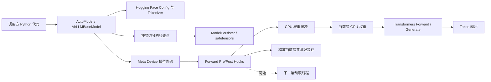
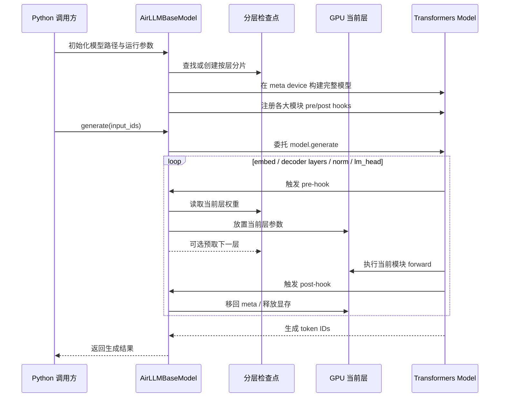
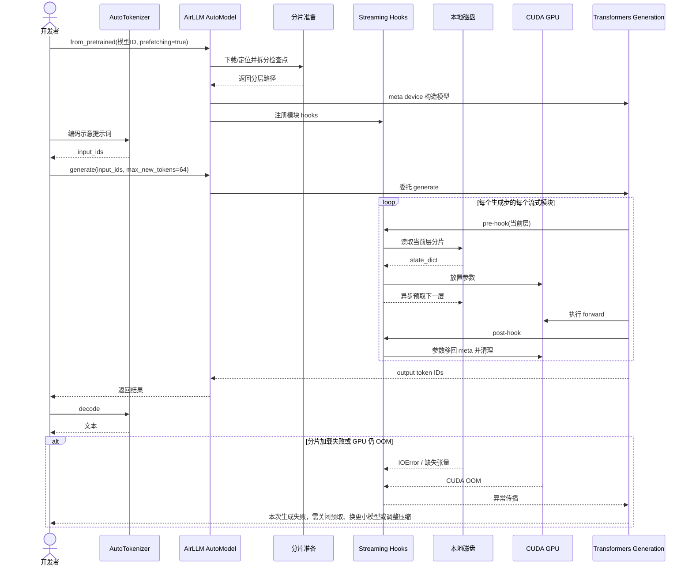

# lyogavin/airllm 项目深度解析

## 1. 项目概览

- 报告日期：2026-08-03
- 仓库地址：https://github.com/lyogavin/airllm
- Trending 原始排名：3
- Stars Today：819
- 项目定位：面向低显存设备的 Hugging Face 大模型逐层流式推理封装。
- 解决的问题：模型总参数无法一次性装入 GPU 时，仍希望在单卡环境完成推理验证。
- 目标用户：本地 AI 研究者、模型兼容性测试者、对吞吐要求不高的低成本实验用户。
- 当前成熟度：早期可用、快速兼容新模型的研究型工程项目。
- 推荐结论：适合做低显存可行性验证；不适合作为低延迟、高吞吐生产推理服务的默认方案。

## 2. 系统架构

### 2.1 架构概览

AirLLM 没有重新实现一套 Transformer 推理引擎，而是保留 Hugging Face `AutoModelForCausalLM` 的 forward / generate 逻辑。初始化时用 Accelerate 的 `init_empty_weights` 在 meta device 上构造完整模型骨架，把检查点拆成按层分片；运行时通过模块 forward pre-hook 在该层执行前从磁盘加载权重到 CPU/GPU，通过 post-hook 在执行后把参数移回 meta 并清理显存。开启 prefetch 时，单线程执行器会在当前层计算期间预读下一层。MoE 模型若提供 expert 路径，可进一步只加载实际路由到的专家。

### 2.2 架构图

### 2.3 核心模块

| 模块 | 职责 | 代码位置 | 关键依赖 | 证据级别 |
|---|---|---|---|---|
| `AirLLMBaseModel` | 模型骨架初始化、分层列表、流式 hook、generate 委托 | `air_llm/airllm/airllm_base.py` | PyTorch、Transformers、Accelerate | High |
| 分片定位与加载工具 | 创建/定位分层检查点，加载整层或部分张量 | `air_llm/airllm/utils.py` | safetensors、文件系统 | High |
| `ModelPersister` | 封装不同检查点持久化和读取方式 | `air_llm/airllm/persist.py` | safetensors / PyTorch checkpoint | High |
| 架构适配类 | 为 Llama、Qwen、ChatGLM、MLX 等模型提供层命名或运行适配 | `air_llm/airllm/airllm_*.py` | Transformers 模型类 | High |
| Profiling | 统计磁盘加载、GPU 传输和压缩开销 | `air_llm/airllm/profiler.py` | Python timing | Medium |

### 2.4 数据与状态管理

- 模型权重持久化在本地模型缓存与分层分片目录中。
- 完整模型参数占位符大部分时间位于 meta device，不占实际显存。
- 当前层权重临时进入 CPU 内存和 GPU；post-hook 完成后释放。
- 预取状态由 `_prefetch_future`、`_prefetched_idx` 和单线程 `ThreadPoolExecutor` 维护。
- 未发现数据库、缓存服务或任务队列；状态主要是本进程对象和本地文件。

### 2.5 外部集成与协议

- 通过 Hugging Face Transformers 加载 Config、Tokenizer、GenerationConfig 和模型实现。
- 可从 Hugging Face Hub 下载模型，需要时使用 `hf_token`。
- 可选 bitsandbytes 4/8 bit 压缩；部分预量化格式通过 Transformers quantizer 处理。
- 无网络服务协议；主要 API 是 Python 方法调用。

### 2.6 部署与运行形态

- Python 库，典型形态为 Notebook 或本地脚本内嵌运行。
- 主要依赖本地磁盘、CPU 内存和一块 CUDA GPU；部分代码也提供 MLX 等适配。
- 不提供独立 HTTP 服务、调度器或多租户边界。

## 3. 主线流程

### 3.1 核心流程图

### 3.2 关键步骤

1. `find_or_create_local_splitted_path` 准备按层分片路径。
2. `init_model` 在 meta device 上创建真实 Transformers 模型，并处理 attention 实现、dtype 与量化配置。
3. `_install_streaming_hooks` 按执行顺序为 embedding、decoder layers、norm 和 lm_head 注册 hook。
4. `_pre_hook` 从分片加载当前层，必要时等待预取结果，再把参数放到运行设备。
5. Transformers 正常执行该模块；AirLLM 不替代其 attention、cache 或 generation 主逻辑。
6. `_post_hook` 将刚加载的参数移回 meta 并执行 `clean_memory()`。
7. `generate` 直接委托底层 `self.model.generate` 返回结果。

### 3.3 异常与失败处理

- 开启压缩但未安装 bitsandbytes 时直接抛出 `ImportError`。
- 模型不支持 SDPA 时回退到 eager attention。
- 远程模型代码与当前 Transformers 兼容性不足时，代码包含兼容符号恢复与 GenerationMixin 动态混入。
- 预取和压缩目前不能同时启用，初始化时明确关闭预取。
- 磁盘分片缺失、模型架构未支持或显存仍不足时会由加载/Transformers 调用抛出错误；未发现自动换卡或分布式重试。

## 4. 典型业务场景端到端执行链路

### 4.1 场景定义

| 项目 | 内容 |
|---|---|
| 场景名称 | 在单块低显存 GPU 上加载 Qwen 模型并生成一段文本 |
| 参与者 | 开发者脚本、AirLLM、Hugging Face 模型与 Tokenizer、本地分层检查点、CUDA GPU |
| 前置条件 | Python 与依赖已安装；模型可下载或已在本地；磁盘容量足够；GPU 可用 |
| 输入 | **示意**：模型 ID `Qwen/Qwen3-32B`，提示词“用三句话解释层流式推理”，`max_new_tokens=64` |
| 期望结果 | 返回可解码的 token 序列；推理期间 GPU 只驻留当前执行层及必要运行状态 |
| 成功判定 | `generate` 正常返回，Tokenizer 可解码结果，过程未出现 OOM 或权重分片错误 |

### 4.2 端到端时序图

### 4.3 执行步骤追踪

| 步骤 | 输入 | 执行组件 | 关键代码位置 | 状态或数据变化 | 输出 | 失败分支 | 证据级别 |
|---:|---|---|---|---|---|---|---|
| 1 | 模型 ID 与配置 | `AirLLMBaseModel.__init__` | `airllm_base.py` | 保存 device、dtype、prefetch 等运行状态 | 初始化上下文 | 模型 ID 不存在、鉴权失败 | High |
| 2 | 原始检查点 | `find_or_create_local_splitted_path` | `utils.py` | 在本地生成或复用按层分片 | `model_local_path`、`checkpoint_path` | 磁盘不足、分片格式不支持 | High |
| 3 | 模型 Config | `init_model` | `airllm_base.py` | meta device 上创建完整模型骨架 | `self.model` | 架构/远程代码与 Transformers 不兼容 | High |
| 4 | 模块列表 | `_install_streaming_hooks` | `airllm_base.py` | 为流式模块注册 pre/post hooks | 可流式执行的模型 | 层命名适配错误 | High |
| 5 | **示意**提示词 | Tokenizer | README Quick Start / Transformers | 文本变为 `input_ids` | GPU/CPU tensor | Tokenizer 缺失或输入超限 | High |
| 6 | `input_ids` | `generate` → Transformers | `airllm_base.py` | 进入标准 generation loop | 当前 token 计算请求 | generation 参数错误 | High |
| 7 | 当前层索引 | `_pre_hook` | `airllm_base.py` | 权重从磁盘进入 CPU/GPU；提交下一层预取 | 当前层可执行 | I/O 错误、CPU 内存不足、CUDA OOM | High |
| 8 | hidden states | Transformers 模块 | 上游模型实现 | 当前层产生新 hidden states/cache | 模块输出 | 数值错误或模型实现异常 | High |
| 9 | 已执行模块 | `_post_hook` | `airllm_base.py` | 参数移回 meta，清理显存 | 释放后的设备状态 | 清理不足导致后续 OOM | High |
| 10 | output IDs | Tokenizer decode | 调用方代码 | token IDs 转为文本 | 最终文本 | 非法 token/解码配置问题 | High |

### 4.4 关键状态与数据变化

- 初始化前：权重可能是一个或多个 Hugging Face checkpoint 文件。
- 分片后：本地形成 embedding、每个 decoder layer、norm、lm_head 等分片。
- 运行中：只有当前层及必要的 resident modules 真实占用 GPU 参数内存。
- prefetch 开启时：CPU 可能同时保留当前层和下一层，换取磁盘加载与计算重叠。
- 执行后：当前层参数回到 meta；生成 cache、hidden states 等运行数据仍由 Transformers 管理。

### 4.5 失败传播、重试与回滚

AirLLM 没有服务级任务重试。分片读取、参数放置或 Transformers forward 的异常会沿调用栈返回开发者。可操作的人工恢复路径包括：关闭 prefetch 降低 CPU/固定内存压力、启用受支持的压缩、降低模型规模或序列长度、确认模型架构与当前 Transformers 版本匹配。分片创建失败时应删除不完整分片后重新准备；代码未显示事务式回滚机制。

### 4.6 最终业务结果

成功时，开发者获得与底层 Transformers 模型一致形式的 token 输出，并能在模型总参数远大于 GPU 显存的条件下完成一次推理。代价是每个生成步需要反复流式经过多层权重，延迟和磁盘读放大明显。

### 4.7 最小复现与验证方法

1. 安装项目与 CUDA 版本匹配的 PyTorch、Transformers 依赖。
2. 按 README Quick Start 使用 `from airllm import AutoModel`。
3. 选择一个总权重大于显存、但单层仍能放入 GPU 的模型。
4. 使用 **示意**短提示词与较小 `max_new_tokens` 首次运行。
5. 用 `nvidia-smi` 观察峰值显存，并对比普通 `AutoModelForCausalLM.from_pretrained` 的加载结果。
6. 分别测试 `prefetching=True/False`，记录首 token、总耗时、CPU 内存和磁盘吞吐；这些实测结果才是本机可用性的依据。

## 5. 技术栈

| 层次 | 技术 | 用途 | 是否核心 | 证据位置 |
|---|---|---|---|---|
| 语言与运行时 | Python | 库实现与调用接口 | 是 | `air_llm/` |
| AI 运行时 | PyTorch | tensor、module、CUDA 参数放置 | 是 | `airllm_base.py` |
| 模型框架 | Hugging Face Transformers | Config、Tokenizer、模型 forward 与 generation | 是 | `airllm_base.py`、README |
| 内存初始化 | Accelerate `init_empty_weights` | 在 meta device 构建无参数占用模型 | 是 | `airllm_base.py` |
| 持久化 | safetensors / checkpoint 分片 | 按层读取权重 | 是 | `persist.py`、`utils.py` |
| 量化 | bitsandbytes / Transformers quantizer | 可选 4/8 bit 或预量化格式支持 | 否 | `airllm_base.py` |
| 并发 | `ThreadPoolExecutor` | 预取下一层 | 否 | `airllm_base.py` |
| 部署 | Notebook / Python 脚本 | 本地嵌入运行 | 是 | README、examples |

## 6. 创新点

### 创新点 1

- 类型：架构与工程整合创新
- 传统方案：模型权重一次性驻留 GPU，或通过多 GPU / CPU offload 管理较大模型。
- 当前方案：完整模型仅保留 meta 骨架，依靠 forward hooks 在每个大模块执行前后流式装载和释放权重。
- 实际收益：显存主要与单层尺寸相关，而不是模型总参数量。
- 证据：`_install_streaming_hooks`、`_pre_hook`、`_post_hook` 和 `generate` 委托实现。
- 局限：磁盘 I/O、PCIe 传输和逐 token 重复加载会显著降低速度。

### 创新点 2

- 类型：性能工程优化
- 传统方案：同步读取下一层，GPU 计算完成后再等待磁盘。
- 当前方案：单线程预取下一层，并在适合时使用 pinned memory 加快 host-to-device 传输。
- 实际收益：可部分重叠磁盘读取与当前层计算。
- 证据：`ThreadPoolExecutor`、`_prefetch_future`、`max_pinned_layer_bytes`。
- 局限：高内存层、压缩模式或慢盘环境下收益有限；CPU 内存压力增加。

### 创新点 3

- 类型：MoE 运行优化
- 传统方案：一次加载整层全部专家。
- 当前方案：根据实际模块调用为专家注册 hooks，只物化 token 路由到的专家。
- 实际收益：稀疏 MoE 单层也能降低瞬时权重占用。
- 证据：`_setup_expert_streaming`、`_expert_pre_hook`、`_expert_post_hook`。
- 局限：依赖模型结构、专家命名和 safetensors 分片；不是所有 MoE 都适用。

## 7. 应用场景

### 适合

- 低显存单卡上的大模型功能验证。
- 研究模型架构兼容性和生成质量。
- 对响应速度不敏感的离线演示或一次性实验。

### 可以尝试

- 低并发本地工具、批量离线生成。
- 新型 MoE 模型的按专家加载研究。
- 将分片和预取与高速 NVMe 结合的性能实验。

### 暂不建议

- 面向在线用户的低延迟聊天服务。
- 高并发、多租户推理平台。
- 没有高速本地磁盘或 CPU 内存紧张的环境。

## 8. 第一次阅读与验证建议

1. 先读 README 的 Quick Start 和“How it works”。
2. 再看 `airllm_base.py` 的初始化、`_install_streaming_hooks`、`_pre_hook`、`_post_hook`。
3. 查看 `utils.py` 与 `persist.py`，确认模型如何拆分和按层读取。
4. 找对应模型的 `airllm_*.py` 适配，确认层命名和 resident / expert 配置。
5. 用小输出长度实测显存、磁盘带宽、首 token 与总生成时间，不直接接受 README 性能数字。

## 9. 风险与限制

- 安全：`trust_remote_code=True` 回退意味着某些模型可能执行仓库提供的远程代码；只应加载可信模型。
- 性能：逐层磁盘和 PCIe 搬运是核心瓶颈，显存降低不等于吞吐提高。
- 许可证：项目为 Apache-2.0；所加载模型另有各自许可证与使用限制。
- 维护状态：持续适配新模型和 Transformers 变化，兼容层复杂度较高。
- 生产可用性：未提供服务治理、并发隔离、请求调度、监控或 SLA 能力。

## 10. Evidence Notes

- `AirLLMBaseModel` 类注释明确说明：检查点按层切分、模型在 meta device 初始化、hooks 在执行前加载权重并在执行后释放。
- `_pre_hook` 可等待已预取 state dict，并提交下一层加载任务。
- `_post_hook` 将参数移回 meta 并执行内存清理。
- `generate` 和 `forward` 均委托底层 Transformers 模型，未虚构新的生成引擎。
- MoE 按专家流式加载仅在代码条件满足时启用，报告没有将其描述为所有模型默认能力。

## 11. Honest Caveat

本解析是源码与官方示例的静态验证，没有实际下载 32B/70B/Kimi K3 权重，也没有在 4GB GPU 上复测吞吐、峰值显存或输出正确性。Architecture 与调用链证据较完整；性能收益仍应以目标模型、磁盘、CPU 内存和 GPU 的本机测试为准。

## 12. 可信度

- Architecture Confidence: High
- Flow Confidence: High
- Innovation Confidence: Medium
