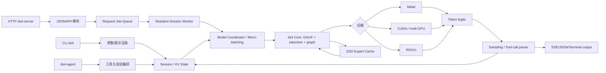
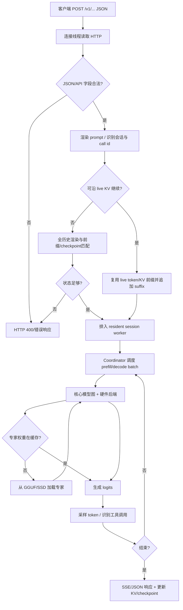
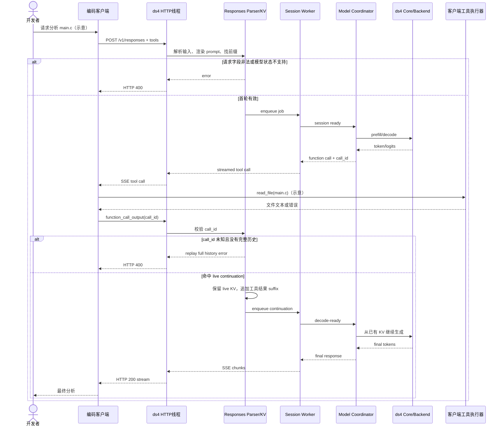

# antirez/ds4 源码与架构解析

- 分析日期：2026-08-04
- 仓库：https://github.com/antirez/ds4
- 入选原因：当日 Trending 原始排名第 8；属于具有完整模型加载、推理后端、KV 状态、HTTP 服务、Agent 和测试矩阵的原生软件系统。
- 分析方法：静态阅读 README、Makefile、HTTP Server、Responses API 设计记录、核心/后端/SSD/KV 文件组织与测试入口；未下载模型或运行推理。

## 1. 项目概览

DwarfStar（ds4）是一个刻意收窄范围的本地大模型推理引擎。它优先支持 DeepSeek V4 Flash，同时支持特定 GLM 5.2 与高内存环境下的 DeepSeek V4 PRO。项目明确声明自己不是通用 GGUF runner，而是把模型文件布局、提示渲染、KV 状态、推理图、硬件后端、HTTP 协议、工具调用和编码 Agent 一起实现与测试。

这种路线的核心取舍是：减少模型和量化格式的通用性，换取对 Metal、CUDA、ROCm、多 GPU、张量/流水线并行、SSD 专家流式加载和服务端批处理的深入优化。仓库同时构建 `ds4`、`ds4-server`、`ds4-bench`、`ds4-eval` 与 `ds4-agent`，说明它不仅是算子库，也覆盖交互和服务边界。

当前成熟度判断：项目方明确标记 beta、变化快；适合本地推理研究和受控部署实验，不宜在没有模型兼容、质量、内存和稳定性验证时直接承担关键生产流量。

## 2. 系统架构

### 2.1 架构概览

入口可以是 CLI、兼容 OpenAI/Anthropic 的本地 HTTP Server，或内置 Agent。入口层解析模型、上下文、采样、后端和分布式参数；核心 `ds4.c/ds4.h` 负责 GGUF 元数据、张量、tokenizer、KV 与模型求值。后端层由 Metal、CUDA 或 ROCm 提供图执行；当模型不能完整驻留内存时，`ds4_ssd.c` 负责路由专家权重的缓存与按需加载。Server 将连接线程解析出的请求排队给 resident session worker，由 coordinator 对 decode-ready sessions 做批处理，并保持每个 session 的 KV 所有权。



### 2.2 核心模块与代码位置

| 模块 | 职责 | 关键代码位置 | 关键证据 |
|---|---|---|---|
| 核心模型运行时 | GGUF 模型加载、tokenizer、层执行、KV、采样公共接口 | `ds4.c`, `ds4.h` | Makefile 所有二进制都链接核心对象 |
| CLI | 参数、交互式输入、模型执行与流式终端输出 | `ds4_cli.c`, `ds4_help.c`, `linenoise.c` | 构建目标 `ds4` |
| HTTP Server | HTTP/JSON 解析、OpenAI/Anthropic兼容端点、连接线程、session job、批处理与流输出 | `ds4_server.c` | 文件头注释明确 blocking client thread → resident session worker → coordinator |
| KV 持久/匹配 | 会话 KV checkpoint、前缀和工具调用状态 | `ds4_kvstore.c`, `ds4_kvstore.h`, `rax.c` | Server/Agent 构建显式链接这些文件 |
| Agent | 编码 Agent、工具调用和交互工作流 | `ds4_agent.c`, `ds4_web.c` | 构建目标 `ds4-agent` |
| Metal 后端 | Apple GPU 图与算子执行 | `ds4_metal.m`, `metal/*.metal` | macOS 默认核心对象 |
| CUDA 后端 | NVIDIA GPU、MMQ、multi-GPU | `ds4_cuda.cu`, `cuda/`, `ds4_gpu_args.c` | `cuda-spark`/`cuda-generic` 目标 |
| ROCm 后端 | AMD Strix Halo/HIP 图执行 | `ds4_rocm.*`, `rocm/` | `strix-halo` 目标 |
| SSD streaming | 路由 MoE 专家缓存、缺失时从 GGUF 加载 | `ds4_ssd.c`, `ds4_ssd.h` | README 专章与核心对象 |
| 分布式 | 张量并行、流水线并行和远端协作 | `ds4_distributed.c`, `ds4_tp.c` | Makefile 核心对象、README 运行模式 |
| 模型准备/质量 | GGUF 构建、imatrix、官方 continuation 对比 | `gguf-tools/` | README 指向独立生成与质量流程 |
| 回归/基准 | 后端、长上下文、batch、sampling、speculative路径 | `tests/`, `speed-bench/`, `QA_BEFORE_RELEASES.md` | Makefile 多个测试目标 |

### 2.3 请求与并发模型

`ds4_server.c` 的文件头明确描述：每个客户端连接由一个小型阻塞线程解析一次请求，然后把 job 放入常驻 session worker。模型 coordinator 把可 decode 的 session 做批处理，并将 prefill 切成有界量，避免客户端线程直接修改推理图，同时保持每个 session 的 KV 所有权。

这说明系统不是“每个 HTTP 请求独立启动模型”，也不是目录名推测出的微服务。它是单进程本地服务器，内部有连接线程、session worker、coordinator 和共享模型运行时。

### 2.4 数据与状态

- 模型权重来自特定 GGUF 文件。
- 每个会话持有 token/KV 状态，用于继续对话和前缀复用。
- `ds4_kvstore` 与 rax 辅助保存/查找 checkpoint、工具调用相关的精确 replay 信息。
- Server 可维护 live continuation；`misc/RESPONSE_API.md` 说明 `/v1/responses` 的工具输出可以沿已知 call id 继续 live KV。
- SSD streaming 只缓存路由专家权重；非路由权重、KV、图 scratch、激活和专家 cache 仍占内存。
- 未发现外部数据库、Redis 或消息队列作为必需组件。

### 2.5 外部协议与部署边界

- 本地 HTTP：OpenAI/Anthropic-compatible 接口，以及 `/v1/responses` 相关实现。
- 模型文件：特定 GGUF 与可选 DSpark/MTP 支持文件。
- 硬件：Metal、CUDA、ROCm；CPU 目标主要用于诊断与测试，不代表所有模型可实用运行。
- 分布式：多 GPU、两台 Mac RDMA、流水线/张量并行路径，需按项目文档配置。
- 项目不托管外部模型 API；主要计算在用户本机或自有服务器完成。

## 3. 主线流程：HTTP Chat/Responses 推理



1. 连接线程读取并解析有限的 HTTP/JSON 字段；JSON 跳过逻辑设置最大嵌套深度，防止无关深层对象耗尽 C 栈。
2. 请求被标准化为 prompt、采样参数、工具定义和会话信息。
3. 对 Responses 工具链路，服务器先检查 call id 是否能命中 live continuation；能命中时保留真实 KV 中的隐藏 reasoning，并只追加工具结果 suffix。
4. 不能 live 继续时，服务器按完整历史做 token/text/checkpoint 前缀匹配；状态不足时返回明确 400，而不是用缺失 reasoning 的可见文本假装恢复。
5. job 进入 resident session worker，coordinator 统一安排 prefill 和 decode micro-batch。
6. 核心模型执行选择 Metal、CUDA 或 ROCm 后端；SSD streaming 模式在专家 cache miss 时读取相应权重。
7. logits 经采样形成 token；直到 stop、长度、工具调用或错误条件。
8. 服务器流式返回内容，并更新 session KV 与必要 checkpoint。

## 4. 典型业务场景端到端执行链路

### 4.1 场景定义

- **场景名称**：本地编码客户端调用 `/v1/responses`，模型发起工具调用，客户端回传工具结果后继续生成最终答案。
- **参与者**：编码客户端、ds4-server 连接线程、Responses parser、live continuation/KV store、session worker、model coordinator、ds4 core、Metal/CUDA/ROCm 后端、客户端工具执行器。
- **前置条件**：已下载项目支持的 GGUF；`ds4-server` 成功加载模型；客户端使用受支持的 Responses 字段；工具实际由客户端执行。
- **输入**：第一轮请求“读取 `main.c` 并解释 bug”（**示意文本**），包含一个 `read_file` 工具 schema（**示意工具**）；第二轮回传匹配 `call_id` 的 `function_call_output`。
- **期望结果**：第一轮返回工具调用；客户端执行工具后，第二轮沿 live KV 继续，不重建整段上下文，最终流式返回分析结果。
- **成功判定**：工具 call id 在两轮间一致；第二轮得到 HTTP 200；服务器日志显示 live continuation 或等价缓存命中；最终 response 包含可见答案并结束。

### 4.2 Mermaid 时序图



### 4.3 逐步追踪表

| 步骤 | 输入 | 执行组件 | 关键代码位置 | 状态变化 | 输出 | 失败分支 | 证据级别 |
|---:|---|---|---|---|---|---|---|
| 1 | HTTP request bytes | 连接线程/HTTP parser | `ds4_server.c` | 建立单请求连接上下文 | method/path/body | 超时、请求过大、格式错误 | 高：源码 |
| 2 | JSON body | 内置 JSON parser | `ds4_server.c` | 字段进入 request struct；无外部存储 | prompt/tools/采样参数 | 嵌套超过 `JSON_MAX_NESTING=256` 或字段非法 | 高：源码 |
| 3 | Responses input | Responses parser | `ds4_server.c`, `misc/RESPONSE_API.md` | 收集 call ids、可见历史、reasoning state | 标准化 prompt/continuation 信息 | 非空 `previous_response_id`/`conversation` 当前返回 400 | 高：设计记录+实现说明 |
| 4 | call id + live state | KV/continuation | `ds4_kvstore.c`, server continuation 代码 | 复用 live KV 或选择 stateless replay | cached prefix + suffix | 未知 call id 且无完整历史，返回 400 | 高：设计记录与 QA |
| 5 | 推理 job | resident session worker | `ds4_server.c` | job 进入内存队列；session 保持 KV 所有权 | ready session | server stop、内存不足、队列/线程错误 | 高：源码文件头与实现 |
| 6 | ready sessions | model coordinator | `ds4_server.c` | 对 prefill/decode 做有界调度与 micro-batch | backend batch | 某 session 失败应向该请求传播，不应由客户端线程直接改图 | 中高：源码注释/架构 |
| 7 | token/KV/weights | `ds4.c` + backend | `ds4.c`, `ds4_metal.m` / `ds4_cuda.cu` / ROCm files | KV 增长，激活与图 scratch 更新 | logits | 模型/量化不支持、后端初始化或显存失败 | 高：代码结构+README |
| 8 | routed expert id | SSD cache | `ds4_ssd.c` | cache hit 复用；miss 从 GGUF 载入/淘汰 | expert weights available | I/O 失败或 cache/内存不足导致推理失败 | 中高：README+构建对象 |
| 9 | logits | sampling/tool parser | core/server | 新 token 追加到 session；可能产生 tool call | token/SSE event | stop/长度/采样错误；工具 JSON 不完整 | 中高：系统边界明确 |
| 10 | tool result suffix | live continuation | server/KV | 在保留隐藏 reasoning 的 live KV 后追加 suffix | 第二轮生成 | live state 丢失且 replay 缺 reasoning，明确拒绝 | 高：`RESPONSE_API.md` |
| 11 | final chunks | HTTP sender | `ds4_server.c` | 结束响应并保留/保存 checkpoint | SSE/JSON + usage | 客户端发送阻塞超过 stall timeout，连接中断 | 高：源码常量与发送逻辑边界 |

### 4.4 关键状态或数据变化

1. HTTP JSON 被转成内部 prompt、工具和采样配置。
2. 首轮 prefill 产生 session token/KV；随后 decode 每个 token 增长 KV。
3. 工具调用生成 call id，并在 live state/tool-memory 中建立继续关系。
4. 客户端执行工具，仓库本身不会读取示意文件；工具结果回传后作为 suffix 进入模型上下文。
5. live continuation 保留模型真实生成的隐藏 reasoning 和 KV，不用可见 transcript 重建。
6. SSD streaming 模式下专家权重在内存 cache 与 GGUF 文件之间迁移；它不是外部缓存服务。

### 4.5 失败传播与重试分支

- **请求验证失败**：JSON、字段、未知 call id 或缺失 reasoning state，返回 HTTP 400；客户端需要修正请求或重放完整历史。
- **live state 丢失**：例如服务器重启或切换 session，尝试 stateless replay/checkpoint；历史不足则拒绝，不静默丢 reasoning。
- **后端/模型失败**：模型布局不支持、量化组合不允许、GPU 初始化失败或内存不足，启动或请求失败；应改用受支持模型/后端/缓存预算后重试。
- **SSD cache miss**：正常路径从文件加载；I/O 或容量失败向推理层传播。减少 context、调整 cache 或使用能驻留内存的模型是恢复方式。
- **客户端慢/断开**：Server 设置 I/O 与发送 stall 超时，连接终止；是否重新请求由客户端决定。

### 4.6 最终业务结果

开发者得到兼容现有编码客户端的本地模型响应，工具调用前后可以在同一个真实 KV 状态上继续。数据和代码上下文主要停留在本地服务器边界；代价是用户自行承担模型下载、硬件、协议兼容和服务运维。

### 4.7 最小复现方法

```bash
# 下面命令、模型路径、请求和工具均为示意；必须按仓库文档下载兼容 GGUF
make                  # macOS Metal；其他平台选对应 target
./ds4-server -m ./ds4flash.gguf

# 首轮可用兼容客户端请求 /v1/responses；建议先做无工具的最小请求，
# 再加入一个只读的示意工具并核对 call_id continuation。
```

最小验证顺序：启动日志确认模型和 backend；发单轮请求；发两轮普通对话；最后测试工具 call id 的 live continuation与错误 call id 的 400 分支。

## 5. 分层技术栈

| 层次 | 技术 | 用途 | 是否核心 |
|---|---|---|---|
| 语言 | C99/C11、少量 Objective-C/CUDA/HIP、Python 工具 | 核心运行时与离线工具 | 是 |
| 模型格式 | 特定 GGUF、项目量化布局 | 权重、tokenizer、元数据 | 是 |
| GPU | Metal、CUDA/cuBLAS/MMQ、ROCm/HIP | prefill/decode/专家算子 | 是 |
| CPU/线程 | pthread、socket、poll | HTTP线程、session worker、调度 | 是 |
| HTTP/协议 | 自实现 HTTP/JSON、SSE、OpenAI/Anthropic-compatible | 本地服务接口 | 是 |
| 状态 | 内存 KV、checkpoint 文件、rax tool-memory | 会话继续和前缀复用 | 是 |
| 容量扩展 | SSD expert streaming | 模型大于 RAM 时加载路由专家 | 可选核心路径 |
| 分布式 | multi-GPU、tensor/pipeline parallel、RDMA路径 | 合并显存/内存与吞吐 | 可选高级路径 |
| 工具/Agent | ds4-agent、Responses/tool calls | 编码和协议工作流 | 可选产品层 |
| 测试/评测 | C/Python tests、官方 continuation fixture、speed bench | 正确性与性能回归 | 工程核心 |
| 外部数据层 | 未发现必需数据库/队列 | 单进程和本地文件状态 | 否 |

## 6. 创新点与代价

### 6.1 模型特化而非通用 runner（架构/性能创新）

- 传统做法：一个运行时支持大量 GGUF 模型和算子组合。
- 当前方案：只支持少数模型、张量布局和量化组合，整条链共同优化。
- 收益：更容易针对路由 MoE、硬件和工具链做专项优化。
- 代价：模型升级或布局改变可能需要改代码；任意 GGUF 不可直接运行。

### 6.2 SSD 路由专家流式缓存（容量创新）

- 传统做法：所有权重驻留 RAM/VRAM，模型超过容量就不能运行或完全 offload。
- 当前方案：非路由部分常驻，体积最大的路由专家按需从 SSD 进入内存 cache。
- 收益：高端个人机器可尝试运行超过 RAM 的 MoE 模型。
- 代价：每 token 都可能触发专家访问，cache miss 会损害生成速度；SSD、内存和上下文预算仍有硬限制。

### 6.3 session worker + coordinator micro-batching（服务架构创新/整合）

- 传统做法：每请求独立推理或客户端线程直接控制模型。
- 当前方案：连接线程只解析请求，session worker持有 KV，coordinator 批处理 decode 并切分 prefill。
- 收益：多会话共享模型时更好控制图变更与吞吐。
- 代价：调度器、KV所有权和错误隔离复杂度增加。

### 6.4 Responses live continuation 保留隐藏状态（协议创新/正确性优化）

- 传统做法：收到工具结果后根据可见历史重建 prompt/KV。
- 当前方案：call id 命中时沿 live KV 追加 suffix，保留隐藏 reasoning；状态不足则显式拒绝。
- 收益：减少长上下文重建并提高工具链状态忠实度。
- 代价：live state 不是持久 `previous_response_id` 服务；服务器重启和多客户端切换需要 fallback。

## 7. 应用场景

### 适合
- 96GB+ Mac、DGX Spark、Strix Halo或多 GPU 主机上的本地模型实验。
- 对特定 DeepSeek/GLM 模型做性能、量化和服务研究。
- 在可信局域网为少量团队用户提供本地兼容 API。

### 可以尝试
- SSD streaming 容量模式，需测生成抖动和 SSD 压力。
- 多会话 micro-batching和多 GPU，需用真实并发压测。
- 本地编码 Agent/tool loop，先限制工具权限。

### 暂不建议
- 当作通用 GGUF runner。
- 未做 QA/故障恢复就承载关键生产服务。
- 在不核验模型许可、数据边界和硬件预算时大规模部署。
- 把项目方单机速度数据直接外推到其他设备和模型。

## 8. 阅读与验证路径

1. 先读 README 的 Status、Model Weights、Speed 与 SSD streaming。
2. 看 Makefile，理解五个二进制与各后端对象如何组合。
3. 从 `ds4_cli.c` 或 `ds4_server.c` 进入，建立入口与核心 API关系。
4. 读 `ds4.h/ds4.c` 的 model/session/KV 和 eval 接口。
5. 选择实际硬件后读对应 `ds4_metal.m`、`ds4_cuda.cu` 或 ROCm 文件。
6. 关注 `ds4_ssd.c`、`ds4_kvstore.c` 和 `misc/RESPONSE_API.md`。
7. 按 `QA_BEFORE_RELEASES.md` 和 tests 先做单轮正确性，再测长上下文、batch、工具 continuation和故障分支。

## 9. 风险与限制

- 项目 beta 且快速变化，接口、模型支持和性能路径可能调整。
- 模型/量化布局受限；错误组合必须拒绝，不能假设“同名 GGUF”都兼容。
- 高内存和 GPU要求显著；SSD模式仍需大量常驻内存。
- C/CUDA/Metal 原生代码涉及内存安全、并发和设备错误风险。
- 自实现 HTTP/JSON 协议兼容需持续跟随客户端变化。
- Server 当前不持久实现 Responses `previous_response_id`/conversation状态。
- 项目方性能数据和模型质量说法未独立复测，README 也提醒部分数字可能滞后。
- 模型权重的许可证、来源和使用限制需与代码 MIT 许可证分开核对。

## 10. Evidence Notes

- README：https://github.com/antirez/ds4/blob/main/README.md
- 构建图：https://github.com/antirez/ds4/blob/main/Makefile
- 核心：https://github.com/antirez/ds4/blob/main/ds4.c
- 公共接口：https://github.com/antirez/ds4/blob/main/ds4.h
- HTTP Server：https://github.com/antirez/ds4/blob/main/ds4_server.c
- KV Store：https://github.com/antirez/ds4/blob/main/ds4_kvstore.c
- SSD streaming：https://github.com/antirez/ds4/blob/main/ds4_ssd.c
- Agent：https://github.com/antirez/ds4/blob/main/ds4_agent.c
- Responses continuation：https://github.com/antirez/ds4/blob/main/misc/RESPONSE_API.md
- 测试：https://github.com/antirez/ds4/tree/main/tests
- 发布 QA：https://github.com/antirez/ds4/blob/main/QA_BEFORE_RELEASES.md

## 11. Honest Caveat

本解析没有下载数十到数百 GB 的 GGUF、编译 Metal/CUDA/ROCm 后端、运行 HTTP 客户端或复现性能数据。Server线程/worker/coordinator、核心/后端/SSD/KV边界有源码和构建证据；具体调度公平性、cache命中、并行正确性与硬件性能仍需实机验证。

## 12. 可信度

- **Architecture Confidence：High** — 构建目标、核心对象、Server并发说明、后端和状态文件均有直接证据。
- **Flow Confidence：Medium** — HTTP与Responses工具 continuation链路有源码/设计记录，但未逐函数完整跟踪到每个后端 kernel，也未实机执行。
- **Innovation Confidence：Medium** — 模型特化、SSD专家流式和live KV continuation有明确设计价值，实际收益高度依赖模型、硬件和负载。
