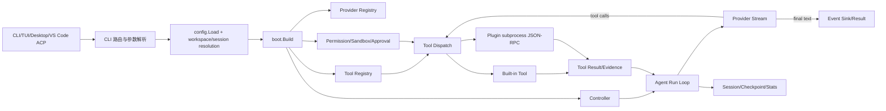
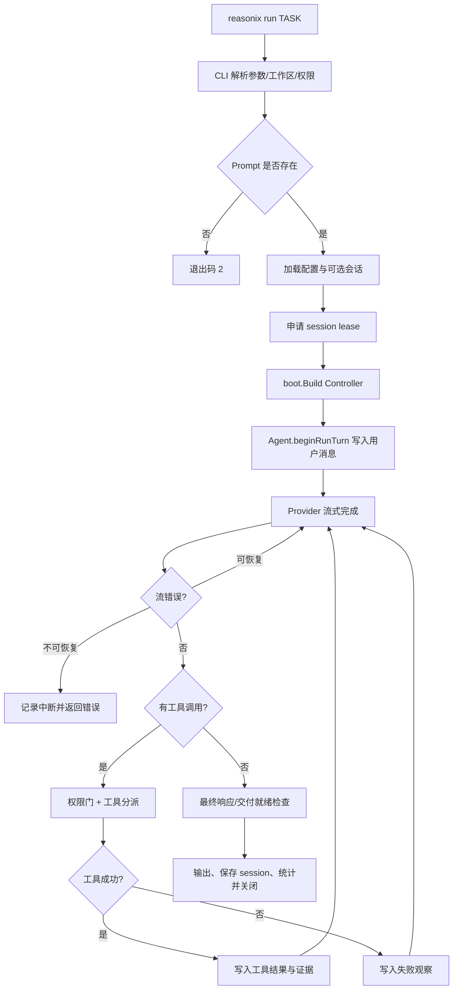
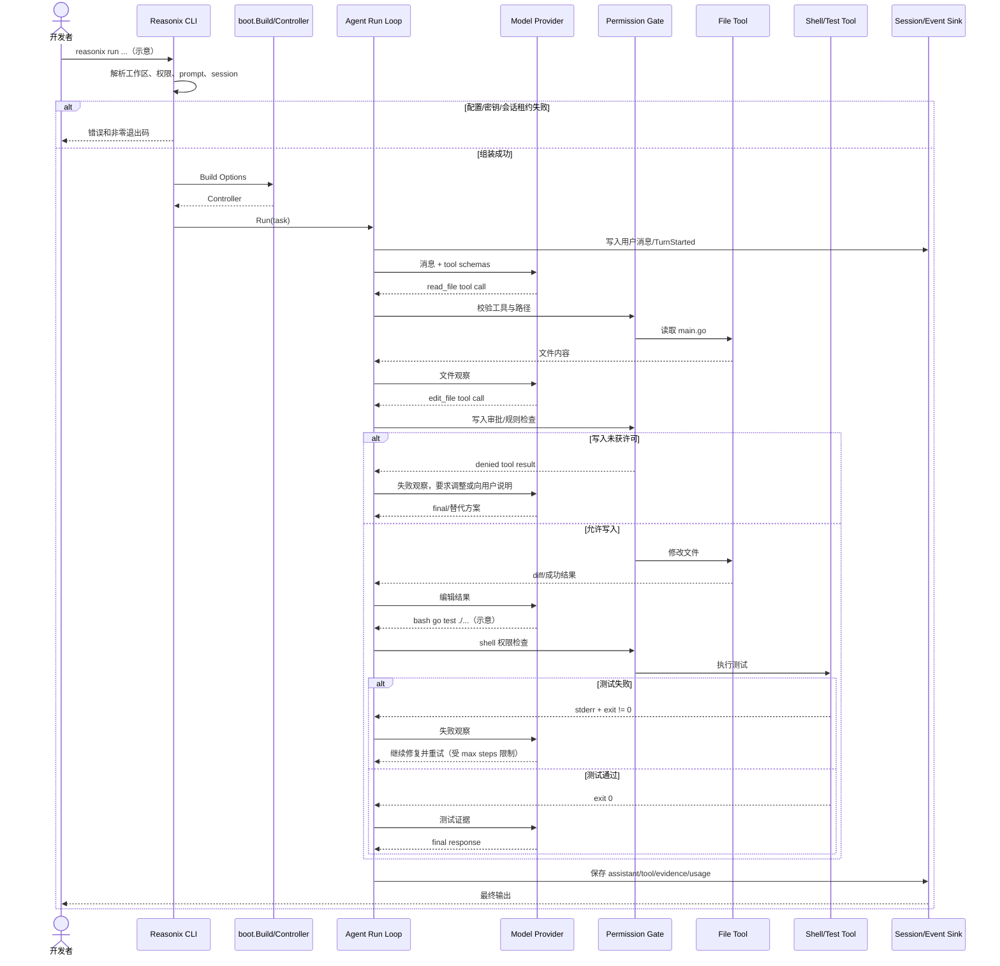

# esengine/DeepSeek-Reasonix 源码与架构解析

- 分析日期：2026-08-04
- 仓库：https://github.com/esengine/DeepSeek-Reasonix
- 分析分支：`main-v2`（仓库当前默认分支）
- 入选原因：当日 Trending 原始排名第 3；具备完整 CLI/TUI、Provider、工具权限、插件、会话与 Agent 循环实现。
- 分析方法：静态阅读 README、`go.mod`、CLI 入口、配置组装、Agent run loop、工具与协议文档；未调用真实模型服务。

## 1. 项目概览

Reasonix 是一个配置与插件驱动的本地编码 Agent 引擎。用户可以通过一次性 `reasonix run`、交互 TUI、桌面应用、ACP 或编辑器扩展进入同一套执行核心。它从配置解析 Provider、模型、工具、权限和插件，组装 `Controller` 与 `Agent`，然后在“模型流式输出—工具调用—工具结果—继续推理—最终回答”的循环里完成任务。

它不是简单的 API 包装器。源码中能看到会话租约、无头审批策略、工具调用轮次、流式中断恢复、证据/交付门禁、事件流、上下文维护和多入口共享引擎等工程控制。项目特别强调 DeepSeek 前缀缓存，但 Provider 注册同时支持 OpenAI、Anthropic 和 Responses 风格接口。

当前成熟度判断：功能面较完整、变化速度快的工程型 Agent；适合研究和个人/团队试用，生产接入需单独评估模型端点、工具权限、会话文件与插件信任边界。

## 2. 系统架构

### 2.1 架构概览

`cmd/reasonix/main.go` 只负责崩溃捕获和进入 `internal/cli.Run`。CLI 完成子命令路由、工作区切换、权限模式、会话恢复与输出格式解析，再调用 `boot.Build` 组装 Controller。编译期 blank import 把内置 Provider 与工具注册到各自 Registry；外部插件通过子进程 stdio JSON-RPC 接入。Controller 驱动 Agent，Agent 的 run loop 调用 Provider 流，记录 assistant turn；存在 tool calls 时交给工具注册表与权限门执行，再把观察结果加入会话进入下一轮。



### 2.2 核心模块与代码位置

| 模块 | 职责 | 关键代码位置 | 关键证据 |
|---|---|---|---|
| 进程入口 | 运行 CLI、注册内置 Provider/工具、捕获 panic | `cmd/reasonix/main.go` | blank import 注册 openai/anthropic/responses 和 builtin tools |
| CLI 路由 | `run/chat/serve/acp/mcp/plugin/subagent/...` 命令分发 | `internal/cli/cli.go::Run` | 明确 switch 与退出码 |
| 一次性运行 | 解析 prompt、工作区、权限、会话、输出格式并构建 Controller | `internal/cli/cli.go::runAgent` | 无头审批默认 fail-closed；支持 resume/copy/session lease |
| 配置与组装 | 从配置解析模型、Provider、工具、插件、Controller | `internal/config/`, `internal/boot/` | `setupProfile...` 调用 `boot.Build`，README 说明 `reasonix.toml` 驱动 |
| Controller | 对外统一运行、会话、审批和关闭边界 | `internal/control/` | CLI 与桌面入口共享 |
| Agent 核心 | 保存用户/助手消息、控制 tool-round、最终响应与交付门禁 | `internal/agent/`, `internal/agent/run_loop.go` | `beginRunTurn`, `runToolLoop` |
| Provider | OpenAI-compatible、Anthropic、Responses 等模型流接口 | `internal/provider/` | 注册表 + Provider stream/usage/tool call 类型 |
| 工具 | schema、内置读写/shell类工具、工具调用与结果 | `internal/tool/`, `internal/tool/builtin/` | 通过工具 schema 注入模型并分派 |
| 插件 | 外部进程 stdio JSON-RPC，MCP-compatible | 插件加载代码与 `docs/PLUGIN_PACKAGES.md`, `docs/TOOL_CONTRACT.md` | README 明确插件进程协议 |
| 权限与工作区 | 写入审批、附加目录、计划模式、无头安全策略 | `internal/control/`, CLI permission parsing | `ask/auto/acceptEdits/dontAsk/plan/yolo` |
| 会话与恢复 | 会话文件、租约、继续/复制、检查点和恢复 | `internal/agent/`, `internal/control/`, `docs/CHECKPOINTS.md` | CLI 拒绝双写同一 session |
| 事件与输出 | TUI/纯文本/JSON/stream JSON、用量和通知 | `internal/event/`, `internal/cli/` | sink 包装链 |

### 2.3 数据与状态

- 会话消息保存在 `agent.Session` 中，用户、assistant、reasoning、tool calls 和工具结果形成连续 transcript。
- `runLoopState` 是单次 `Run` 的顺序状态机，记录 max steps、工具使用、流恢复、待办进度和交付门禁状态，不跨 goroutine 共享。
- CLI 对被恢复的会话使用 lease，避免桌面端或另一个 CLI 同时写同一文件。
- Stats/telemetry 可以异步记录使用信息；这不是 Agent 业务决策的数据层。
- 未发现核心执行依赖数据库或消息队列；持久状态主要是本地配置、会话、检查点和日志/统计文件。

### 2.4 外部服务与协议

- 模型服务：OpenAI-compatible、Anthropic 或 Responses 风格 Provider。
- 插件：子进程 stdio JSON-RPC，声明为 MCP-compatible。
- ACP：供编辑器集成的本地 Agent Client Protocol 后端。
- 系统能力：文件系统、shell、Git、网络或其他工具，是否可用取决于注册表、配置和权限。

### 2.5 部署形态

- 单个静态 Go CLI 二进制是核心分发形态。
- 桌面应用和 VS Code 扩展启动或连接本地 Reasonix 引擎。
- 外部插件作为本机子进程运行。
- 模型通常是远程 API；也可指向任意兼容端点，仓库不内置模型权重或推理引擎。

## 3. 主线流程：`reasonix run` 执行编码任务



1. `Run` 把 `run` 子命令交给 `runAgent`。
2. CLI 解析模型、profile、max steps、输出格式、工作区、额外目录、权限与恢复参数。
3. prompt 来自参数或 stdin；为空时退出 2。
4. CLI 加载可选会话并持有 lease，防止并发双写。
5. `boot.Build` 组装 Provider、工具、权限门、Controller 和 Agent。
6. Agent 把用户消息加入 session，获取工具 schemas 后向 Provider 发起流式请求。
7. 若模型返回 final text，则进入最终响应与交付完整性判断。
8. 若返回 tool calls，则在权限与工作区边界内执行；结果无论成功失败都作为 observation 进入下一轮。
9. 流中断可在预算内重试；达到 max steps 时返回可继续会话的 pause，而不是丢弃已有工作。
10. 最终输出经过 Text/JSON/Event sink，session、统计和资源在退出时收尾。

## 4. 典型业务场景端到端执行链路

### 4.1 场景定义

- **场景名称**：开发者要求 Reasonix 修复一个 Go 文件中的 TODO，并运行测试确认结果。
- **参与者**：开发者、Reasonix CLI、配置/Boot、Agent、模型 Provider、权限门、文件工具、Shell/Test 工具、Session/Event Sink。
- **前置条件**：在一个 Go 仓库中运行；`reasonix.toml` 已配置可用模型和 API key；文件读取与测试工具可用；写入权限模式允许编辑或能获得审批。
- **输入**：`reasonix run --permission-mode acceptEdits "修复 main.go 中的 TODO，并运行 go test ./..."`（**示意命令和任务文本**）。
- **期望结果**：目标文件被正确修改；`go test ./...` 退出成功；最终回答说明修改和测试结果；session 保存工具调用与结果。
- **成功判定**：文件 diff 与需求一致；测试工具返回 exit code 0；Agent 通过最终就绪检查并输出 final response，而非仅声称“已完成”。

### 4.2 Mermaid 时序图



### 4.3 逐步追踪表

| 步骤 | 输入 | 执行组件 | 关键代码位置 | 状态变化 | 输出 | 失败分支 | 证据级别 |
|---:|---|---|---|---|---|---|---|
| 1 | CLI args | `cmd/reasonix/main.go` → `cli.Run` | `cmd/reasonix/main.go`, `internal/cli/cli.go::Run` | 无业务状态 | 路由到 `runAgent` | 未知命令退出 2 | 高：源码 |
| 2 | model/profile/permission/dir/task | `runAgent` | `internal/cli/cli.go::runAgent` | 构造 workspace、permission、resume 参数 | prompt + build overrides | 空 prompt、非法权限组合、目录失败 | 高：源码 |
| 3 | resume path | Session lease | `internal/cli/cli.go`, `internal/control/` | 锁定会话文件，可能加载历史 | resumable session | 已被其他进程持有则拒绝；可用 `--copy` 分叉 | 高：源码 |
| 4 | 配置与 overrides | Boot | `internal/boot/`, CLI `setupProfileWithOverrides` | 组装 Provider/Tool/Controller | 可运行 Controller | API key、模型、插件或配置错误 | 高：源码/README |
| 5 | 用户任务 | Agent | `internal/agent/run_loop.go::beginRunTurn` | session 新增 user message；初始化 runLoopState | tool schemas + provider context | 交付/证据状态异常会影响后续就绪判断 | 高：源码 |
| 6 | session + schemas | Provider stream | `internal/agent/run_loop.go::runToolLoop`, provider packages | session 暂未提交工具副作用 | text/reasoning/tool calls/usage | 流中断在预算内重试；不可恢复则返回错误 | 高：源码 |
| 7 | read/edit/shell call | Permission + Tool registry | `internal/control/`, `internal/tool/` | 可能读取或修改工作区 | Tool result | 未授权路径/写入/命令返回 denied/error | 中高：架构与源码路径明确，具体工具逐个未全读 |
| 8 | edit success | File tool | `internal/tool/builtin/` | `main.go` 内容变化；可形成 diff/evidence | 成功观察 | 锚点过期、文件冲突、权限错误 | 中高：工具契约/Agent证据机制 |
| 9 | `go test ./...`（示意） | Shell tool | builtin shell 工具 | 子进程运行；文件不再变化或产生测试产物 | stdout/stderr/exit code | exit != 0，被作为 observation 回传模型 | 中高：工具调用模式明确，命令是示意 |
| 10 | 工具结果 | Agent + Provider | `runToolLoop`, `handleToolRound` | session 追加 tool result，step 增加 | 下一次模型请求 | 达到 max steps 返回 pause，保留已完成工作 | 高：源码 |
| 11 | final text + evidence | Final readiness/Output sink | `handleFinalResponse`, CLI sinks | session 追加 assistant final；统计刷新 | 文本/JSON/事件流 | 就绪条件不满足时阻断或追加提示 | 中高：run loop 注释与事件/证据代码 |

### 4.4 关键状态或数据变化

1. CLI 参数变成 `boot.Options`，确定工作区与权限边界。
2. Session 获得 lease，避免多个进程修改同一会话文件。
3. 用户消息写入 session；每轮 assistant text/reasoning/tool calls 和 tool result 随后追加。
4. 文件工具可能改变工作区文件；Agent 的 evidence/交付机制记录副作用与验证结果。
5. 测试失败不是异常吞掉，而是普通工具结果，模型可基于 stderr 继续修复。
6. 最终完成后 session、事件和用量被持久化/输出；未发现必须写数据库或队列。

### 4.5 失败传播与重试分支

- **配置/密钥失败**：`boot.Build` 返回错误，CLI 退出；不进入 Agent 循环。
- **权限拒绝**：工具调用返回 denied/error observation，模型可以换只读方案、请求用户处理或给出失败说明。无头 `ask` 模式默认关闭写入，避免永远等待不存在的 UI。
- **模型流中断**：`runToolLoop` 在 `maxStreamRecoveries` 内重试，并且重试不消耗工具轮次预算；重试失败则记录中断内容并返回错误。
- **工具失败/测试失败**：结果进入 session 供模型修复；重复尝试受 max steps、循环守卫和交付门禁约束。
- **会话双写**：lease 冲突直接拒绝；用户可显式 `--copy` 在会话副本中继续。

### 4.6 最终业务结果

开发者应得到实际文件修改、测试结果和最终解释三件套。Reasonix 的工程重点是让“改了什么”和“验证过什么”都进入同一执行上下文，而不是只返回一段看起来像完成了的文本。

### 4.7 最小复现方法

```bash
# 命令、文件名和任务文本均为示意；请在测试仓库和受控权限下运行
reasonix setup
reasonix run --permission-mode acceptEdits \
  "修复 main.go 中的 TODO，并运行 go test ./..."
```

最小验证：先用临时 Git 分支；运行前记录 `git diff`；运行后检查 diff、测试退出码、Reasonix 最终输出和 session 文件。首次验证不要使用 `yolo/bypassPermissions`。

## 5. 分层技术栈

| 层次 | 技术 | 用途 | 是否核心/证据 |
|---|---|---|---|
| 语言/运行时 | Go 1.25 + toolchain 1.26.5 | 单二进制 Agent 核心 | 核心，`go.mod` |
| CLI/TUI | pflag、Bubble Tea/Bubbles/Lip Gloss | 命令解析和交互界面 | 核心入口 |
| 配置 | TOML (`BurntSushi/toml`)、dotenv、keyring | Provider、模型、工具、UI和凭据配置 | 核心 |
| 模型协议 | OpenAI-compatible、Anthropic、Responses | 流式文本、reasoning、tool calls与usage | 核心 |
| Agent | 自研 session/run loop/controller/evidence | 工具轮次、恢复、交付门禁 | 核心 |
| 工具/插件 | 内置 Registry + stdio JSON-RPC/MCP-compatible | 文件、shell和外部能力 | 核心扩展面 |
| 代码分析 | tree-sitter 多语言解析 | 代码结构和相关工具能力 | 辅助但重要 |
| 远程/文件 | SSH、SFTP、glob、gitignore | 远程工作区和文件边界 | 可选 |
| 输出/可观测 | slog、event sink、stats、telemetry | CLI/TUI/JSON输出、诊断和使用统计 | 工程支撑 |
| 持久化 | 本地 TOML、session/checkpoint/日志文件 | 配置与恢复 | 核心；未发现数据库依赖 |

## 6. 创新点与代价

### 6.1 配置与 Registry 组装，而非模型硬编码（架构/开发体验创新）

- 传统做法：CLI 直接依赖固定 Provider 和工具集合。
- 当前方案：内置实现注册到 Registry，运行时由配置选择；外部插件走进程协议。
- 收益：替换模型端点和工具无需改主循环。
- 代价：配置组合和兼容矩阵变大，故障可能来自模型、插件、权限或配置任一层。

### 6.2 无头权限 fail-closed（安全工作流创新）

- 传统做法：沿用交互审批逻辑，自动化任务可能无限等待或默认放行。
- 当前方案：`reasonix run` 显式把审批模式映射为非阻塞 gate；默认 ask 无 UI时拒绝写入。
- 收益：批处理不会卡死，也不会悄悄把“等待确认”变成“自动同意”。
- 代价：用户必须明确选择 auto/acceptEdits/yolo，初次使用可能觉得限制多。

### 6.3 把流恢复、交付证据和会话租约纳入 Agent 循环（工程整合创新）

- 传统做法：模型/工具循环只处理成功路径。
- 当前方案：对流中断、session 双写、工具副作用、最终就绪和 max steps 有显式状态。
- 收益：长任务更可恢复，完成声明更可信。
- 代价：核心状态机复杂，维护和回归测试成本高。

### 6.4 DeepSeek 前缀缓存维护（性能/成本工程）

- 传统做法：上下文频繁改写导致缓存前缀失效。
- 当前方案：稳定环境摘要、工具输出修剪、会话压缩和 prefix shape 诊断尽量维持缓存稳定。
- 收益：长会话可能降低 token 成本与延迟。
- 代价：真实命中率依赖 Provider 实现和会话内容，本报告未测量。

## 7. 应用场景

### 适合
- 在本地代码仓库执行可审计的读、改、测任务。
- 希望在多个 OpenAI-compatible 模型间切换的终端 Agent 用户。
- 需要 CLI、TUI、桌面或编辑器共享同一引擎的工具作者。

### 可以尝试
- 团队内部编码自动化，但需收紧工具白名单和模型数据边界。
- 自定义 stdio JSON-RPC 插件。
- 远程工作区和子 Agent 流程，先做故障注入与权限测试。

### 暂不建议
- 未审查工具权限就对生产仓库启用 yolo/bypassPermissions。
- 把敏感代码发送到未经评估的模型或代理端点。
- 假设所有 OpenAI-compatible 服务在 reasoning/tool-call/stream 语义上完全一致。

## 8. 阅读与验证路径

1. 先读 `README.md`、`docs/GUIDE.md`、`docs/SPEC.md`。
2. 看 `cmd/reasonix/main.go` 与 `internal/cli/cli.go::Run/runAgent`。
3. 进入 `internal/boot/` 看 Controller 如何被配置组装。
4. 读 `internal/agent/run_loop.go`，重点看 `beginRunTurn`、`runToolLoop` 和流恢复。
5. 读 `docs/TOOL_CONTRACT.md`、`docs/TASK_CONTRACT.md` 与权限代码。
6. 找一个临时 Git 仓库，从只读任务开始，再试 acceptEdits + 单文件修改 + 测试。
7. 验证 session resume/copy、Provider 断流和工具拒绝三种失败路径。

## 9. 风险与限制

- 工具拥有读写和命令执行能力，错误配置可造成代码或环境破坏。
- 模型端点会接收项目上下文，隐私和保留政策需单独审查。
- 插件是本地子进程，安装来源与可执行文件必须可信。
- 多 Provider 的“兼容”不保证边缘语义一致，尤其是 reasoning、tool calls 和缓存。
- 项目快速变化，文档和默认行为可能随版本调整。
- 自动测试通过不代表修改符合业务需求；仍需要 Git diff 和代码审查。
- MIT 许可证宽松，但外部 Provider、插件和依赖有各自条款。

## 10. Evidence Notes

- README：https://github.com/esengine/DeepSeek-Reasonix/blob/main-v2/README.md
- 依赖：https://github.com/esengine/DeepSeek-Reasonix/blob/main-v2/go.mod
- 入口：https://github.com/esengine/DeepSeek-Reasonix/blob/main-v2/cmd/reasonix/main.go
- CLI/`runAgent`：https://github.com/esengine/DeepSeek-Reasonix/blob/main-v2/internal/cli/cli.go
- Agent 循环：https://github.com/esengine/DeepSeek-Reasonix/blob/main-v2/internal/agent/run_loop.go
- 组装：https://github.com/esengine/DeepSeek-Reasonix/tree/main-v2/internal/boot
- Provider：https://github.com/esengine/DeepSeek-Reasonix/tree/main-v2/internal/provider
- 工具：https://github.com/esengine/DeepSeek-Reasonix/tree/main-v2/internal/tool
- 工具契约：https://github.com/esengine/DeepSeek-Reasonix/blob/main-v2/docs/TOOL_CONTRACT.md
- 检查点：https://github.com/esengine/DeepSeek-Reasonix/blob/main-v2/docs/CHECKPOINTS.md

## 11. Honest Caveat

本解析没有配置 API key、连接 DeepSeek/OpenAI/Anthropic 端点，也没有让 Reasonix 实际改动仓库或运行测试。CLI、Controller、Session 和 run loop 的关系有直接源码证据；具体内置工具的每一种权限分支、插件协议兼容和缓存收益未逐项实测。

## 12. 可信度

- **Architecture Confidence：High** — 入口、CLI、Boot、Controller、Agent、Provider、工具和会话边界清楚且有源码。
- **Flow Confidence：High** — `runAgent` 与 `runToolLoop` 直接支撑从任务到模型、工具、重试和最终输出的链路。
- **Innovation Confidence：Medium** — 无头权限、缓存维护和恢复设计有价值，但成本/稳定性收益未在真实 Provider 上独立验证。
