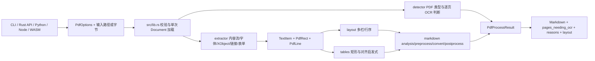
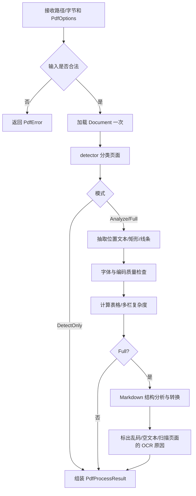
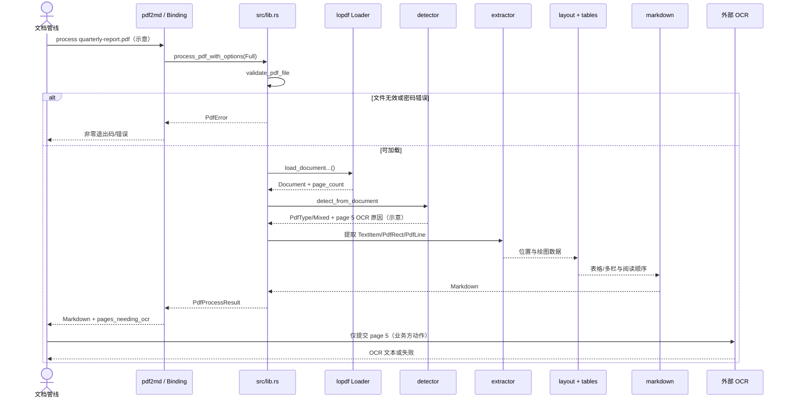

# firecrawl/pdf-inspector 源码与架构解析

- 分析日期：2026-08-04
- 仓库：https://github.com/firecrawl/pdf-inspector
- 入选原因：当日 Trending 原始排名第 2；具备明确 Rust 核心、CLI、多语言绑定、布局与 Markdown 管线，适合追踪真实执行链路。
- 分析方法：静态阅读 README、`Cargo.toml`、公共 API、CLI、检测/提取/Markdown 模块与公开测试说明；未运行真实 PDF 基准。

## 1. 项目概览

`pdf-inspector` 是一个本地 PDF 分类与结构化文本提取库。它不负责 OCR 本身，而是先回答两个更省钱的问题：这份 PDF 有没有可直接提取的文本，以及哪些页面必须转交 OCR。对可直接解析的页面，它继续提取带坐标、字体和样式的文本，分析多栏与表格，最后生成 Markdown。

项目的核心价值不是单个解析算法，而是把“快速分类 → 位置感知提取 → 布局分析 → Markdown → 逐页 OCR 路由”放进一次文档加载中，并通过 Rust、Python、Node.js 和浏览器 WASM 暴露同一套能力。

当前成熟度判断：可用的工程型库，但复杂 PDF 兼容性天然受字体编码、绘图指令和格式变体影响；项目方基准不能替代业务语料验收。

## 2. 系统架构

### 2.1 架构概览

CLI 或语言绑定把文件路径/字节与 `PdfOptions` 传入公共 API。`src/lib.rs` 先校验文件并通过 `lopdf` 加载文档，然后把同一个 `Document` 交给 detector 和 extractor。提取器产出 `TextItem`、矩形和线条等位置数据；布局层判断表格与多栏；Markdown 层根据字体统计、文本类别和表格结果完成结构化输出。结果对象同时返回分类、置信度、Markdown、复杂布局信息、编码问题和逐页 OCR 原因。



### 2.2 核心模块与代码位置

| 模块 | 职责 | 关键代码位置 | 关键依赖/证据 |
|---|---|---|---|
| 公共 API 与编排 | 校验输入、单次加载文档、按模式驱动检测/提取/Markdown，组装结果 | `src/lib.rs` | `process_pdf_with_options`、`process_pdf_mem_with_options`、`PdfProcessResult` |
| 模式与参数 | DetectOnly / Analyze / Full、页过滤、密码、Markdown 配置 | `src/process_mode.rs`, `src/lib.rs` | `PdfOptions` builder；密码在 Debug 输出中被脱敏 |
| 快速分类 | 检查页面内容流中的文本/图片信号，返回 PdfType、置信度与需 OCR 页面 | `src/detector.rs` | `DetectionConfig`, `ScanStrategy`, `detect_from_document` |
| 字体与字符解码 | 字体宽度、ToUnicode CMap、CID 字体和字符映射 | `src/tounicode.rs`, `src/glyph_names.rs`, `src/text_utils.rs` | `FontCMaps`; 对异常编码设置 OCR 原因 |
| 位置提取 | 遍历 PDF operators，处理文本、XObject、链接、表单和绘图对象 | `src/extractor/` | 产出 `TextItem`, `PdfRect`, `PdfLine` |
| 表格 | 矩形边框检测、文本对齐启发式、网格与单元格映射 | `src/tables/` | README 与模块结构均说明双模式表格检测 |
| Markdown | 字体统计、标题/列表/代码/说明文字分类、表格插入和清理 | `src/markdown/` | `MarkdownOptions`, `MarkdownProfile`, `to_markdown...` |
| CLI | 解析模式、页码、JSON/原始输出，调用公共 API并设置退出码 | `src/bin/pdf2md.rs`, `src/bin/detect_pdf.rs` | `process_pdf_with_options`; 错误写 stderr/JSON 并退出 1 |
| 多语言绑定 | 将 Rust 核心暴露给 Python、Node/Bun、浏览器 | `src/python.rs`, `napi/`, `wasm/` | PyO3、napi-rs、wasm-bindgen |

### 2.3 数据与状态

- 主要状态存在于单次调用内：`lopdf::Document`、位置项、字体映射、布局结果和 Markdown 字符串。
- `PdfProcessResult` 是调用边界上的聚合结果，包含 `pdf_type`、`markdown`、`page_count`、`pages_needing_ocr`、`ocr_reasons_by_page`、`layout` 和 `has_encoding_issues`。
- 未发现项目核心库要求数据库、缓存服务器、消息队列或常驻服务。
- 浏览器 WASM 路径没有文件系统，因此 CMap 采用嵌入资源；原生构建可使用并行解析。

### 2.4 部署与运行边界

- Rust crate/CLI：本机进程。
- Python：PyO3 扩展模块。
- Node.js/Bun：napi-rs 原生绑定。
- 浏览器：WASM/Worker 内本地处理。
- OCR 是调用方的后续能力，不在本仓库内自动完成。

## 3. 主线流程：一次 PDF 转 Markdown



1. CLI 或绑定创建 `PdfOptions`，选择 Full、Analyze 或 DetectOnly。
2. `process_pdf_with_options` 调用输入校验；失败立即返回 `PdfError`。
3. `load_document_from_path_with_password` 或内存版本解析一次文档。
4. detector 使用同一 `Document` 进行页面分类。
5. Analyze/Full 模式继续解析字体和内容流，生成带页码、坐标、样式的文本项。
6. 表格和多栏分析复用这些位置数据；Full 模式继续转换 Markdown。
7. 编码异常、GID 字体、扫描页、矢量文字或无文本页被写入逐页 OCR 原因。
8. 调用方获得 Markdown 和可据此路由 OCR 的结构化结果。

关键失败处理：无效文件、解密失败或解析错误直接返回错误；提取文字不可信时不会假装成功，而是设置 `needs_ocr`/原因，并在逐页 API 中把不可信 Markdown 置空。

## 4. 典型业务场景端到端执行链路

### 4.1 场景定义

- **场景名称**：文档管线把一份混合型财务 PDF 转为 Markdown，并只把异常页面交给 OCR。
- **参与者**：文档管线调用方、`pdf2md`/Rust 公共 API、loader、detector、extractor、layout/tables、markdown converter、外部 OCR 服务（仅作为后续调用方组件）。
- **前置条件**：已安装 CLI 或绑定；输入 PDF 可读；若加密则提供正确密码；OCR 服务由业务系统另行配置。
- **输入**：`quarterly-report.pdf`（**示意文件名**），Full 模式；示意文档第 1–4 页为原生文本，第 5 页为扫描图片。
- **期望结果**：返回第 1–4 页的结构化 Markdown，并把第 5 页列入 `pages_needing_ocr`，附带机器可读原因。
- **成功判定**：调用返回成功；`markdown` 非空；页数正确；第 5 页出现在 OCR 列表；Markdown 标题/表格可被下游解析。

### 4.2 Mermaid 时序图



### 4.3 逐步追踪表

| 步骤 | 输入 | 执行组件 | 关键代码位置 | 状态变化 | 输出 | 失败分支 | 证据级别 |
|---:|---|---|---|---|---|---|---|
| 1 | 文件路径和 CLI 参数 | `pdf2md` | `src/bin/pdf2md.rs::main` | 参数转为 `PdfOptions` | Full 模式、页过滤、密码等 | 参数缺值/页码非法，打印错误并退出 | 高：源码 |
| 2 | 路径 | 公共 API | `src/lib.rs::process_pdf_with_options` | 无持久化；开始计时 | 进入校验 | 文件不存在、非 PDF、读取失败 | 高：源码 |
| 3 | 合法文件、可选密码 | loader + lopdf | `src/lib.rs` 的 `load_document_from_path_with_password` 调用链 | 内存中建立一次 `Document` | `Document`, `page_count` | 密码错误、损坏对象/xref 导致 `PdfError` | 高：源码 |
| 4 | 同一 Document | detector | `src/detector.rs`, `detect_from_document` | 形成逐页文本/图片信号 | `PdfTypeResult`、置信度、OCR 页 | 无法读取内容流时返回错误或低可信判断 | 高：源码/公共类型 |
| 5 | Document、字体 CMap | extractor | `src/extractor/`, `src/tounicode.rs` | 生成内存位置项与绘图对象 | `TextItem`, `PdfRect`, `PdfLine` | GID/乱码/无法解码，记录需 OCR | 高：源码 |
| 6 | 位置项/矩形/线条 | layout/tables | `src/tables/`, `src/markdown/analysis` | 计算表格、多栏、字体统计 | `LayoutComplexity`、表格结构 | 启发式误判时 Markdown 结构可能不理想 | 中高：源码+README |
| 7 | 内容与布局 | markdown converter | `src/markdown/` | 组装并清理 Markdown 字符串 | Markdown | 文本质量异常时逐页结果可置空并标 OCR | 高：源码 |
| 8 | 所有阶段结果 | `PdfProcessResult` | `src/lib.rs` | 聚合调用内状态 | Markdown、OCR 页/原因、耗时、布局 | 整体错误向调用方传播 | 高：源码 |
| 9 | `pages_needing_ocr` | 业务管线 | 仓库外，**示意集成** | 仅异常页进入 OCR 队列/调用 | OCR 文本 | OCR 失败由业务系统重试或人工处理 | 低：建议性集成，不属于仓库实现 |

### 4.4 关键状态或数据变化

1. 路径/字节被解析成只存在于当前调用内的 `Document`。
2. 每页从“未知”变成文本型、扫描型、图片型或混合判断，并附置信度。
3. PDF operators 被转换为带位置和样式的 `TextItem` 等中间结构。
4. 中间结构被重排为阅读顺序、表格和 Markdown。
5. 可疑页面从普通输出集合转入 `pages_needing_ocr`；项目本身不创建 OCR 任务或数据库记录。

### 4.5 失败传播与重试分支

- **硬失败**：文件不存在、格式损坏、密码错误。`PdfError` 直接返回；CLI 给出非零退出码。重试应在修复路径、文件或密码后进行，而不是无条件重放。
- **软降级**：字体乱码、GID 编码、空提取或扫描页。调用成功，但页面被标记需 OCR；下游应按页回退 OCR。
- **结构质量失败**：表格或多栏启发式与真实版式不一致。调用方可保留原始位置项 JSON进行抽样核验，或对该页改走 OCR/版面模型。

### 4.6 最终业务结果

用户得到一份可立即索引或送入知识库的 Markdown，同时获得精确到页面的 OCR 路由信息。项目不承诺替代 OCR，而是把 OCR 从“全量默认”变成“有证据的例外处理”。

### 4.7 最小复现方法

```bash
# 命令和文件名为示意；需替换为本地真实 PDF
cargo run --bin pdf2md -- quarterly-report.pdf --json

# 仅检查类型与布局
cargo run --bin detect-pdf -- quarterly-report.pdf --analyze --json
```

验证点：JSON 中的 `pdf_type`、`page_count`、`pages_needing_ocr`、`ocr_reasons_by_page`、`layout` 与 Markdown 是否符合人工抽查页。

## 5. 分层技术栈

| 层次 | 技术 | 用途与证据 | 是否核心 |
|---|---|---|---|
| 语言与运行时 | Rust 2021 | 核心解析、类型与 CLI | 是 |
| PDF 解析 | `lopdf 0.42` | 读取文档对象、页面树和内容流 | 是 |
| 并行 | Rayon（原生目标） | 配合 lopdf 原生并行解析 | 辅助 |
| 文本处理 | regex、unicode-normalization、ttf-parser | 标题/列表判断、Unicode 清理、字体 CMap 辅助 | 是 |
| Python 绑定 | PyO3 | 暴露 Python API | 可选边界 |
| Node 绑定 | napi-rs | Node/Bun 原生模块 | 可选边界 |
| Web | wasm-bindgen/include_dir | 浏览器 WASM 与嵌入 CMap | 可选边界 |
| 错误/日志 | thiserror、log、env_logger | 统一错误和 CLI 日志 | 工程支撑 |
| 持久化 | 未发现核心持久化 | 所有主要状态在进程内；输出由调用方保存 | 否 |

## 6. 创新点与代价

### 6.1 单次文档加载的组合管线（工程整合创新）

- 传统做法：分类、提取和布局工具可能各自重新解析 PDF。
- 当前方案：公共 API 加载一次 `Document`，检测与提取共享。
- 收益：减少重复 I/O 和解析开销，API 结果更一致。
- 证据：`process_pdf_with_options` 源码注释与调用链。
- 代价：模块共享同一 PDF 表示，库内部耦合比“多个独立工具”更高。

### 6.2 逐页 OCR 理由而非二元开关（工作流创新）

- 传统做法：整份文档直接 OCR，或仅返回“扫描件”。
- 当前方案：返回页列表和 `scanned`、`no_text`、`vector_text`、`suspected_garbled_text` 等原因。
- 收益：业务方能做混合处理和可解释路由。
- 代价：正确路由仍依赖启发式和下游 OCR 质量。

### 6.3 同一 Rust 核心覆盖服务端与浏览器（工程整合创新）

- 传统做法：不同语言各维护解析逻辑。
- 当前方案：Rust 核心配 Python、Node 和 WASM 边界。
- 收益：算法一致、适配面广。
- 代价：原生包发布、ABI、WASM 资源和平台兼容增加维护成本。

## 7. 应用场景

### 适合
- 原生文本占比较高的报告、论文、合同、发票批处理。
- 需要 Markdown、位置项或表格结构的本地文档管线。
- 需要按页决定是否 OCR 的成本优化层。

### 可以尝试
- 浏览器内离线 PDF 解析。
- RAG 入库前的快速文档结构化。
- 混合 PDF 的 OCR 前置路由，但需用真实语料测召回率。

### 暂不建议
- 把它当成扫描件 OCR 引擎。
- 未抽样验收就用于高风险法律或财务数据自动提取。
- 仅凭 README 基准决定大规模替换现有 PDF 引擎。

## 8. 阅读与验证路径

1. 先读 `README.md` 的 Architecture 与 classification 说明。
2. 看 `Cargo.toml`，确认平台依赖与绑定边界。
3. 从 `src/bin/pdf2md.rs` 进入，理解 CLI 如何构造 `PdfOptions`。
4. 顺着 `src/lib.rs::process_pdf_with_options` 看单次加载和结果类型。
5. 再读 `src/detector.rs`、`src/extractor/`、`src/tables/`、`src/markdown/`。
6. 用三份真实样本验证：原生文本、多栏表格、混合扫描 PDF。
7. 对照 `--items-json` 和人工页面，确认坐标、阅读顺序与 OCR 页判断。

## 9. 风险与限制

- PDF 格式极其复杂，字体编码、嵌套 XObject、旋转坐标和矢量文本可能导致降级。
- 表格与标题判断含启发式，结构正确率应使用业务语料验证。
- 加密 PDF 需要密码；错误密码或不支持的加密方式会失败。
- 项目方基准不能直接外推到其他硬件、版本与语料。
- WASM 内存与大文件处理能力需单独压测。
- MIT 许可证较宽松，但输入文档内容的版权和隐私仍由使用者负责。

## 10. Evidence Notes

- README：https://github.com/firecrawl/pdf-inspector/blob/main/README.md
- 依赖与二进制：https://github.com/firecrawl/pdf-inspector/blob/main/Cargo.toml
- 公共 API/结果/单次加载：https://github.com/firecrawl/pdf-inspector/blob/main/src/lib.rs
- CLI 参数、错误和输出：https://github.com/firecrawl/pdf-inspector/blob/main/src/bin/pdf2md.rs
- 检测：https://github.com/firecrawl/pdf-inspector/blob/main/src/detector.rs
- 提取：https://github.com/firecrawl/pdf-inspector/tree/main/src/extractor
- 表格：https://github.com/firecrawl/pdf-inspector/tree/main/src/tables
- Markdown：https://github.com/firecrawl/pdf-inspector/tree/main/src/markdown

## 11. Honest Caveat

本解析是公开源码和文档的静态阅读，没有下载测试语料、运行基准、验证所有绑定，也没有与商业 OCR 或其他 PDF 引擎做独立对比。架构与主线流程有直接源码支撑；对复杂版式质量和性能的判断仍需在目标环境实测。

## 12. 可信度

- **Architecture Confidence：High** — 公共 API、核心模块、依赖和绑定边界可直接追踪。
- **Flow Confidence：High** — CLI → 单次加载 → 分类 → 提取 →布局/表格 → Markdown → OCR 路由有源码与公共类型支撑。
- **Innovation Confidence：Medium** — 逐页 OCR 路由与单次加载组合价值明确，但性能和质量优势未独立复测。
