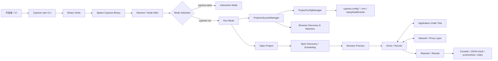
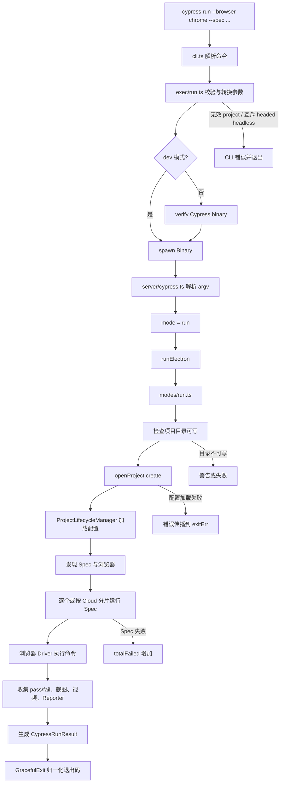
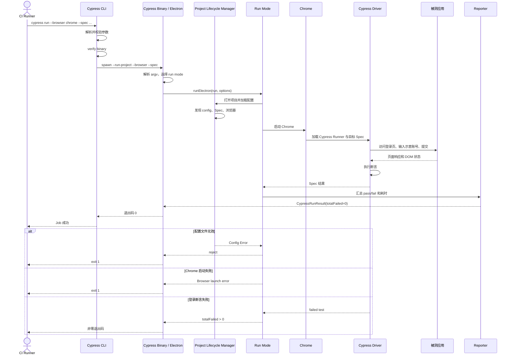

# cypress-io/cypress 源码架构解析

> 报告日期：2026-08-05  
> Trending 原始排名：#7  
> 分析范围：公开 monorepo 的 CLI、Electron/Server、Data Context、Run Mode、配置与测试入口  
> 分析方法：静态源码与官方 README 交叉验证；未启动浏览器、未执行真实测试。

## 1. 项目概览

Cypress 是浏览器端到端测试和组件测试平台。它不是一段“打开网页点按钮”的单脚本，而是一套分层系统：

- npm CLI 负责命令解析、二进制校验和进程启动；
- Electron/Node 主进程决定 `interactive` 或 `run` 模式；
- Project Lifecycle 与 Config Manager 负责项目、配置、插件、浏览器和 Spec 生命周期；
- Run Mode 打开项目、选择浏览器、调度 Spec、收集测试结果并处理截图、视频与 Reporter；
- Browser Driver、网络代理和测试运行器在浏览器侧完成命令执行与应用交互。

仓库采用大型 workspace/monorepo，根 `package.json` 显示 `cli`、`packages/*`、`npm/*`、`tooling/*`、`system-tests` 等工作区，并依赖 Electron、TypeScript、GraphQL、React、Mocha 等组件。

## 2. 系统架构



### 边界说明

- Cypress Cloud 的记录、并行分片和远端 API 属于可选路径，本报告的典型场景采用本地 `cypress run`，不把 Cloud 服务画成必经组件。
- 根仓库包含很多 Browser Family、Component Dev Server 和 Framework Adapter；典型链路只覆盖 E2E 无头运行。
- PostgreSQL、Redis、消息队列等不是该本地测试主线的已验证组件，本报告没有凭想象补上。

## 3. 核心模块及代码位置

| 模块 | 代码位置 | 职责 | 证据级别 |
|---|---|---|---|
| CLI 命令定义 | `cli/lib/cli.ts` | 定义 `run`、`open`、`verify` 等命令和 `--browser`、`--spec`、`--reporter`、`--config` 等参数 | High |
| Run 参数转换 | `cli/lib/exec/run.ts` | 校验项目路径与互斥参数，把 CLI Options 转成 Cypress Binary 参数；先 verify 再 spawn | High |
| 二进制启动 | `cli/lib/exec/spawn.ts` | 启动下载/缓存的 Cypress 二进制并传递参数 | Medium |
| Server 主入口 | `packages/server/lib/cypress.ts` | 解析 Binary 参数、选择模式、启动 Electron、归一化退出码和错误 | High |
| Run Mode | `packages/server/lib/modes/run.ts` | 打开项目、加载配置、选择 Spec、驱动浏览器运行、收集结果、截图与视频 | High |
| 项目打开 | `packages/server/lib/open_project.ts` | 创建与持有当前 Project，连接 Server、Socket 与浏览器生命周期 | Medium |
| 配置生命周期 | `packages/data-context/src/data/ProjectLifecycleManager.ts` | 发现配置文件、创建 Config Manager、加载最终配置、发现 Spec、选择浏览器、处理重启 | High |
| 配置管理 | `packages/data-context/src/data/ProjectConfigManager.ts` | 加载 `cypress.config.*`、运行 Node Events、生成 Final Config | Medium |
| 浏览器管理 | `packages/server/lib/browsers/` | 检测、启动和关闭 Chrome/Firefox/Electron/WebKit 等浏览器 | Medium |
| Driver | `packages/driver/` | 在浏览器中排队执行 Cypress 命令、断言和应用交互 | Medium |
| 网络层 | `packages/proxy/`、`packages/net-stubbing/`、`packages/network-interception/` | 代理请求、修改响应和实现 `cy.intercept` 等能力 | Medium |
| Reporter / Results | `packages/server/lib/reporter`、`packages/server/lib/modes/results.ts` | 汇总测试、失败数、浏览器与 Spec 结果，生成公开返回结构 | Medium |
| 系统测试 | `system-tests/`、各包 `test/`、`cypress/e2e/` | 验证 CLI、运行模式、配置、浏览器和 UI 行为 | High |

## 4. 主线流程



## 5. 典型业务场景：CI 中运行一个登录 E2E Spec

### 5.1 场景定义

- **场景名称**：在 CI 中使用 Chrome 无头执行登录流程 Spec
- **参与者**：CI Runner、Cypress CLI、Cypress Binary/Electron、Project Lifecycle Manager、Chrome、Cypress Driver、被测 Web 应用、Reporter
- **前置条件**：
  - 项目已安装 Cypress；
  - 存在有效 `cypress.config.ts` 或其他支持的配置文件；
  - 被测应用可通过配置中的 `baseUrl` 访问；
  - Chrome 可被 Cypress 检测；
  - `cypress/e2e/login.cy.ts` 存在。
- **输入**：`npx cypress run --browser chrome --spec "cypress/e2e/login.cy.ts"`（**示意命令**）
- **示意测试数据**：用户名 `demo@example.test`、密码 `<示意密码>`，仅用于说明，不是真实凭据。
- **期望结果**：Cypress 打开项目、加载配置、启动 Chrome、执行登录 Spec，Reporter 显示测试通过并以退出码 0 结束。
- **成功判定**：目标 Spec 被发现且执行；所有测试通过；`totalFailed = 0`；CLI 退出码为 0。

### 5.2 端到端时序图



### 5.3 逐步追踪表

| 步骤 | 输入 | 执行组件 | 关键代码位置 | 状态变化 | 输出 | 失败分支 | 证据级别 |
|---:|---|---|---|---|---|---|---|
| 1 | `run` 命令与 Options | Commander CLI | `cli/lib/cli.ts` | 原始 argv → `browser/spec/project/reporter` 选项 | Run Options | 未知选项打印帮助并退出 1 | High |
| 2 | Run Options | `processRunOptions()` | `cli/lib/exec/run.ts` | Options → `--run-project`、`--browser`、`--spec` 参数数组 | Binary args | 无效 project、互斥 headed/headless 抛出错误 | High |
| 3 | Binary args | `runModule.start()` | `cli/lib/exec/run.ts` | 未验证 → 已完成 binary verify | spawn 请求 | verify 失败时不启动测试 | High |
| 4 | Binary args | Electron Server | `packages/server/lib/cypress.ts` | argv → Server Options；`runProject` 令 mode 变为 `run` | Run Mode Options | 参数解析失败进入 `exitErr` | High |
| 5 | Run Mode Options | `runElectron()` | `packages/server/lib/cypress.ts` | 当前进程状态 → 内部执行或新 Electron 子进程 | Electron run Promise | 子进程 signal 关闭映射为失败 | High |
| 6 | projectRoot | `createAndOpenProject()` | `packages/server/lib/modes/run.ts` | 目录未打开 → Project 实例与 Config | `project/config/projectId` | 目录不可写、Project 缺失或配置异常 | High |
| 7 | config 与 CLI browser | `ProjectLifecycleManager` | `packages/data-context/src/data/ProjectLifecycleManager.ts` | 配置文件、最终配置、Spec 列表、Active Browser 被确定 | FullConfig、Specs、Browser | config 加载/Dev Server 返回无效会触发错误 | High |
| 8 | Spec 列表 | `iterateThroughSpecs()` | `packages/server/lib/modes/run.ts` | 待运行列表 → 逐 Spec 状态 | 单 Spec 结果数组 | Cloud 模式无可领取 Spec 时结束；本地按序执行 | High |
| 9 | 目标 Spec | Browser + Driver | `packages/driver/`、`packages/server/lib/browsers/` | 浏览器启动；命令队列与页面状态变化 | Test Results | 浏览器崩溃、命令超时、断言失败 | Medium |
| 10 | Spec Results | Reporter / Results | `packages/server/lib/modes/run.ts`、`modes/results.ts` | 累积 passes/failures、截图/视频元数据 | `CypressRunResult` | 视频失败通常警告，不应伪装为测试失败；测试失败增加 totalFailed | Medium |
| 11 | `totalFailed` | `startInMode()` | `packages/server/lib/cypress.ts` | 结果对象 → 退出码 | 0、失败数或 POSIX 0/1 | 取消运行或网络错误可使用特定非零码 | High |

### 5.4 关键状态或数据变化

| 阶段 | 关键状态 | 数据变化 |
|---|---|---|
| CLI | 原始命令行 | 生成结构化 Run Options |
| Binary 启动 | npm 包与缓存 Binary | 确认 Binary 可执行并传入内部参数 |
| Server | `argv` | 解析成 `runProject`、`headed`、`browser`、`spec` 等内部字段 |
| Project | 未加载 | 生成 Project、Final Config、Project ID、配置文件名 |
| Spec 发现 | Glob/CLI Spec | 形成实际 Spec 列表 |
| 浏览器 | 未选择/关闭 | 根据 CLI、配置、历史偏好或发现顺序选定并启动 |
| Test | 待执行命令 | Cypress Driver 推进页面与断言状态 |
| Result | 单测试结果 | 汇总到 Spec、Run 和 `totalFailed` |
| CI | 未知 | 由退出码决定 Job 成败 |

### 5.5 失败传播与重试分支

- **CLI 参数失败**：在启动 Binary 前终止，避免把无效参数传到更深层。
- **配置加载失败**：Project/Config 错误向 Run Mode 传播，最终由 `exitErr` 记录并退出 1。
- **浏览器启动失败或崩溃**：Run Mode 无法获得有效 Spec 结果，运行失败；具体浏览器重启策略因模式和 Browser Family 而异，本报告不虚构统一重试次数。
- **测试断言失败**：该 Spec 标为失败并增加 `totalFailed`；本地串行模式通常继续后续 Spec，最终返回非零退出码。
- **视频录制失败**：`modes/run.ts` 中存在 warning 路径，设计目标是不让视频故障自动改变测试退出码。这是一种“附件坏了不等于考试没交”的降级。
- **Cloud 并行网络错误**：启用 POSIX 退出码时保留 112 等特定错误语义；本地场景不经过这条远端分支。

### 5.6 最终业务结果

CI 获得稳定、机器可判断的退出码，同时开发者得到 Spec 级通过/失败结果、Reporter 输出，以及按配置生成的截图和视频。成功时 Job 继续；失败时 Job 阻断，并保留足够上下文用于复现。

### 5.7 最小复现方法

> 下列应用地址、账号和文件内容均为**示意**。

```bash
# 1. 安装 Cypress
npm install --save-dev cypress

# 2. 启动示意应用
npm run dev

# 3. 执行单个 E2E Spec
npx cypress run \
  --browser chrome \
  --spec "cypress/e2e/login.cy.ts"
```

示意 Spec：

```ts
describe('login', () => {
  it('logs in', () => {
    cy.visit('/login')
    cy.get('[name=email]').type('demo@example.test') // 示意数据
    cy.get('[name=password]').type('not-a-real-password') // 示意数据
    cy.contains('button', 'Sign in').click()
    cy.url().should('include', '/dashboard')
  })
})
```

最小成功条件：本地应用可访问、选择器存在、示意用户由测试环境提供，命令退出码为 0。

## 6. 分层技术栈

| 层级 | 技术与组件 | 作用 |
|---|---|---|
| 命令层 | Node.js、Commander、npm CLI | 接收用户/CI 参数、验证与启动 Binary |
| 桌面/进程层 | Electron、Child Process | 承载交互 UI 和运行模式主进程 |
| 项目上下文层 | TypeScript、Data Context、GraphQL | 管理项目、配置、Spec、浏览器和 UI 数据 |
| 配置层 | `cypress.config.*`、Node Events | 组装测试类型、baseUrl、插件与浏览器设置 |
| 执行层 | Browser Launcher、Driver、Mocha | 启动浏览器、执行命令与断言 |
| 网络层 | Proxy、Net Stubbing、Interception | 控制请求、响应、跨源和网络模拟 |
| 结果层 | Reporter、Screenshots、Video、Results | 输出可读和机器可用的测试结果 |
| 工程层 | Yarn Workspaces、Lerna、Gulp、TypeScript、Vitest/Mocha | 管理大型 monorepo、构建与测试 |

## 7. 创新点

1. **浏览器内执行模型**：命令和应用状态在真实浏览器上下文中协同，便于时间旅行、自动等待和可视化调试。
2. **本地 UI 与无头 CI 共用核心能力**：`open` 和 `run` 由同一 Server/Project 体系支撑，但采用不同交互和退出策略。
3. **项目生命周期集中管理**：`ProjectLifecycleManager` 把配置、Spec、浏览器和重启条件放到一个明确状态管理中心。
4. **失败语义细分**：测试失败、网络错误、视频失败、配置错误和运行取消并非一锅端，退出码与警告路径有所区分。

## 8. 应用场景

- Web 产品端到端回归测试。
- React/Vue/Svelte/Angular 等组件测试。
- CI 中的浏览器兼容性验证。
- 对登录、支付、表单、权限等关键用户旅程做自动化守门。
- 使用网络 Stub 构造边界场景和稳定测试数据。
- 通过截图、视频与 Reporter 辅助失败复现。

## 9. 阅读验证路径

1. `README.md`：确认产品定位、安装方式和许可证。
2. 根 `package.json`：理解 workspace、Electron、脚本和测试矩阵。
3. `cli/lib/cli.ts`：查看公开命令与参数。
4. `cli/lib/exec/run.ts`：追踪 `cypress run` 的参数转换、verify 和 spawn。
5. `packages/server/lib/cypress.ts`：确认 Binary 如何选择模式和生成退出码。
6. `packages/server/lib/modes/run.ts`：确认项目打开、Spec 调度、结果与媒体处理。
7. `packages/data-context/src/data/ProjectLifecycleManager.ts`：确认配置、Spec 与浏览器状态。
8. 进入 `packages/driver/` 与 `packages/server/lib/browsers/` 追踪浏览器内执行。
9. 用 `system-tests/` 和相关 `*.cy.ts`、`*.spec.ts` 验证异常分支。

## 10. 风险与限制

- Cypress monorepo 体量大，模块之间存在大量事件、Socket、GraphQL 和进程边界；只凭目录名推断调用关系很容易跑偏。
- 浏览器版本、操作系统、Display Server、容器权限和代理设置都会影响稳定性。
- 测试自动等待能减少显式 sleep，但不能替代稳定选择器、可测试设计和隔离数据。
- 视频与截图会增加磁盘和运行开销，应按 CI 需求配置。
- Cypress Cloud 属于额外服务路径；本地开源运行与 Cloud 记录能力不能混为一谈。
- 本轮没有验证 WebKit、Firefox、Component Dev Server 和跨源机制的全部实现。

## 11. Evidence Notes

- 根 README：浏览器测试定位、安装和 MIT License。
- 根 `package.json`：monorepo 工作区、Electron/TypeScript/GraphQL 等依赖和测试脚本。
- `cli/lib/cli.ts`：公开 `run` 参数和未知选项失败行为。
- `cli/lib/exec/run.ts`：参数校验、Binary verify 和 spawn。
- `packages/server/lib/cypress.ts`：run mode 选择、Electron 进程和退出码处理。
- `packages/server/lib/modes/run.ts`：Project 打开、Config 获取、Spec 调度、视频与结果。
- `packages/data-context/src/data/ProjectLifecycleManager.ts`：配置文件发现、Final Config、Spec 与 Active Browser。

本报告没有根据 `packages/` 名字虚构数据库、队列或微服务。所有明确链路都落在公开代码或 README 上。

## 12. Honest Caveat

本报告没有实际运行 Cypress，也没有打开 Chrome、执行示意 Spec 或连接 Cypress Cloud。CLI 到 Project/Run Mode 的流程证据较强；浏览器 Driver、网络代理和所有 Browser Family 的细节只做边界内概括，因此 Flow Confidence 保持 Medium。

## 13. 可信度

| 维度 | 评级 | 理由 |
|---|---|---|
| Architecture Confidence | **High** | monorepo 清单、CLI、Server、Run Mode 和 Project Lifecycle 代码相互印证 |
| Flow Confidence | **Medium** | `cypress run` 主线可追踪，但浏览器内部命令、Socket/Proxy 和多浏览器分支未逐函数走完 |
| Innovation Confidence | **Medium** | 架构特点和工程价值明确，但未做与 Playwright/WebdriverIO 的独立对比实验 |
