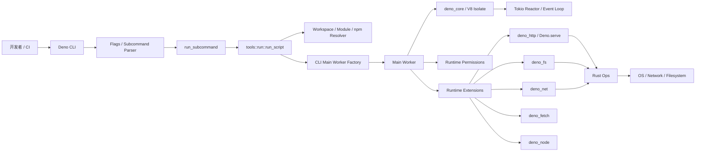
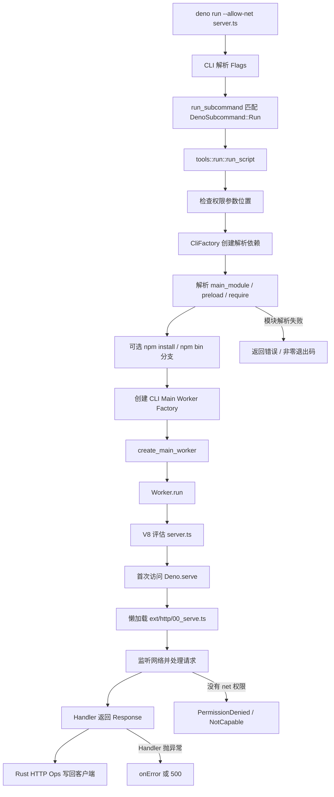
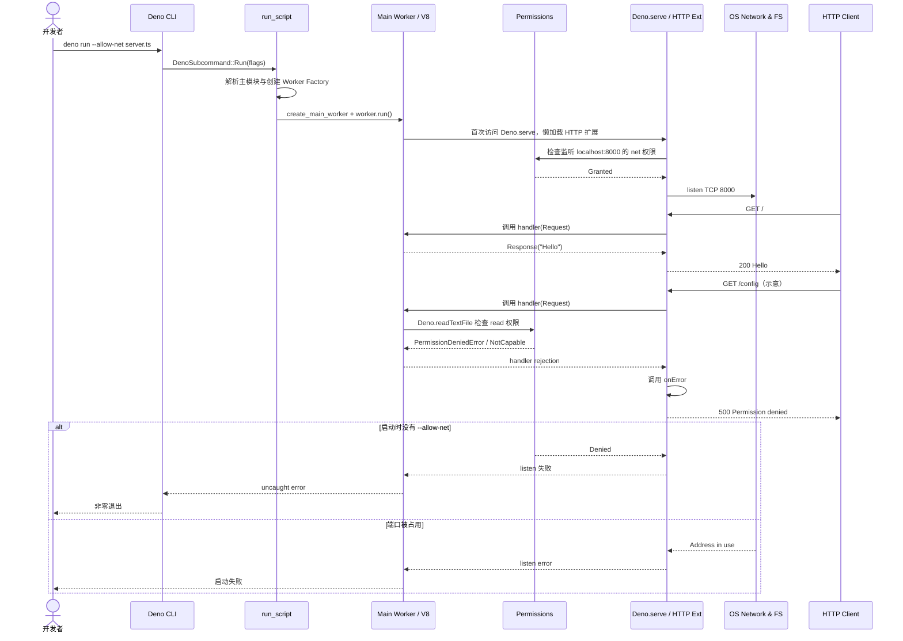

# denoland/deno 源码架构解析

> 报告日期：2026-08-05  
> Trending 原始排名：#11  
> 分析范围：公开 Cargo workspace、CLI 分派、`deno run`、Worker 创建、权限系统、`Deno.serve` HTTP 扩展与单元测试  
> 分析方法：静态源码与官方示例交叉验证；未编译运行时、未执行测试。

## 1. 项目概览

Deno 是 JavaScript、TypeScript 与 WebAssembly 运行时，核心由 Rust、V8 和 Tokio 构成。与“只负责执行 JavaScript”的传统运行时不同，Deno 把 CLI、模块解析、权限、安全默认值、Node/npm 兼容、HTTP/Web API、格式化、Lint、测试、打包等能力放入统一工作区。

根 `Cargo.toml` 展示了清晰的分层：

- `cli/` 负责命令、配置、模块解析和 Worker 创建；
- `runtime/` 负责 JavaScript 运行时与权限；
- `ext/*` 提供 HTTP、Fetch、FS、Net、Node、WebSocket、KV 等扩展；
- `libs/core` 与 V8、Rust Op、事件循环相关；
- `tests/` 覆盖单元、集成、规范、Node 兼容和性能测试。

## 2. 系统架构



### 架构边界

- V8 执行 JavaScript/TypeScript 转换后的模块；Rust 层负责运行时、模块加载、权限和系统能力。
- `Deno.serve` 的 JavaScript 接口在 `runtime/js/90_deno_ns.js` 中懒加载 `ext:deno_http/00_serve.ts`，HTTP 扩展再通过 `core.ops` 进入 Rust 实现。
- Deno Deploy 是单独产品，不是本地 `deno run` 场景的必经组件，本报告没有把它画进主线。

## 3. 核心模块及代码位置

| 模块 | 代码位置 | 职责 | 证据级别 |
|---|---|---|---|
| Workspace 清单 | `Cargo.toml` | 声明 CLI、Runtime、Core、扩展、解析器、测试与工具成员 | High |
| CLI 主分派 | `cli/lib.rs` | 将 `DenoSubcommand::Run` 等命令分派到具体工具；统一退出码和错误 | High |
| Run 工具 | `cli/tools/run/mod.rs` | 校验权限参数位置、解析主模块、安装 npm 依赖、创建 Main Worker 并执行 | High |
| CLI Factory | `cli/factory.rs` | 延迟构建 Resolver、HTTP Client、Deno Dir、Worker Factory 等依赖 | Medium |
| Worker | `cli/worker.rs`、`runtime/worker.rs` | 组装模块加载器、权限、扩展与 V8 Worker，驱动主模块生命周期 | Medium |
| Core | `libs/core/` | V8 隔离、Rust Op、资源表与事件循环桥接 | Medium |
| 权限系统 | `runtime/permissions/lib.rs` | 定义 Permission State、拒绝错误、审计、提示和 read/write/net/env 等检查 | High |
| Deno Namespace | `runtime/js/90_deno_ns.js` | 向 JavaScript 暴露 `Deno.*` API，并对 `Deno.serve` 等较重能力做懒加载 | High |
| HTTP Serve | `ext/http/00_serve.ts` | 构建请求/响应、监听、Handler 调用、取消、关闭、升级和错误响应 | High |
| HTTP Rust 扩展 | `ext/http/` Rust 源码 | 实现 `op_http_serve`、请求读取、响应写入等底层能力 | Medium |
| 模块/配置解析 | `cli/module_loader.rs`、`cli/resolver/`、`libs/config/` | 解析 URL/路径、Workspace、Import Map、npm/jsr 依赖 | Medium |
| 测试 | `tests/unit/serve_test.ts`、`tests/specs/`、`tests/integration/` | 验证 HTTP 生命周期、权限、CLI 行为和兼容性 | High |

## 4. 主线流程



## 5. 典型业务场景：只授予网络权限的最小 HTTP 服务

### 5.1 场景定义

- **场景名称**：运行仅有网络权限的 TypeScript HTTP 服务，并验证文件读取被拒绝
- **参与者**：开发者、Deno CLI、Main Worker、权限系统、`Deno.serve`、HTTP 客户端、操作系统网络/文件系统
- **前置条件**：
  - 已安装 Deno；
  - 当前目录存在 `server.ts`；
  - 端口 8000 可用；
  - 运行命令只授予 `--allow-net`，没有授予 `--allow-read`。
- **输入**：`deno run --allow-net server.ts`（**示意命令**）
- **示意请求**：`GET /` 与 `GET /config`
- **期望结果**：
  - `/` 返回 `200 Hello`；
  - `/config` 中的 `Deno.readTextFile('./config.json')` 被权限系统拒绝，Handler 的 `onError` 返回 500。
- **成功判定**：网络监听成功；正常路由返回 200；未经授权的文件读取没有成功，客户端收到预期错误响应；进程可被正常终止。

### 5.2 示意程序

> 文件名、响应文本和路由均为**示意**，不是仓库内置业务应用。

```ts
Deno.serve({
  port: 8000,
  async handler(req) {
    const url = new URL(req.url)
    if (url.pathname === '/config') {
      const text = await Deno.readTextFile('./config.json')
      return new Response(text)
    }
    return new Response('Hello')
  },
  onError(err) {
    console.error(err)
    return new Response('Permission denied', { status: 500 })
  },
})
```

### 5.3 端到端时序图



### 5.4 逐步追踪表

| 步骤 | 输入 | 执行组件 | 关键代码位置 | 状态变化 | 输出 | 失败分支 | 证据级别 |
|---:|---|---|---|---|---|---|---|
| 1 | `run --allow-net server.ts` | CLI Parser | `cli/args/`、`cli/lib.rs` | argv → `Flags` + `DenoSubcommand::Run` | RunFlags | 参数错误时 CLI 终止 | High |
| 2 | Flags | `run_subcommand()` | `cli/lib.rs` | 通用子命令 → `tools::run::run_script` | 异步 Run Future | stdin/eszip/task fallback 走其他明确分支 | High |
| 3 | Run Flags | `run_script()` | `cli/tools/run/mod.rs` | 构建 `CliFactory`、解析 main module、preload 和 require | `ModuleSpecifier` 与 Worker Factory 输入 | 模块不存在、配置或 npm 解析失败 | High |
| 4 | 解析后的模块 | Worker Factory | `cli/tools/run/mod.rs`、`cli/worker.rs` | 无 Worker → Main Worker | 可执行 Worker | Worker 创建失败上报 boot failure | High |
| 5 | `server.ts` | V8 / Main Worker | `worker.run()`、`libs/core/` | 模块未评估 → 已执行顶层代码 | `Deno.serve` 调用 | JS 未捕获异常令进程失败 | Medium |
| 6 | 首次访问 `Deno.serve` | Deno Namespace | `runtime/js/90_deno_ns.js` | `_serveImpl` 未加载 → 加载 `ext:deno_http/00_serve.ts` | Serve 实现 | 扩展加载失败导致 API 调用失败 | High |
| 7 | `{port:8000}` | HTTP 扩展 + Permissions | `ext/http/00_serve.ts`、`runtime/permissions/lib.rs` | `net` 权限检查为 Granted；创建 Listener | 活跃 Server | 无 `--allow-net` 返回 NotCapable；端口冲突返回 OS 错误 | High |
| 8 | `GET /` | HTTP Ext → Handler | `ext/http/00_serve.ts` | 原始请求 → Web `Request` → Web `Response` | 200 Response | Handler 返回非法值或抛异常进入 onError/500 | High |
| 9 | `GET /config`（示意） | FS API + Permissions | `runtime/permissions/lib.rs`、FS 扩展 | read 权限为 Prompt/Denied；不产生文件内容 | PermissionDeniedError | 若误加 `--allow-read`，文件会被读取，需重新检查权限目标 | High |
| 10 | Handler rejection | HTTP onError | `ext/http/00_serve.ts` | 异常 → 错误响应 | 500 Response | 自定义 onError 再抛异常时使用内部错误处理 | Medium |
| 11 | Ctrl+C / shutdown | Server 生命周期 | `ext/http/00_serve.ts`、`tests/unit/serve_test.ts` | Listener 活跃 → 停止接收并完成/中断连接 | `finished` Promise 完成 | abrupt shutdown 会中断进行中连接 | High |

### 5.5 关键状态与数据变化

| 阶段 | 关键状态/数据 | 变化 |
|---|---|---|
| CLI | 字符串参数 | 转为结构化权限与子命令 Flags |
| 模块解析 | `server.ts` 路径 | 转为 Main Module URL/Specifier |
| Worker | 尚未创建 | 组装 Loader、Permissions、Extensions 与 V8 Isolate |
| Serve 懒加载 | `_serveImpl` 为空 | 第一次访问时加载 HTTP JavaScript 扩展 |
| 网络权限 | `net` 默认未授予 | `--allow-net` 使监听检查通过 |
| Listener | 不存在 | OS 创建 `localhost:8000` TCP Listener |
| 普通请求 | 原始 HTTP 字节 | 转成 Request，Handler 返回 Response，再写回字节流 |
| 文件读取 | `read` 未授权 | 产生 `PermissionDeniedError`，没有读取文件内容 |
| 错误响应 | Handler Promise reject | `onError` 转成显式 500 Response |
| 关闭 | Server 活跃 | 停止新连接，完成或中断现有连接，`finished` 结束 |

### 5.6 失败传播与重试分支

- **没有网络权限**：监听阶段直接失败，错误向 Worker/CLI 传播；Deno 不会偷偷把权限开开。
- **文件读取无权限**：失败发生在 FS Op 前的权限检查，异常进入 Handler 错误路径。应用可以返回 500/403，但不能获得文件内容。
- **端口占用**：OS listen 返回错误，服务启动失败。仓库主线没有为用户代码自动更换端口；应用可自行配置或重试。
- **Handler 异常**：`Deno.serve` 支持 `onError` 转换为 Response；若无有效处理，会使用内部 500 错误路径。
- **请求取消/客户端断开**：HTTP 扩展包含 cancel、request-on-cancel 和 completed 处理；具体应用是否重试由业务层决定，运行时不会替业务请求无限重放。
- **异常关闭**：测试验证 abrupt shutdown 会禁止新连接并中断正在进行的事务；这不是“优雅重试”，而是明确终止语义。

### 5.7 最终业务结果

服务以最小权限启动并处理网络请求；正常路由成功，越权文件读取失败且没有泄露内容。这个案例体现 Deno 的核心价值之一：权限是运行时主线状态，不是 README 里贴的一张“安全第一”横幅。

### 5.8 最小复现方法

```bash
# 1. 保存上方示意 server.ts

# 2. 只开放网络权限
 deno run --allow-net server.ts

# 3. 正常请求
curl -i http://localhost:8000/

# 4. 触发无文件权限分支
curl -i http://localhost:8000/config

# 5. 对照验证：仅在测试目录、确认无敏感文件时再显式授权
# deno run --allow-net --allow-read=./config.json server.ts
```

预期：第 3 步返回 200；第 4 步返回示意的 500，终端显示 NotCapable/PermissionDenied 相关错误。

## 6. 分层技术栈

| 层级 | 技术与组件 | 作用 |
|---|---|---|
| CLI 层 | Rust、Clap/CLI Parser、Flags | 子命令、权限、配置和退出码 |
| 解析层 | deno_graph、Resolver、Import Map、npm/jsr 解析 | 构建模块图并解析依赖 |
| Worker 层 | Main Worker、Web Worker、Worker Factory | 封装模块加载、权限和执行生命周期 |
| 引擎层 | V8、deno_core、serde_v8 | JavaScript 执行与 Rust/JS 数据桥接 |
| 异步层 | Tokio、Reactor、Future | 驱动 I/O、事件循环和异步任务 |
| 扩展层 | `ext/http`、`ext/net`、`ext/fs`、`ext/fetch`、`ext/node` | 向 JS 暴露系统与 Web API |
| 安全层 | Runtime Permissions、Broker、Prompt、Audit Sink | 控制 read/write/net/env/run/ffi 等能力 |
| 工具层 | fmt、lint、test、bench、bundle、compile、task | 一体化开发工具链 |
| 验证层 | unit/spec/integration/node_compat tests | 验证 API、CLI、权限和兼容性 |

## 7. 创新点

1. **权限作为运行时一等能力**：默认拒绝敏感系统访问，权限状态、错误、提示和审计在 Rust 层统一实现。
2. **Web API 与服务器运行时统一**：`Request`、`Response`、`fetch`、Streams 与 `Deno.serve` 共享 Web 标准语义。
3. **扩展化 Runtime**：HTTP、FS、Net、Node 兼容等通过 Extension 和 Rust Ops 装配，边界清晰且可按启动路径优化。
4. **重能力懒加载**：`Deno.serve` 等 API 首次访问才加载较大的 JS 扩展，降低不使用这些能力的程序启动成本。
5. **工具链内聚**：运行、格式化、Lint、测试、任务和编译由同一 CLI 提供，减少版本和配置拼装。

## 8. 应用场景

- TypeScript/JavaScript Web 服务与 API。
- 需要细粒度文件、网络和进程权限的脚本工具。
- CLI、自动化任务和跨平台开发工具。
- 使用 npm/Node 生态但希望采用 Deno 工具链的项目。
- Serverless、边缘运行时和嵌入式 Runtime 研究。
- Web API 兼容的测试、抓取与数据处理程序。

## 9. 阅读验证路径

1. `README.md`：确认定位、V8/Rust/Tokio 和官方 HTTP 示例。
2. 根 `Cargo.toml`：查看 workspace 成员和扩展依赖。
3. `cli/lib.rs`：从 `DenoSubcommand::Run` 看子命令分派。
4. `cli/tools/run/mod.rs`：追踪主模块、npm 分支、Worker Factory 与 `worker.run()`。
5. `cli/factory.rs`、`cli/worker.rs`：核验依赖装配和 Worker 创建。
6. `runtime/permissions/lib.rs`：核验权限状态、拒绝错误、审计和检查流程。
7. `runtime/js/90_deno_ns.js`：确认 Deno Namespace 与 Serve 懒加载。
8. `ext/http/00_serve.ts`：追踪监听、Request/Response、取消、关闭和错误。
9. `tests/unit/serve_test.ts`：核验启动、请求属性、shutdown 和错误边界。
10. 再进入 `ext/http` Rust 源码和 `libs/core`，验证 JS Op 到 Tokio/OS 的底层路径。

## 10. 风险与限制

- Deno workspace 很大，Node/npm 兼容、缓存、Lockfile、LSP、Compile 和 Deploy 不能由一个 HTTP 案例代表。
- “安全默认值”不等于应用自动安全；授予 `--allow-all`、宽泛路径或不受控网络域名仍会放大风险。
- npm 包和远程模块会引入供应链风险，需配合 Lockfile、权限、审计与依赖治理。
- V8、Rust Extension 与 JavaScript Polyfill 跨语言调试复杂，性能问题可能跨越多层。
- Deno 版本迭代快，API、Node 兼容程度和内部模块可能变化；源码分析对应抓取时主分支。
- 本轮未验证 Windows、macOS、Linux 的权限提示和网络行为差异。

## 11. Evidence Notes

- `README.md`：Deno 建立在 V8、Rust、Tokio 上，提供 `Deno.serve` 示例。
- `Cargo.toml`：workspace 成员、MIT License、Runtime/Core/Ext/Test 分层。
- `cli/lib.rs`：`Run` 分支调用 `tools::run::run_script` 并处理 fallback 与错误。
- `cli/tools/run/mod.rs`：主模块解析、npm 分支、Worker Factory、Main Worker 与执行。
- `runtime/permissions/lib.rs`：`PermissionDeniedError`、权限状态、审计与授权提示。
- `runtime/js/90_deno_ns.js`：`Deno.serve` 首次访问懒加载 HTTP 扩展。
- `ext/http/00_serve.ts`：HTTP Ops、Request/Response、取消、500 和 Server 生命周期。
- `tests/unit/serve_test.ts`：真实 `Deno.serve` 单元测试、net 权限声明和 shutdown 行为。

没有从目录名推断数据库、缓存服务器、消息队列或微服务。Deno 内部有模块缓存和 KV 扩展，但它们不是本案例必经组件，因此未画进主线。

## 12. Honest Caveat

本报告没有编译 Deno，没有执行 `server.ts`，也没有逐函数进入 V8、所有 Rust HTTP Op 和 OS Socket 实现。CLI、权限与 HTTP JavaScript 扩展有直接源码支撑；跨 Rust/JS 的完整请求执行链仍保留静态分析边界。

## 13. 可信度

| 维度 | 评级 | 理由 |
|---|---|---|
| Architecture Confidence | **High** | Cargo workspace、CLI、Runtime、Permissions、Namespace、HTTP 扩展和测试相互印证 |
| Flow Confidence | **Medium** | `deno run` 到 Worker 与 Serve 的主线清楚，但未逐函数进入所有 Rust Ops、V8 调度和 OS I/O |
| Innovation Confidence | **Medium** | 安全默认、扩展化和工具链一体化可由代码确认，性能与开发体验优势未独立对比复测 |
