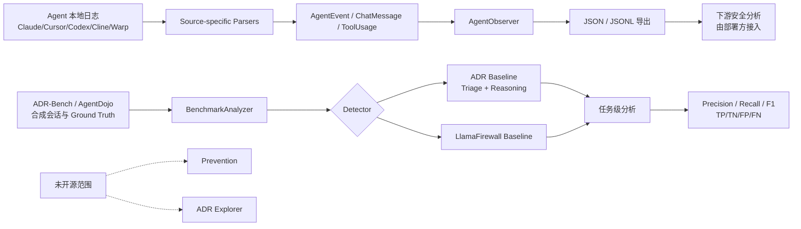
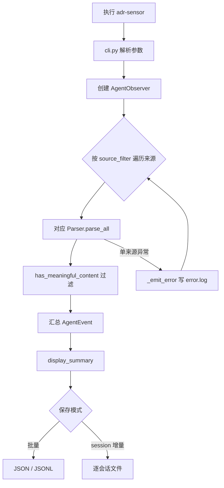
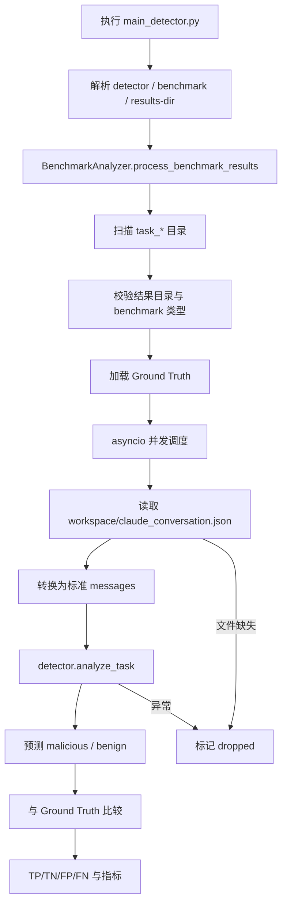
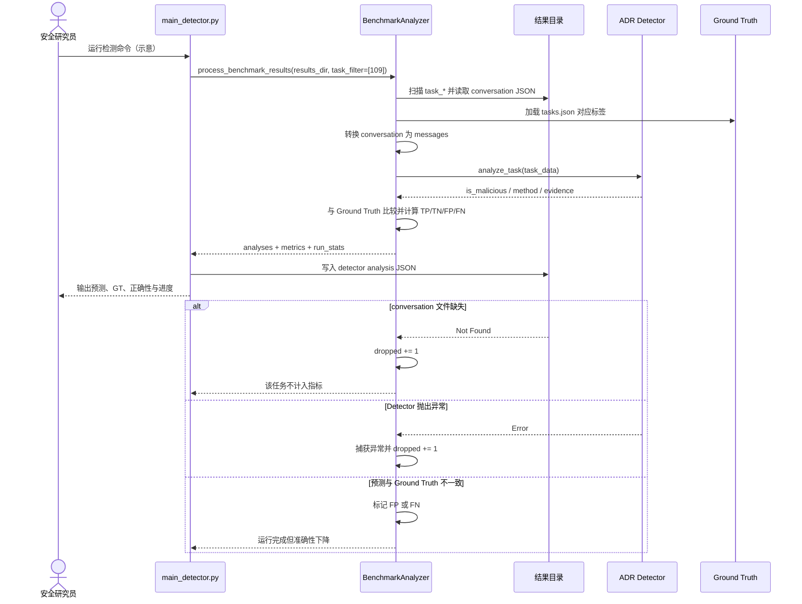

# uber/ADR 源码架构解析

> 报告日期：2026-08-05  
> Trending 原始排名：#4  
> 分析范围：公开仓库 `Sensor/`、`Detection/`、根 README 与公开配置/测试说明  
> 分析方法：静态源码、依赖清单与官方文档交叉验证；未运行基准、未调用外部模型。

## 1. 项目概览

ADR（Agentic AI Detection and Response）面向企业 AI Agent 的安全观测、检测与评估。当前公开仓库主要包含三部分：

1. **ADR Sensor**：读取 Claude Code、Cursor、Cline、Claude Desktop、Codex CLI、Warp 等本地日志，归一化为 `AgentEvent`。
2. **ADR-Bench**：用合成任务、MCP 服务和已标注攻击场景生成可评估会话。
3. **ADR Detector**：读取基准会话，调用 ADR 或 LlamaFirewall 检测器，计算 precision、recall、F1 与混淆矩阵等指标。

项目 README 明确说明：Preventive blocking 与离线 ADR Explorer 没有随当前开源版本发布。因此本报告不把它描述成“完整生产阻断平台”，只分析已公开的观测、基准和检测链路。

## 2. 系统架构



### 架构边界

- Sensor 输出可供 SIEM 或自定义检测管线使用，但仓库没有提供一个“Sensor JSONL 自动灌入 Detector”的单一生产编排入口。
- Detector 主线针对 ADR-Bench 或 AgentDojo 的结果目录运行。
- README 声称系统在 Uber 生产使用；本轮只能确认公开源码结构，不能核验内部部署规模和运行数据。

## 3. 核心模块及代码位置

| 模块 | 代码位置 | 职责 | 证据级别 |
|---|---|---|---|
| Sensor CLI | `Sensor/adr_sensor/cli.py` | 解析 `--source`、`--output-format`、`--save-sessions` 等参数，创建 `AgentObserver`，执行采集、摘要与保存 | High |
| 采集编排 | `Sensor/adr_sensor/observer.py` | 实例化各来源 Parser；逐来源调用 `parse_all()`；过滤无意义记录；单来源失败时记录 `error.log` 并继续 | High |
| 统一 Schema | `Sensor/adr_sensor/schemas/agent_event_schema.py` | 定义 `ToolUsage`、`ChatMessage`、`AgentEvent`，生成确定性 UUID、内容哈希与 JSON 序列化 | High |
| 来源 Parser | `Sensor/adr_sensor/parsers/*.py` | 解析 JSONL、SQLite、JSON 等不同 Agent 日志格式并生成统一事件 | Medium |
| Sensor 包入口 | `Sensor/pyproject.toml` | 声明 Python 版本、依赖和 `adr-sensor = adr_sensor.cli:main` 控制台命令 | High |
| 基准执行 | `Detection/main_benchmark.py` | 执行 ADR-Bench/AgentDojo 任务并输出任务目录与会话记录 | Medium |
| 检测入口 | `Detection/main_detector.py` | 校验结果目录、加载 Ground Truth、并发分析任务、计算指标并保存检测结果 | High |
| ADR 检测器 | `Detection/guardrail/adr_agent/` | 实现 ADR 检测基线，区分初筛与深度推理路径 | Medium |
| LlamaFirewall 基线 | `Detection/guardrail/llamafirewall_agent/` | 提供可选检测基线 | Medium |
| MCP 注册与上下文 | `Detection/mcp_servers_registry.json`、`Detection/context_providers/` | 描述合成测试中的 MCP 服务与威胁情报、策略、源码上下文提供器 | High |
| 任务与配置 | `Detection/tasks.json`、`config_benchmark.yaml`、`config_detector.yaml` | 定义合成任务、Ground Truth 和模型/超时等运行参数 | High |

## 4. 主线流程

### 4.1 Sensor 观测主线



关键点是 **单来源错误隔离**：`AgentObserver.ingest_all()` 对各 Parser 分别捕获异常，因此 Cursor 日志解析失败不会阻止 Codex 或 Claude 日志继续采集。

### 4.2 Detector 评估主线



## 5. 典型业务场景：检测一条合成 Agent 工具攻击会话

### 5.1 场景定义

- **场景名称**：对 ADR-Bench 中一条疑似恶意 Agent 会话执行检测并计入评估指标
- **参与者**：安全研究员、`main_detector.py`、`BenchmarkAnalyzer`、ADR Detector、Ground Truth 文件
- **前置条件**：
  - 已在隔离环境完成某次 ADR-Bench 运行；
  - 结果目录包含 `task_*` 子目录；
  - 目标任务存在 `workspace/claude_conversation.json`；
  - 使用 ADR Detector 时已配置所需模型凭据和 Claude CLI；
  - 不连接生产凭据、生产 MCP 服务或真实业务数据。
- **输入**：`benchmark/adr_bench_20260805_120000/task_109/workspace/claude_conversation.json`（**示意路径**）
- **示意命令**：`uv run python main_detector.py --tasks 109 --results-dir benchmark/adr_bench_20260805_120000`
- **期望结果**：输出该任务的预测、Ground Truth、判断正确性和检测方法，并写入 detector analysis JSON。
- **成功判定**：任务被计入 `scored`，分析记录包含 `ground_truth_binary`、`is_correct`、TP/TN/FP/FN 标志；运行结束后指标文件可读取。

### 5.2 端到端时序图



### 5.3 逐步追踪表

| 步骤 | 输入 | 执行组件 | 关键代码位置 | 状态变化 | 输出 | 失败分支 | 证据级别 |
|---:|---|---|---|---|---|---|---|
| 1 | CLI 参数（示意） | argparse 入口 | `Detection/main_detector.py` | 生成 detector、benchmark_type、results_dir、task_filter | `BenchmarkAnalyzer` 调用参数 | 目录或参数不合法时终止 | High |
| 2 | 结果目录 | `process_benchmark_results()` | `Detection/main_detector.py` | 从未知目录变为已校验任务集合 | `task_dirs` | 无 `task_*` 目录抛出 `FileNotFoundError` | High |
| 3 | benchmark 类型 | `validate_benchmark_results_dir()` / `_load_ground_truth()` | `Detection/main_detector.py` | 加载 `task_id -> malicious bool` | `ground_truth` 映射 | Ground Truth 缺失时无法可靠评分 | High |
| 4 | `task_109` | asyncio 调度器 | `_analyze_tasks_async()` | semaphore 占用 1 个并发槽 | 单任务 Future | 单任务异常被计入 dropped | High |
| 5 | conversation JSON | `_analyze_task_async()` | `Detection/main_detector.py` | 文件内容转为内存对象 | `conversation_data` | 文件缺失返回 `None` | High |
| 6 | 会话对象 | `_convert_conversation_to_messages()` | `Detection/main_detector.py` | 统一为 role/content/tool_calls 消息 | `messages` | 畸形字段可能导致转换或检测失败 | High |
| 7 | `task_data` | ADR Detector | `Detection/guardrail/adr_agent/` | 产生预测、方法与分析证据 | Detector result | 模型、CLI 或 MCP 调用失败，任务 dropped | Medium |
| 8 | 预测 + Ground Truth | `BenchmarkAnalyzer` | `_analyze_task_async()` | 写入 `is_correct`、TP/TN/FP/FN | 任务分析记录 | 预测不一致会成为 FP/FN，不重试伪装成正确 | High |
| 9 | 全部已完成任务 | 指标计算与输出 | `main_detector.py` | 更新 `scored`、`dropped` 和总体指标 | analysis JSON / 控制台摘要 | dropped 不计入指标，需单独关注 | High |

### 5.4 关键状态与数据变化

| 阶段 | 关键状态/数据 | 变化 |
|---|---|---|
| 扫描前 | `results_dir` 只是字符串路径 | 解析为 `Path` 并验证存在性 |
| 任务发现 | 未知任务数量 | 收集所有 `task_*` 目录，应用 task filter |
| Ground Truth | 无标签 | 建立 `task_109 -> true/false` 映射 |
| 会话读取 | 文件系统 JSON | 转成结构化消息列表 |
| 检测 | 无预测 | 生成 `is_malicious`、method、分析字段 |
| 对照 | 预测与标签彼此独立 | 生成 `is_correct`、TP/TN/FP/FN |
| 聚合 | 单任务结果 | 更新 scored、dropped 与总体指标 |

### 5.5 失败传播与重试分支

- **会话文件缺失**：`_analyze_task_async()` 返回 `None`，上层把任务计为 `dropped`，不会拿空数据硬算准确率。
- **Detector 异常**：单任务捕获异常并计入 `dropped`；其他任务继续运行。
- **预测错误**：不会自动重跑直到“猜对”，而是如实标记 FP/FN，影响指标。
- **外部模型暂时失败**：仓库主线没有在该层展示统一指数退避策略；是否重试取决于具体 Detector 实现或外部调用层。本报告不虚构重试次数。

### 5.6 最终业务结果

安全研究员得到一份可审计的任务级检测结果和总体指标，能区分：

- 检测正确；
- 误报或漏报；
- 因文件/调用错误被丢弃的任务。

这种区分比只报一个漂亮的 F1 更重要：掉在地上的任务不能假装没掉，扫到地毯底下也不算数据治理。

### 5.7 最小复现方法

> 以下路径、任务号和凭据均为**示意**。Detection README 要求在容器、虚拟机或专用隔离主机运行。

```bash
# 1. 安装依赖
cd Detection
uv sync

# 2. 可选：配置 ADR Detector 需要的模型凭据
export ANTHROPIC_API_KEY="<示意值>"
export OPENAI_API_KEY="<示意值>"

# 3. 对已有的合成结果目录运行一个任务
uv run python main_detector.py \
  --tasks 109 \
  --results-dir benchmark/adr_bench_20260805_120000

# 4. 无模型凭据的基础烟雾测试可按官方说明选择 llamafirewall
uv run python main_detector.py \
  --detector llamafirewall \
  --tasks 109 \
  --results-dir benchmark/adr_bench_20260805_120000
```

不要把示意目录指向生产日志，不要放入真实密钥，也不要把合成脆弱 MCP 服务暴露到生产网络。

## 6. 分层技术栈

| 层级 | 技术与组件 | 作用 |
|---|---|---|
| 输入层 | JSONL、SQLite、JSON、本地 Agent 会话目录 | 承载不同宿主的原始行为记录 |
| 解析层 | Python Source Parsers | 读取来源特定格式 |
| 领域模型层 | dataclass `AgentEvent` / `ChatMessage` / `ToolUsage` | 统一会话、消息和工具调用语义 |
| 编排层 | `AgentObserver`、`BenchmarkAnalyzer`、asyncio semaphore | 多来源采集、并发任务分析、错误隔离 |
| 检测层 | ADR Baseline、LlamaFirewall Baseline、LLM/MCP 上下文 | 产生恶意/正常判断与解释 |
| 评估层 | Ground Truth、NumPy/统计逻辑 | 计算 TP/TN/FP/FN、precision、recall、F1 |
| 输出层 | JSON、JSONL、analysis JSON、控制台摘要 | 供人工、研究脚本或下游系统读取 |
| 工程层 | `uv`、`pyproject.toml`、pytest、ruff | 依赖、测试和代码质量管理 |

## 7. 创新点

1. **跨 Agent 日志归一化**：把多个编码 Agent 的异构日志映射到统一事件模型，为后续安全分析降低接入成本。
2. **观测与评估分离**：Sensor 解决“看见”，Benchmark/Detector 解决“测得准不准”，边界比把一切塞进单体脚本更清楚。
3. **双层检测思路**：先高召回初筛，再对可疑会话做更深推理，试图在成本和判断质量之间取平衡。
4. **大量合成 MCP 场景**：通过注册表和仿真环境覆盖工具供应链、提示注入与数据外传等 Agent 特有风险。

## 8. 应用场景

- 企业盘点 Claude Code、Cursor、Codex 等工具的本地活动。
- 构建 Agent 工具调用的安全审计数据层。
- 评估不同检测器在相同合成任务上的误报与漏报。
- 在部署前测试 MCP 服务、提示注入和工具链风险。
- 为 SIEM、内部告警或调查平台提供统一事件输入。

## 9. 阅读验证路径

1. 先读根 `README.md`，确认开源范围和未开源组件。
2. 读 `Sensor/README.md`，理解来源、Schema 和输出。
3. 对照 `Sensor/pyproject.toml` 与 `Sensor/adr_sensor/cli.py`，确认真正入口。
4. 读 `observer.py`，检查各 Parser 的调用、过滤和异常隔离。
5. 读 `agent_event_schema.py`，确认字段、UUID、哈希和序列化。
6. 读 `Detection/README.md`，确认基准目录、任务数、输出与隔离要求。
7. 读 `main_detector.py`，追踪目录扫描、并发、Detector 调用和指标生成。
8. 最后进入 `guardrail/adr_agent/`，逐函数核验 Triage 与 Reasoning 的具体实现。
9. 用 `tests/` 和 `docs/REPRODUCIBILITY.md` 检查边界条件和论文复现步骤。

## 10. 风险与限制

- Detection 目录是研究基准，官方明确提示固定依赖中包含在隔离威胁模型下接受、但不适合生产的已知 CVE。
- 合成 MCP 服务包含刻意脆弱行为、假凭据和攻击载荷，不能接入真实网络或生产数据。
- 本地日志可能含代码、路径、提示词、工具参数和结果，采集前需要隐私、合规和数据最小化设计。
- Sensor 对单来源异常采取继续策略，提升可用性，但也意味着“命令成功”不等于“所有来源都采集成功”；应监控 `error.log`。
- Detector 依赖外部模型和 CLI 时，结果可能受模型版本、提示词、网络和成本影响。
- Prevention 和 Explorer 未开源，不能从目录名或论文摘要推断其实现。

## 11. Evidence Notes

- 根 README：开源 Sensor、Benchmark、Detector；Prevention 与 Explorer 未包含。
- `Sensor/README.md`：来源格式、架构、CLI、Schema 与项目结构。
- `Sensor/pyproject.toml`：包入口和最小运行依赖。
- `Sensor/adr_sensor/cli.py`：参数解析、Observer 调用、保存和资源日志。
- `Sensor/adr_sensor/observer.py`：Parser 编排、逐来源错误隔离、JSON/JSONL 输出。
- `Sensor/adr_sensor/schemas/agent_event_schema.py`：统一数据模型、UUID 和内容哈希。
- `Detection/README.md`：基准结构、任务与 MCP 注册表、运行和隔离要求。
- `Detection/main_detector.py`：任务目录扫描、并发分析、Ground Truth 对照与 dropped 统计。

所有“代码位置”均来自公开仓库。未见源码支撑的生产组件、数据存储或阻断机制没有补画。

## 12. Honest Caveat

本报告没有运行 ADR-Bench，没有调用 GPT、Claude 或 LlamaFirewall，没有验证论文指标，也没有接触 Uber 内部部署。架构结论对公开代码边界可信；关于生产规模、实际召回率、成本和运营效果，只能保留为项目方声明。

## 13. 可信度

| 维度 | 评级 | 理由 |
|---|---|---|
| Architecture Confidence | **High** | 根 README、组件 README、入口、Schema、编排与检测代码相互印证，公开边界清楚 |
| Flow Confidence | **High** | 典型 Detector 场景可从 `main_detector.py` 逐步追到目录、会话、Detector、Ground Truth 与指标 |
| Innovation Confidence | **Medium** | 设计与论文主张清楚，但优势、生产效果和基准领先程度未独立复现 |
